# ABAS v3 - Systems Design - Foundation

Status: Proposed
Created by: Alfredo Sanchez Jr
Created time: January 30, 2025 4:00 PM

# ABAS v3 - Core Components Systems Design

# Revision History

| **Date** | **Version** | **Description** | **Author** | Status |
| --- | --- | --- | --- | --- |
| 2025-01-30 | Draft 00.09.00 | Initial Draft | asanchez | Draft |
| 2025-02-13 | 00.09.01 | Final Draft - added divisions, companies, permission template, tokens, annoucement, messages, locator, biometric logs, remove irrelevant tables from hris, dashboard widgets:  birthdays, leaves | asanchez | Draft |
| 2025-02-17 | 00.09.02 | Added new submodules: audit trails, audit module, employee locator, documents management module, kpi and performance management | asanchez | Proposed |

# 1. Introduction

## 1.1 Purpose

This document outlines the design and implementation of Avega Bros Business Automation System (ABAS) v3, a comprehensive Enterprise Resource Planning (ERP) system tailored to integrate and streamline all business processes and departments across the entire company, Avega Bros Integrated Shipping Corp. While the system accommodates the specific needs of a company engaged in vessel cargoes, with a particular focus on bulk and breakbulk cargo and a large fleet of 60 vessels, its purpose extends beyond vessel operations to encompass all aspects of the business.

This document serves as a guide for developers, stakeholders, and end-users to understand the system's architecture, modules, and functionalities, enabling them to effectively utilize ABAS v3 to improve efficiency, productivity, and decision-making across all departments.

## 1.2 Scope

ABAS v3 is a complete upgrade from ABAS v2.5.x, utilizing CodeIgniter on the backend with RESTful APIs and React.Next on the frontend for enhanced performance and user experience. This document covers the following modules, highlighting key functionalities and areas of integration:

- **Core Module:** Shared components and functionalities across all modules, including user authentication, data management, workflow management, reporting and analytics, system monitoring, a ticketing system, cross-module processes, a personalized user dashboard, and data privacy management to ensure compliance with the Data Privacy Act of the Philippines. Provides tools for managing document trails and approval processes across different modules. Supports both single and multi-company setups. Implements token-based authentication for enhanced security and session management.
- **Human Resources Information System (HRIS):** Manages the entire employee lifecycle, from recruitment and onboarding to performance management, compensation and benefits, talent management, and statutory compliance.
- **Accounting:** Handles all aspects of financial accounting, including general ledger, accounts payable, accounts receivable, and financial reporting.
- **Finance:** Manages financial planning, budgeting, analysis, and investment management, including asset depreciation and amortization, and collections for cargo services.
- **Supply Chain Management:** Streamlines procurement, inventory management, and logistics, with specific features for managing vessel supplies, cargo handling, and warehouse operations.
- **Customer Relationship Management (CRM):** Manages customer interactions, sales, and marketing, with segmentation capabilities for different cargo types and shipping routes. This includes contract management to generate and track contracts, which are the basis for invoicing and collections by the Finance module. Customer segmentation is further refined by service type: Chartered Vessel or Voyage Cargo.
- **Engineering:** Supports engineering design, project management, product development, and quality management, including vessel maintenance, repair, and dry docking operations.
- **Operations:** Manages day-to-day business operations, with a focus on vessel management, including scheduling, routing, crew management, voyage management, and performance analysis.
- **Administration:** Handles administrative tasks, including document management, facility management, and a dedicated Compliance sub-department for managing government-related tasks, vessel clearances, and statutory compliance. Also includes asset management functionalities for tracking vessel inventory, asset assignment, and overall asset tracking.
- **IT:** Manages IT infrastructure, software development, IT support, cybersecurity, data privacy, a ticketing system, and IT equipment requests.

Each module will have its own dedicated design document, with the Core Module document serving as the  template.

## 1.3 Goals and Objectives

The ABAS v3 system is designed to achieve the following key goals and objectives:

- **Address ABAS 2.5 limitations:** ABAS v3 aims to overcome the limitations of the previous version, particularly in terms of user interface and user experience.
- **Enhanced User Interface:** Provide a more advanced, intuitive, and user-friendly interface that addresses the issues and pain points identified in ABAS 2.5.
- **Improved User Experience:** Enhance the overall user experience by incorporating user feedback and implementing features that improve usability and efficiency.
- **Advanced Features:** Introduce new features and functionalities that were not available in ABAS 2.5, providing users with more powerful tools and capabilities.
- **Notifications:** Implement a comprehensive notification system that keeps users informed about important events, updates, and tasks, addressing a key request from ABAS 2.5 users.
- **Reliability:** Ensure system stability and availability.
- **Security:** Protect sensitive data and prevent unauthorized access.
- **Scalability:** Adapt to future growth and changing business needs.
- **Maintainability:** Ensure easy maintenance and updates.

### Key Features and Improvements in ABAS v3

ABAS v3 introduces several key features and improvements compared to the previous version (ABAS 2.5):

- **Improved UI/UX experience:** ABAS v3 provides a significantly enhanced user interface and user experience, addressing the limitations and pain points identified in ABAS 2.5. The new interface is more intuitive, user-friendly, and efficient, making it easier for users to navigate and perform their tasks.
- **Multi-company data segregation:** ABAS v3 supports multi-company setups with robust data segregation capabilities, ensuring that data for different companies is securely separated and access is restricted appropriately. This feature is essential for compliance with BIR regulations and for managing data for multiple companies within a single system.
- **ABAS messaging system:** ABAS v3 includes a built-in messaging system that allows employees to communicate and collaborate efficiently within the platform. This feature reduces reliance on external communication tools and provides a secure and integrated way to exchange information.
- **Multi-permission per user per role:** ABAS v3 allows for granular control over user permissions, enabling administrators to assign multiple permissions to users based on their roles and responsibilities. This provides greater flexibility and control over access to sensitive data and functionalities.
- **Data privacy protection:** ABAS v3 incorporates data privacy protection measures in compliance with the Data Privacy Act of the Philippines. This includes features for consent management, data subject rights management, and data breach management, ensuring that personal data is handled responsibly and securely.
- **Document tracking:** ABAS v3 includes a comprehensive document tracking system that manages both system-generated documents and their physical counterparts. This system tracks the location, status, and history of documents, improving document management and retrieval processes.
- **Biometric and time attendance integration:** ABAS v3 integrates biometric data and time attendance information with an employee locator system, providing a comprehensive view of employee attendance and location. This feature can improve workforce management and enhance security.
- **Company-wide ticketing system:** ABAS v3 includes a ticketing system that allows employees to submit and track requests or issues to different departments. This provides a centralized platform for managing and resolving employee concerns.

These key features and improvements make ABAS v3 a significant upgrade from the previous version, offering enhanced usability, security, and functionality to support the evolving needs of Avega Bros Integrated Shipping Corp.

## 1.4 Development Team

| **Name** | **Role** | **Responsibilities** |
| --- | --- | --- |
| Alfredo Sanchez Jr | Project Manager | Oversee the entire project, ensuring timely completion and adherence to requirements. |
| Julius Brian Canillo | Lead Developer | Lead the development team, provide technical guidance, and ensure code quality. |
| Samantha Vega | Business Analyst | Gather and analyze business requirements, translate them into technical specifications. |
| Leigh Buendia | Front-End Developer | Design and develop the user interface, ensuring a positive user experience. |
| Dominic Vega | API Developer | Develop and maintain the RESTful APIs for system integration. |
| Marvin Toh | Back-End Developer | Develop and maintain the backend logic and database interactions. |
| Rhealyn Arnoco | QA Tester | Conduct testing and quality assurance to identify and report bugs. |

# 2. System Architecture

## 2.1 Overall Architecture

ABAS v3 adopts a modular architecture with a shared Core Module. This module provides common components and functionalities used by all other modules, such as:

- **User Authentication and Authorization:** Manages user accounts, roles, and permissions.
- **Data Management:** Provides a centralized database and data access layer.
- **Workflow Management:** Enables the definition and execution of business processes.
- **Reporting and Analytics:** Offers tools for generating reports and dashboards.
- **System Monitoring and Logging:** Tracks system performance and events.
- **User Dashboard:** Provides a personalized dashboard for each user to access tasks, information, and key functionalities.
- **Manual Management:** Provides functionalities for managing and versioning company manuals, handling amendment requests, and generating notifications for updates.
- **Document Management System (DMS):** Manages and tracks both digital and physical documents, including their storage location and retention policies.

The system utilizes token-based authentication to ensure secure access and manage user sessions effectively.

## 2.2 Module Architecture

Each module has its own architecture, built on top of the Core Module. This allows for flexibility and scalability, as modules can be developed and deployed independently.

## 2.3 Technology Stack

- **Backend:** CodeIgniter with RESTful APIs
- **Frontend:** React.Next
- **Database:** MySQL
- **Server:** Apache or Nginx
- **Operating System:** Linux

## 2.4 API Documentation

- [https://api.avegabros.org/documentation/](https://api.avegabros.org/documentation/)

# 3. Core Module

The Core Module of Avega Bros Business Automation System (ABAS) v3 provides essential functionalities and services that are shared across all other modules within the system. These functionalities are crucial for the overall operation, security, and maintainability of ABAS v3.

## 3.1 User Authentication and Authorization

- **User Management:** Create, update, and delete user accounts, including assigning users to specific companies.
- **Role-Based Access Control (RBAC):** Assign roles to users and define permissions for each role, considering company-specific permissions.
- **Authentication:** Verify user identity through username/password or other authentication methods, ensuring secure access for users across different companies.
- **Authorization:** Enforce access control to system resources based on user roles and permissions, restricting access based on company affiliation.

## 3.2 Data Management

- **Database Design:** Define tables, relationships, and data integrity rules, considering data segregation or sharing between companies.
- **Data Access Layer:** Provide an abstraction layer for accessing and manipulating data, ensuring data access is restricted to the appropriate company.
- **Data Validation:** Ensure data accuracy and consistency, including company-specific validation rules.
- **Data Security:** Protect data from unauthorized access and modification, with security measures implemented at the company level. This includes verifying the validity and expiration of authentication tokens for each request.

## 3.3 Workflow Management

- **Workflow Engine:** Define and execute business processes using a workflow engine. This includes both automated and manual steps, with the ability to track the progress and status of workflows.
- **Workflow Designer:** Provide a visual tool for designing and modeling workflows, allowing users to define the steps, actors, and conditions involved in various processes.
- **Workflow Monitoring:** Track the progress and status of workflows, providing users with visibility into the current state of various processes and enabling them to identify and resolve any bottlenecks or issues.
- **Document Trails:** Maintain a complete and auditable history of all actions and approvals related to documents and workflows, ensuring accountability and compliance.
- **Generic Approval Workflows:** Enable the creation and execution of generic approval workflows that can be applied to various documents and processes across different modules, promoting consistency and efficiency in approval processes.

## 3.4 Reporting and Analytics

- **Report Designer:** Create custom reports and dashboards, with the ability to filter and segment data by company.
- **Data Visualization:** Display data in charts, graphs, and other visual formats, allowing for company-specific visualizations.
- **Report Scheduling:** Generate reports automatically on a scheduled basis, with the option to generate reports for specific companies or all companies.

## 3.5 System Monitoring and Logging

- **System Logs:** Record system events, errors, and warnings, including company-specific logs.
- **Basic System Health Checks:** Monitor basic system health indicators, such as server availability and database connectivity.
- **Alerting:** Notify administrators of critical system events, including company-specific alerts.

## 3.6 Ticket System

- **Ticket Creation:** Allow users to submit tickets with details about their issues, including the affected module, priority, and relevant attachments. The ticket system should allow for company-specific ticket routing and assignment.
- **Ticket Assignment:** Automatically assign tickets to the appropriate department or support team based on the module or issue category, considering company-specific support teams.
- **Ticket Tracking:** Track the status and progress of tickets, including updates, comments, and resolution information.
- **Ticket Escalation:** Enable escalation of tickets to higher-level support teams or management if they are not resolved within a certain timeframe.
- **Ticket Reporting:** Generate reports on ticket volume, resolution time, and other metrics to identify trends and areas for improvement, with the ability to filter and segment data by company.
- **Knowledge Base Integration:** Integrate with a knowledge base to provide users with self-service solutions to common issues.

## 3.7 Cross-Module Processes

The Core Module facilitates various processes that are initiated and managed through other modules. These processes leverage the Core Module's functionalities for user authentication, data management, and workflow management.

**Examples of Cross-Module Processes:**

- **Leave of Absence:** An employee can initiate a leave of absence request through their dashboard or the HRIS module. The Core Module handles the workflow for approval by the employee's manager and updates the employee's leave balance accordingly.
- **Travel Request:** An employee can submit a travel request through the Administration module. The Core Module manages the approval workflow and integrates with the Finance module for expense reimbursement.
- **Purchase Requisition:** A department manager can create a purchase requisition in the Supply Chain Management module. The Core Module routes the requisition for approval and updates the budget in the Finance module.
- **Performance Review:** A manager can initiate a performance review in the HRIS module. The Core Module manages the review workflow, including notifications and reminders.

## 3.8 User Dashboard

The Core Module will feature a personalized user dashboard that provides a centralized location for employees to access and manage their tasks and information. This dashboard will serve as a primary entry point for users to interact with various modules and processes within ABAS v3.

**Key Features of the User Dashboard:**

- **Task Management:** Display a list of pending tasks assigned to the user, including:
    - Leave requests
    - Loan applications
    - Overtime requests
    - Procurement requests
    - Travel requests
    - Performance evaluations
    - IT equipment requests
    - Tickets assigned to the user
- **Notifications:** Display notifications related to tasks, approvals, and system updates.
- **Quick Links:** Provide quick links to frequently accessed modules and functions.
- **Personal Information:** Display relevant personal information, such as contact details, emergency contacts, and assigned assets.
- **Time Management:**
    - Time logs: Allow employees to view and manage their time logs, including clock-in/out times and break times.
    - Attendance calendar: Display an attendance calendar showing the employee's attendance history and upcoming leave schedules.
- **Financial Information:**
    - Cash advances: Allow employees to view and request cash advances.
    - Payslips: Provide access to payslips and other payroll-related information.

**Widgets:**

- **Birthday Celebrants:**
    - Displays a list of employees celebrating their birthdays in the current and next month.
    - Includes information from the `persons` table (`date_of_birth`) and potentially other relevant tables (e.g., `employees` for corporate rank).
    - Respects employee consent for displaying their birthday.
    [Link to Figma prototype for Birthday Celebrants Widget]
- **Leaves and Travel:**
    - Displays a list of employees currently on leave or who have upcoming leave requests.
    - Includes information from the `leave_requests` table (or similar) and potentially other relevant tables (e.g., `travel_requests`).
    [Link to Figma prototype for Leaves and Travel Widget]
- **Company Directory:**
    - Displays a search bar and a list of employees based on search criteria and consent settings.
    - Provides links to view employee details.
    [Link to Figma prototype for Company Directory Widget]
- **Company Announcements:**
    - Displays a list of active announcements relevant to the logged-in user.
    - Announcements can be displayed in a summarized format with links to view the full content.
    [Link to Figma prototype for Company Announcements Widget]

## 3.9 Data Privacy

- **Data Subject Rights Management:**
    - Facilitate data subjects' requests to access, correct, or delete their personal data.
    - Provide mechanisms for data subjects to object to or restrict the processing of their personal data.
    - Maintain records of data subject requests and their fulfillment.
- **Consent Management:**
    - Obtain and record consent for the collection and use of personal data.
    - Allow data subjects to withdraw their consent.
    - Manage consent preferences for different processing activities.
- **Data Breach Management:**
    - Incident Logging: Record and track data breach incidents, including date, time, nature of breach, data involved, source, impact assessment, containment actions, and individuals involved.
    - Incident Tracking: Enable updates on investigation status, remediation actions, and lessons learned.
    - Automated Monitoring: Integrate with system monitoring tools to detect suspicious activity and trigger alerts.
    - Reporting Channels: Provide clear channels for reporting potential breaches.
    - Incident Response Plan: Facilitate the execution of a predefined incident response plan.
    - Compliance: Support compliance with the notification requirements of the Data Privacy Act.
- **Privacy by Design:**
    - Integrate data privacy considerations into the design and development of new features and functionalities.
    - Implement data protection measures, such as data minimization, pseudonymization, and anonymization.
- **Data Protection Impact Assessment (DPIA):**
    - Conduct DPIAs for high-risk processing activities.
    - Identify and mitigate potential privacy risks.
    - Document DPIA findings and recommendations.
- **Privacy Training and Awareness:**
    - Provide privacy training and awareness materials to employees.
    - Promote a culture of privacy within the organization.
- **Integration with Other Modules:**
    - Integrate with other modules to ensure data privacy compliance across all business processes.
    - Implement data sharing agreements and protocols between modules.

## 3.10 Messaging

- **Message Creation and Sending:** Allows users to compose and send messages to other employees within ABAS v3. Users can send messages to individual employees. Initially, only basic features will be supported, including text messages with emojis and the ability to attach image URLs.
- **Message Storage:** Messages are stored securely in the database, with appropriate access controls to protect user privacy.
- **Data Retention:** A data retention policy is implemented to manage the storage of messages. Messages may be automatically deleted after a certain period (e.g., 6 months) to conserve storage space and address privacy concerns.
- **Consent Management:** Users can choose to enable or disable message storage for their conversations. If disabled, messages will not be stored in the database and will only be available for a limited time during the active session.
- **Integration with Company Directory:** The messaging feature is integrated with the Company Directory, allowing users to easily initiate conversations with employees directly from their profile in the directory.

## 3.11 Manual Management

- **Manual Storage and Versioning:** The system stores electronic copies of company manuals and maintains version history, allowing users to access previous versions.
- **Amendment Request Workflow:** Provides a workflow for submitting, reviewing, and approving manual amendment requests. The workflow includes steps for:
    - **Requesting Author:** Submits the amendment request with details of the proposed changes.
    - **Concerned Department Head:** Reviews and verifies the request.
    - **Board of Directors:** Approves or rejects the request.
- **Notifications and Announcements:** The system generates notifications to inform relevant users about the status of amendment requests and publishes announcements for approved manual updates.
- **Automated Message on Amendment Approval:** Upon approval of a manual amendment request, the system automatically generates and sends a message to relevant users, informing them of the changes and providing a link to the updated manual.

## 3.12 Audit Trails

- **Event Logging:** The Core Module logs all relevant system events for audit purposes, including user logins, data modifications, document actions (creation, approval, rejection, etc.), and system configuration changes.
- **Log Details:** Each log entry includes the user ID, timestamp, action performed, and any relevant details (e.g., the data field modified, the document type involved).
- **Audit Log Interface:** A dedicated interface is provided for authorized users (e.g., auditors, administrators) to view and search audit logs.
- **Access Control:** Access to the audit logs is restricted based on user roles and permissions.
- **Integration with Other Modules:** The audit trail functionality is integrated with other modules to capture relevant events.

## 3.13 KPI Tracking and Performance Management

- **KPI Definition:** Key Performance Indicators (KPIs) are defined for different roles, departments, or processes within ABAS v3. These KPIs could be based on various metrics, such as document processing time, task completion rate, or user satisfaction.
- **KPI Data Tracking:** The system tracks the data required for calculating KPIs. This might involve adding new fields to existing tables or creating new tables to store KPI-specific data.
- **KPI Dashboards and Reports:** Dashboards and reports are provided to visualize KPI data, allowing users to track their performance and identify areas for improvement.
- **Integration with Other Modules:** KPI data is integrated with other modules, such as the HRIS module for performance reviews or the Compensation and Benefits module for performance-based bonuses.

# 4. Core Module Use Cases

This chapter provides specific use case scenarios to illustrate how the Core Module functionalities are utilized within ABAS v3. These use cases are grouped by primary actors to demonstrate the interaction of different roles with the Core Module components and their integration with other modules. Each use case is presented in the following format:

- **Use Case Name:** A concise and descriptive name for the use case.
- **Use Case Diagram:** PlantUML code for generating a use case diagram.
- **User Story:** A user story that captures the user need and the goal of the use case.
- **Description:** A detailed explanation of the use case, including the actors involved, the actions they perform, and the expected outcome.
- **Primary Actor:** The main user or role initiating and driving the use case.
- **Goals:** The objectives or outcomes the primary actor aims to achieve through the use case.
- **Stakeholders:** Other users or roles who are involved in or affected by the use case.
- **Pre-conditions:** Conditions that must be met before the use case can begin.
- **Post-conditions:** Conditions that will be true after the use case is completed successfully.
- **Basic Flow:** The typical sequence of steps involved in the use case, including interactions with the user interface.
- **Alternate Paths:** Any alternative flows or exceptions that may occur during the use case.
- **Sequence Diagram:** PlantUML code for generating a sequence diagram, including UI components.
- **UI Mockup:** A visual representation of the user interface for the use case (if available). This will be a link to a Figma prototype.

## 4.1 HR Administrator

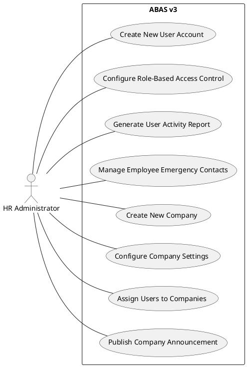

**Use Case 1: Create New User Account**

- **Use Case Diagram:**


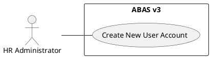

- **User Story:** As an HR Administrator, I want to be able to create new user accounts for employees so that they can access the ABAS v3 system and perform their job responsibilities.
- **Description:** The HR Administrator creates a new user account for a newly hired employee through the system's user interface, granting them access to the system and assigning appropriate permissions based on their role.
- **Primary Actor:** HR Administrator
- **Goals:**
    - Create a new user account with accurate employee information.
    - Assign the appropriate role and permissions to the new user.
    - Ensure the new user can access the system with their credentials.
- **Stakeholders:**
    - Newly hired employee
    - IT Administrator (if involved in user account setup)
- **Pre-conditions:**
    - The employee's information is available.
    - The HR Administrator has the necessary permissions to create user accounts.
- **Post-conditions:**
    - A new user account is created in the system.
    - The new user is assigned the correct role and permissions.
    - The new user can log in to the system.
- **Basic Flow:**
    1. The HR Administrator navigates to the "User Management" module in the ABAS v3 web application.
    2. The system displays the "User Creation" form.
    3. The HR Administrator enters the employee's information, including name, employee ID, department, and role.
    4. The HR Administrator selects the company the user belongs to.
    5. The system validates the entered information and generates a username and temporary password.
    6. The system displays the generated credentials.
    7. The HR Administrator assigns the appropriate role and permissions.
    8. The HR Administrator submits the form.
    9. The system creates the new user account and displays a confirmation message.
    10. The HR Administrator notifies the new employee of their login credentials.
    11. The system logs the user creation event in the `logs` table, including the user ID, timestamp, and details of the created account.
- **Alternate Paths:**
    - If the employee ID already exists, the system displays an error message.
    - If the HR Administrator does not have the necessary permissions, the action is denied.
- **Sequence Diagram:**

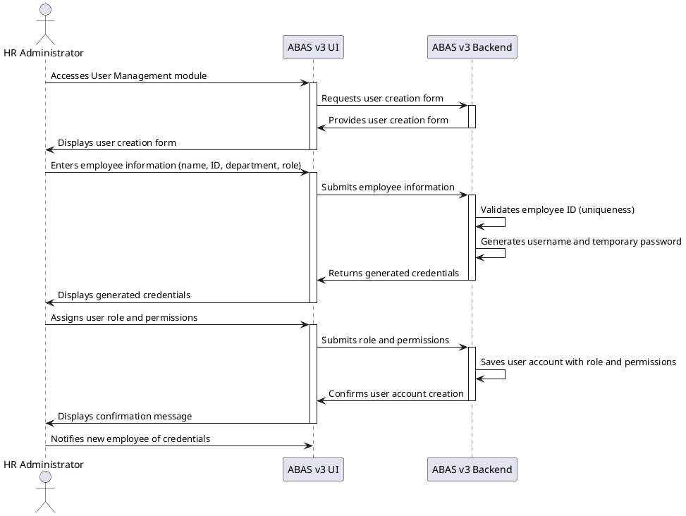

- **UI Mockups:**
    - Screen Flow:
        1. User Management Dashboard: [Link to Figma prototype for User Management Dashboard]
        2. User Creation Form:
            - Fields: `first_name`, `last_name`, `middle_name`, `suffix`, `date_of_birth`, `gender`, `civil_status`, `nationality`, `username`, `email`, `role_id`, `department_id`, `employee_id`, `hire_date`, `position`, `salary`, `pay_frequency`, `company_id`
            [Link to Figma prototype for User Creation Form]
        3. Role and Permission Selection:
            - Fields: `role_id`, `permissions`, `additional_permissions`
            [Link to Figma prototype for Role and Permission Selection]
        4. User Account Confirmation: [Link to Figma prototype for User Account Confirmation]
        5. Success Message: [Link to Figma prototype for Success Message]

**Use Case 2: Configure Role-Based Access Control**

- **Use Case Diagram:**


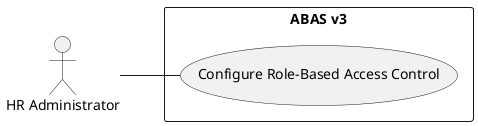

- **User Story:** As an HR Administrator, I want to be able to configure role-based access control so that I can manage user permissions efficiently and ensure data security.
- **Description:** The HR Administrator configures role-based access control (RBAC) through the system's interface to define permissions for different user roles within the system. This ensures that users can only access information and functionalities relevant to their job responsibilities.
- **Primary Actor:** HR Administrator
- **Goals:**
    - Define and manage user roles with appropriate permissions.
    - Ensure data security and confidentiality by restricting access to sensitive information.
    - Streamline user management by assigning roles instead of individual permissions.
- **Stakeholders:**
    - All system users
    - IT Administrator
    - Data Privacy Officer
- **Pre-conditions:**
    - The HR Administrator has the necessary permissions to manage roles and permissions.
    - The system has predefined roles or the ability to create new roles.
- **Post-conditions:**
    - User roles are defined with specific permissions to access modules and functionalities.
    - Users are assigned to roles that align with their job responsibilities.
    - Access to sensitive data and functionalities is restricted based on roles.
- **Basic Flow:**
    1. The HR Administrator navigates to the "Role Management" module in the ABAS v3 web application.
    2. The system displays the available roles and options to create new roles or edit existing ones.
    3. The HR Administrator selects a role to configure or creates a new role.
    4. The system displays the role configuration interface, showing the available permissions for modules, functionalities, and data entities.
    5. The HR Administrator assigns permissions to the role by checking or unchecking boxes or using other UI elements to grant or deny access.
    6. The HR Administrator saves the role configuration.
    7. The HR Administrator assigns users to the configured role through the interface, selecting users from a list or searching for them by name or ID.
    8. The system updates the user roles and displays a confirmation message.
    9. The system logs the role configuration changes in the `logs` table, including the user ID, timestamp, and details of the modified roles and permissions.
- **Alternate Paths:**
    - If the HR Administrator attempts to assign conflicting permissions, the system displays an error message.
    - If the HR Administrator does not have the necessary permissions, the action is denied.
- **Sequence Diagram:**

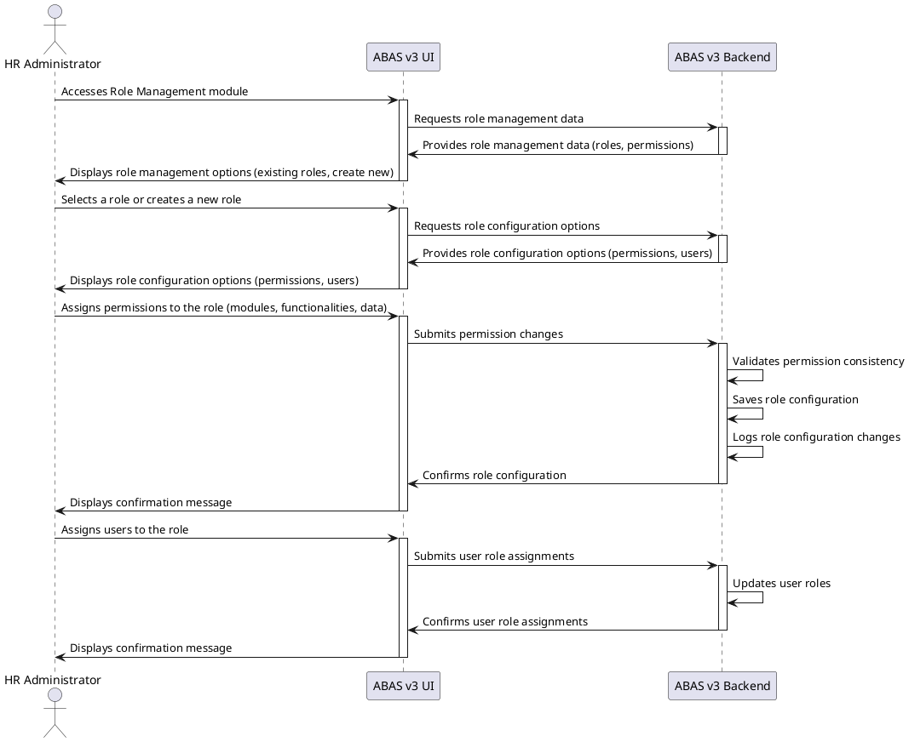

- **UI Mockups:**
    - Screen Flow:
        1. Role Management Dashboard: [Link to Figma prototype for Role Management Dashboard]
        2. Role Creation/Edit:
            - Fields: `role_name`, `description`, `permissions` (list of permissions with checkboxes or similar UI elements for each module/functionality)
            [Link to Figma prototype for Role Creation/Edit]
        3. Permission Assignment: [Link to Figma prototype for Permission Assignment]
        4. User Role Assignment: [Link to Figma prototype for User Role Assignment]
        5. Role Configuration Confirmation: [Link to Figma prototype for Role Configuration Confirmation]

**Use Case 3: Generate User Activity Report**

- **Use Case Diagram:**

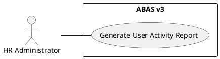

- **User Story:** As an HR Administrator, I want to be able to generate reports on user activity so that I can monitor system usage, identify potential security risks, and gather data for audits.
- **Description:** The HR Administrator generates a report on user activity within the system through the reporting interface. This report provides insights into user login patterns, module access, and other relevant information for monitoring system usage and identifying potential security risks.
- **Primary Actor:** HR Administrator
- **Goals:**
    - Gain insights into user activity patterns and system usage.
    - Identify potential security risks or anomalies in user behavior.
    - Gather data for audit trails and compliance reporting.
    - Monitor system performance and resource utilization.
- **Stakeholders:**
    - IT Administrator
    - Security Officer
    - Management
- **Pre-conditions:**
    - The system logs user activity data, such as login times, module access, and actions performed.
    - The HR Administrator has the necessary permissions to generate user activity reports.
- **Post-conditions:**
    - A report is generated, providing details on user activity within the system.
    - The report can be exported or saved for further analysis or archiving.
- **Basic Flow:**
    1. The HR Administrator navigates to the "Reporting" module in the ABAS v3 web application.
    2. The system displays the available reporting options.
    3. The HR Administrator selects the "User Activity Report."
    4. The system displays the report configuration options, allowing the HR Administrator to specify the reporting period, filters, and output format.
    5. The HR Administrator enters the desired reporting period and any filtering criteria (e.g., specific users, modules, or actions).
    6. The HR Administrator submits the report request.
    7. The system generates the report, retrieving and processing the relevant user activity data.
    8. The system displays the generated report, showing data such as user login times, last login date, modules accessed, and actions performed.
    9. The HR Administrator reviews the report and can optionally export it in various formats (e.g., PDF, CSV) or save it for later reference.
    10. The system logs the report generation event in the `logs` table, including the user ID, timestamp, and report parameters.
- **Alternate Paths:**
    - If no data is available for the specified reporting period, the system displays a message indicating no data found.
    - If the HR Administrator does not have the necessary permissions, the action is denied.
- **Sequence Diagram:**

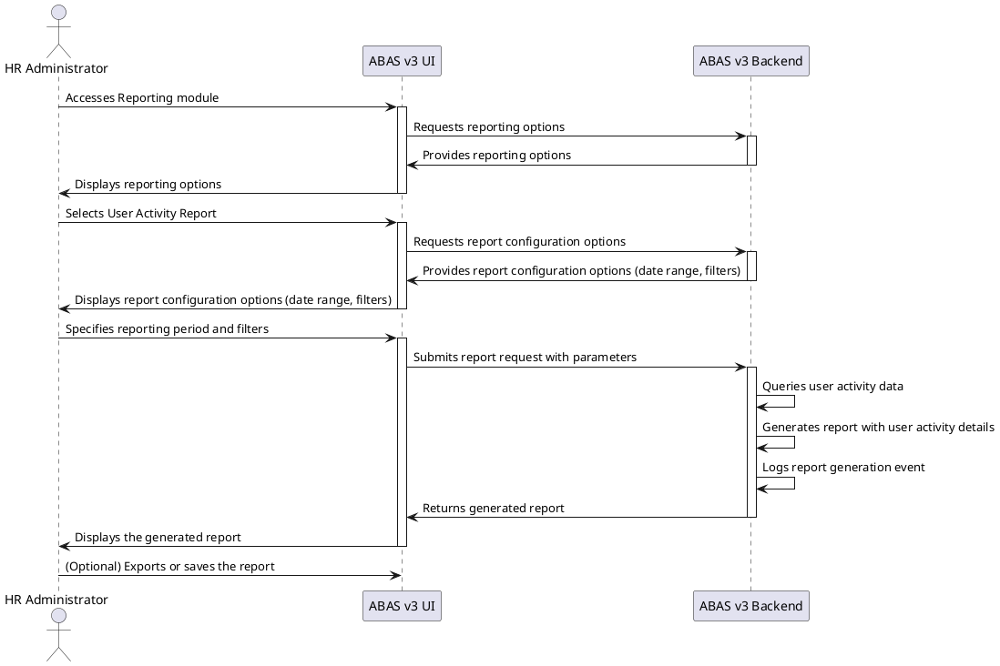

- **UI Mockups:**
    - Screen Flow:
        1. Reporting Module Home: [Link to Figma prototype for Reporting Module Home]
        2. User Activity Report: [Link to Figma prototype for User Activity Report]
        3. Report Configuration:
            - Fields: `report_period_start_date`, `report_period_end_date`, `filters` (e.g., user selection, module selection, action selection)
            [Link to Figma prototype for Report Configuration]
        4. Generated Report: [Link to Figma prototype for Generated Report]

**Use Case 4: Manage Employee Emergency Contacts**

- **Use Case Diagram:**

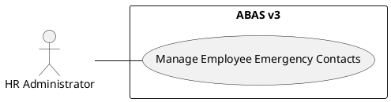

- **User Story:** As an HR Administrator, I want to be able to manage emergency contact information for employees so that I can ensure that the company has up-to-date contact details in case of emergencies.
- **Description:** The HR Administrator adds, updates, or removes emergency contact information for employees in the system. This information is stored in the `other_employee_data` field in the `employees` table, which allows for flexible storage of additional employee-related data.
- **Primary Actor:** HR Administrator
- **Goals:**
    - Maintain accurate and up-to-date emergency contact information for all employees.
    - Ensure that the information is readily accessible in case of emergencies.
- **Stakeholders:**
    - Employees
    - Managers
    - Emergency responders
- **Pre-conditions:**
    - The HR Administrator has the necessary permissions to manage employee data.
- **Post-conditions:**
    - Emergency contact information is updated in the employee's record.
- **Basic Flow:**
    1. The HR Administrator navigates to the "Employee Management" module in the ABAS v3 web application.
    2. The HR Administrator selects the employee whose emergency contact information needs to be managed.
    3. The system displays the employee's details, including the current emergency contact information.
    4. The HR Administrator adds, updates, or removes emergency contact information as needed.
    5. The HR Administrator saves the changes.
    6. The system updates the employee's record with the new emergency contact information.
    7. The system logs the emergency contact update event in the `logs` table, including the user ID, timestamp, and details of the changes made.
- **Alternate Paths:**
    - If the HR Administrator tries to enter invalid data (e.g., an invalid phone number format), the system displays an error message.
- **Sequence Diagram:**


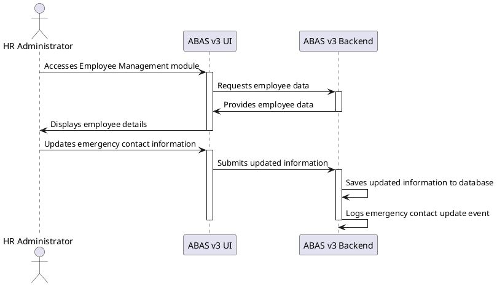

- **UI Mockups:**
    - Screen Flow:
        1. Employee Management Dashboard: [Link to Figma prototype for Employee Management Dashboard]
        2. Employee Details:
            - Fields: `emergency_contact_name`, `emergency_contact_relationship`, `emergency_contact_phone`
            [Link to Figma prototype for Employee Details]

**Use Case 5: Create New Company**

- **Use Case Diagram:**


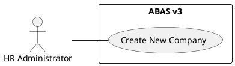

- **User Story:** As an HR Administrator, I want to be able to create new company records in the system so that we can manage information and settings for multiple companies within the same ABAS v3 instance.
- **Description:** The HR Administrator creates a new company within the ABAS v3 system, defining its basic information and settings.
- **Primary Actor:** HR Administrator
- **Goals:**
    - Create a new company record with accurate information.
    - Configure basic settings for the company, such as document numbering and default currency.
- **Stakeholders:**
    - HR Administrator
    - System Administrator
- **Pre-conditions:**
    - The HR Administrator has the necessary permissions to create companies.
- **Post-conditions:**
    - A new company record is created in the system.
    - Basic company settings are configured.
- **Basic Flow:**
    1. The HR Administrator navigates to the "Company Management" module.
    2. The HR Administrator clicks on "Create New Company."
    3. The system displays the company creation form.
    4. The HR Administrator enters the company information, such as name, address, contact details, and abbreviation.
    5. The HR Administrator configures basic settings for the company, such as document numbering format and default currency.
    6. The HR Administrator saves the new company record.
    7. The system logs the company creation event in the `logs` table, including the user ID, timestamp, and company details.
- **Alternate Paths:**
    - If a company with the same name or abbreviation already exists, the system displays an error message.
- **Sequence Diagram:**


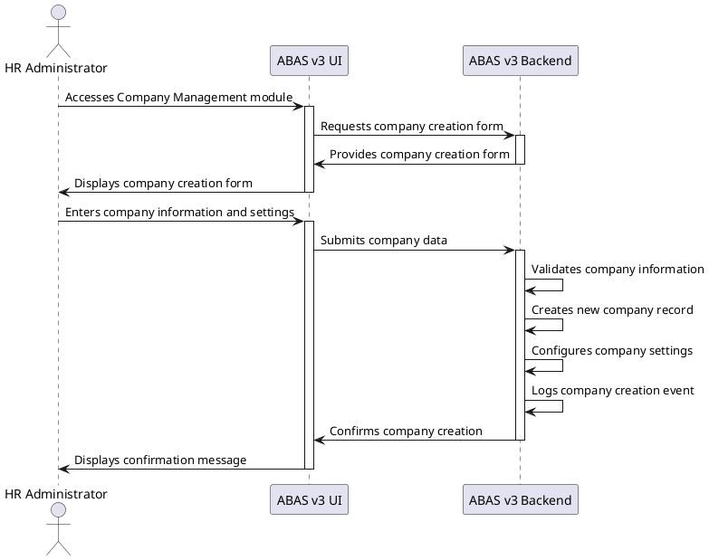

- **UI Mockups:**
    - Screen Flow:
        1. Company Management Dashboard: [Link to Figma prototype for Company Management Dashboard]
        2. Company Creation Form:
            - Fields: `company_name`, `address`, `contact_details`, `abbreviation`, `document_numbering_format`, `default_currency`
            [Link to Figma prototype for Company Creation Form]

**Use Case 6: Configure Company Settings**

- **Use Case Diagram:**


- **User Story:** As an HR Administrator, I want to be able to configure settings for different companies so that I can customize the system to meet each company's specific requirements.
- **Description:** The HR Administrator configures various settings for a specific company, such as document numbering, default currency, and other company-specific preferences.
- **Primary Actor:** HR Administrator
- **Goals:**
    - Customize company settings to meet specific requirements.
    - Ensure consistency in document numbering and other company-specific processes.
- **Stakeholders:**
    - HR Administrator
    - System Administrator
    - Users within the company
- **Pre-conditions:**
    - The HR Administrator has the necessary permissions to configure company settings.
    - The company record exists in the system.
- **Post-conditions:**
    - Company settings are updated and saved in the system.
- **Basic Flow:**
    1. The HR Administrator navigates to the "Company Management" module.
    2. The HR Administrator selects the company to configure.
    3. The system displays the company settings page.
    4. The HR Administrator modifies the company settings as needed, such as document numbering format, default currency, and other preferences.
    5. The HR Administrator saves the updated settings.
    6. The system logs the company settings update event in the `logs` table, including the user ID, timestamp, and details of the modified settings.
- **Alternate Paths:**
    - If the HR Administrator tries to enter invalid settings (e.g., an invalid document numbering format), the system displays an error message.
- **Sequence Diagram:**


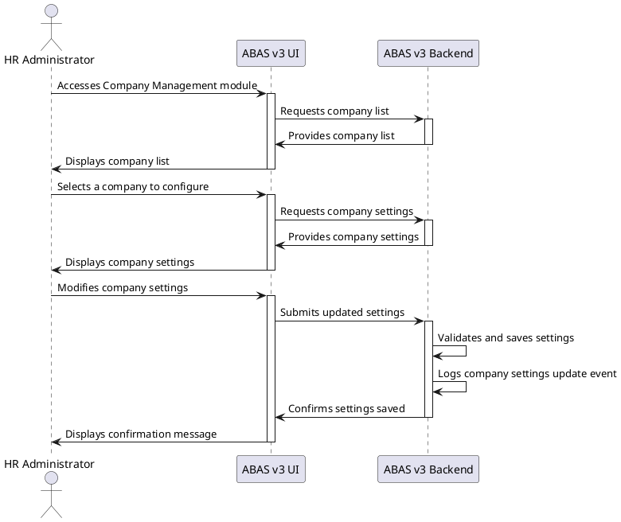

- **UI Mockups:**
    - Screen Flow:
        1. Company Management Dashboard: [Link to Figma prototype for Company Management Dashboard]
        2. Company Settings Page:
            - Fields: `document_numbering_format`, `default_currency`, `other_company_settings`
            [Link to Figma prototype for Company Settings Page]

**Use Case 7: Assign Users to Companies**

- **Use Case Diagram:**


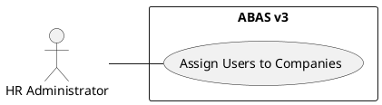

- **User Story:** As an HR Administrator, I want to be able to assign users to specific companies so that I can control their access to company-specific data and functionalities.
- **Description:** The HR Administrator assigns users to specific companies, granting them access to the relevant company data and functionalities within ABAS v3.
- **Primary Actor:** HR Administrator
- **Goals:**
    - Control user access to company-specific data and functionalities.
    - Ensure that users can only access information relevant to their assigned company.
- **Stakeholders:**
    - HR Administrator
    - Users
- **Pre-conditions:**
    - The HR Administrator has the necessary permissions to assign users to companies.
    - The user and company records exist in the system.
- **Post-conditions:**
    - Users are assigned to their respective companies.
    - Users can only access data and functionalities related to their assigned company.
- **Basic Flow:**
    1. The HR Administrator navigates to the "User Management" module.
    2. The HR Administrator selects the user to assign to a company.
    3. The system displays the user's profile and company assignment options.
    4. The HR Administrator selects the company from a list of available companies.
    5. The HR Administrator saves the user's company assignment.
    6. The system logs the user-company assignment event in the `logs` table, including the user ID, timestamp, and company assignment details.
- **Alternate Paths:**
    - If the user is already assigned to a company, the HR Administrator can modify the assignment to a different company.
- **Sequence Diagram:**


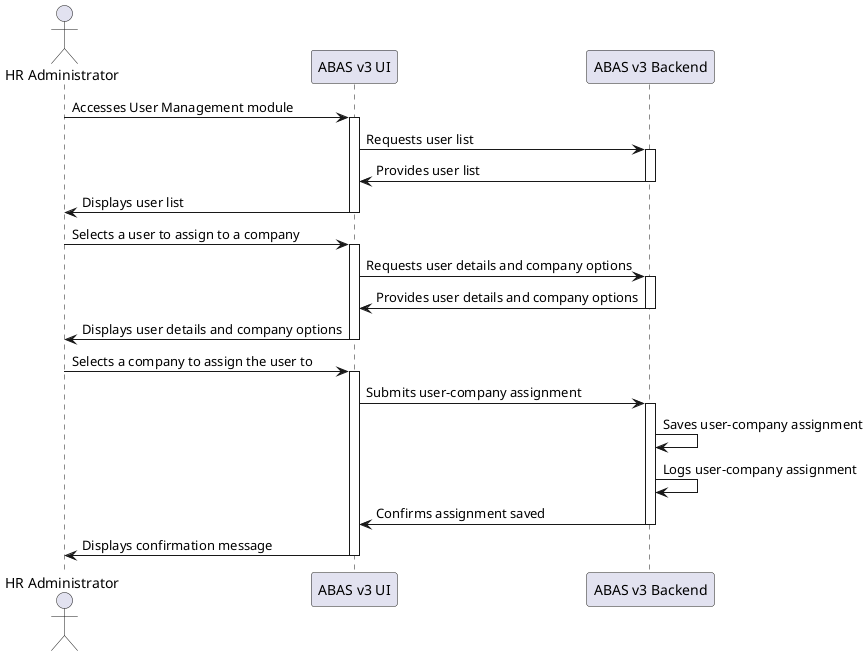

- **UI Mockups:**
    - Screen Flow:
        1. User Management Dashboard: [Link to Figma prototype for User Management Dashboard]
        2. User Profile: [Link to Figma prototype for User Profile]
        3. Company Assignment:
            - Fields: `user_id`, `company_id` (dropdown or searchable list of companies)
            [Link to Figma prototype for Company Assignment]

**Use Case 8: Publish Company Announcement**

- **Use Case Diagram:**


- **User Story:** As an HR Administrator, I want to be able to publish company announcements to the dashboard so that employees can easily stay informed about important company updates, events, and news.
- **Description:** An HR administrator publishes a company-wide announcement about an upcoming holiday.
- **Primary Actor:** HR Administrator
- **Goals:**
    - Inform employees about the upcoming holiday.
    - Ensure the announcement is visible to all relevant employees.
- **Stakeholders:**
    - HR Administrator
    - All employees
- **Pre-conditions:**
    - The HR Administrator has the necessary permissions to create and publish announcements.
- **Post-conditions:**
    - The announcement is published and visible to all employees on their dashboards.
- **Basic Flow:**
    1. The HR Administrator navigates to the "Announcements" module.
    2. The HR Administrator clicks on "Create New Announcement."
    3. The system displays the announcement creation form.
    4. The HR Administrator enters the announcement title, content, and selects the category (e.g., "HR") and target audience (e.g., "All Employees").
    5. The HR Administrator sets the publishing date and (optional) expiration date.
    6. The HR Administrator publishes the announcement.
    7. The system logs the announcement publishing event in the `logs` table, including the user ID, timestamp, and announcement details.
- **Alternate Paths:**
    - The HR Administrator can save the announcement as a draft and publish it later.
- **Sequence Diagram:**


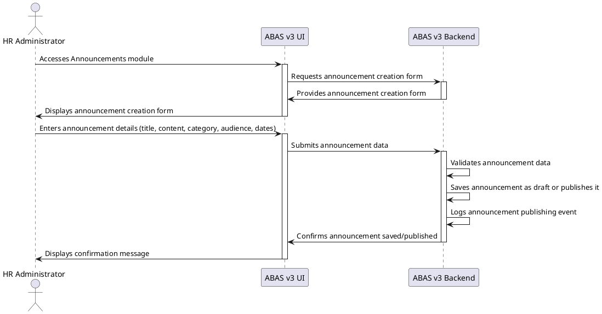

- **UI Mockups:**
    - Screen Flow:
        1. Announcements Dashboard: [Link to Figma prototype for Announcements Dashboard]
        2. Announcement Creation Form:
            - Fields: `title`, `content`, `category`, `target_audience`, `published_at`, `expires_at`
            [Link to Figma prototype for Announcement Creation Form]

## 4.2 IT Administrator

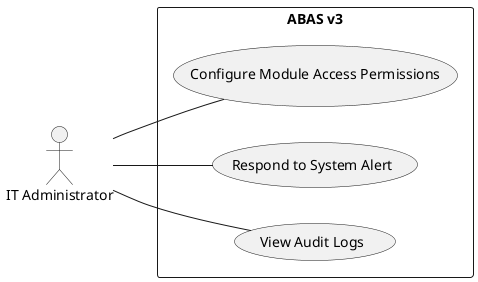

**Use Case 1: Configure Module Access Permissions**

- **Use Case Diagram:**


- **User Story:** As an IT Administrator, I want to be able to configure module access permissions so that I can control which user roles have access to different parts of the system, ensuring data security and preventing unauthorized access.
- **Description:** The IT Administrator configures access permissions for specific modules within ABAS v3, controlling which user roles can access and interact with different parts of the system. This ensures that sensitive data and functionalities are protected and only accessible to authorized personnel.
- **Primary Actor:** IT Administrator
- **Goals:**
    - Define and manage access permissions for different modules.
    - Restrict access to sensitive modules and data based on user roles.
    - Maintain system security and prevent unauthorized access.
- **Stakeholders:**
    - All system users
    - HR Administrator
    - Data Privacy Officer
- **Pre-conditions:**
    - The IT Administrator has the necessary permissions to manage module access.
    - The system has predefined modules with configurable access settings.
- **Post-conditions:**
    - Modules have defined access permissions based on user roles.
    - Users can only access modules and functionalities that are relevant to their roles and responsibilities.
    - Unauthorized access to sensitive modules and data is prevented.
- **Basic Flow:**
    1. The IT Administrator navigates to the "System Configuration" module in the ABAS v3 web application.
    2. The system displays the available configuration options, including "Module Access Permissions."
    3. The IT Administrator selects "Module Access Permissions."
    4. The system displays a list of modules with their current access settings.
    5. The IT Administrator chooses a module to configure.
    6. The system displays the access configuration settings for the selected module, showing which user roles have access and what level of access they have (e.g., view, edit, delete).
    7. The IT Administrator modifies the access settings as needed, granting or denying access to specific roles.
    8. The IT Administrator saves the module access configuration.
    9. The system updates the access permissions for the module, and the changes are reflected immediately or upon the next user login.
    10. The system logs the module access permission changes in the `logs` table, including the user ID, timestamp, and details of the modified permissions.
- **Alternate Paths:**
    - If the IT Administrator attempts to configure conflicting permissions, the system displays an error message.
    - If the IT Administrator does not have the necessary permissions, the action is denied.
- **Sequence Diagram:**


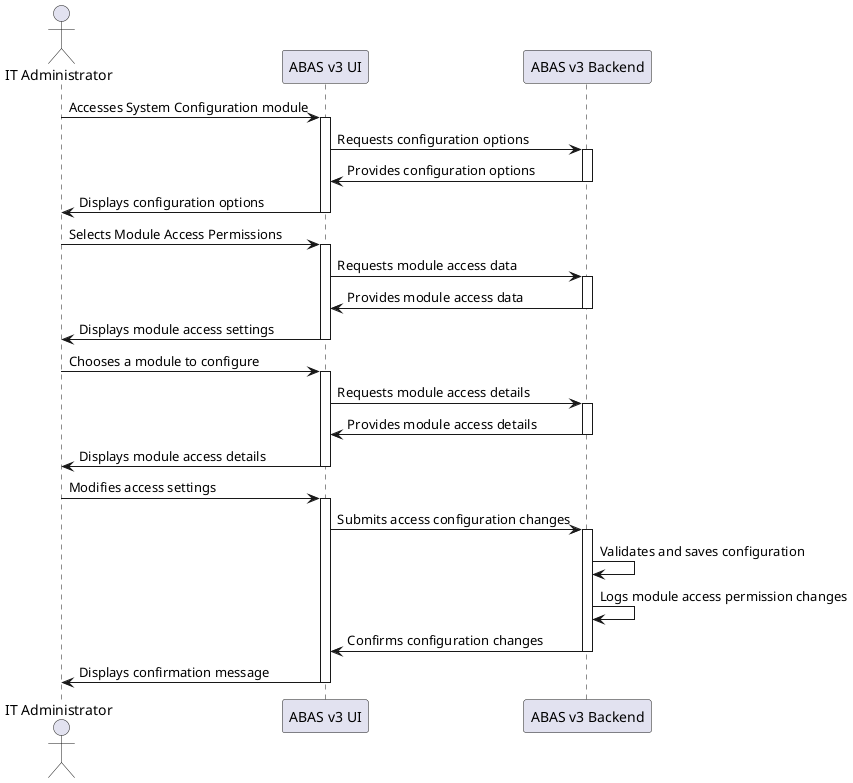

- **UI Mockups:**
    - Screen Flow:
        1. System Configuration Dashboard: [Link to Figma prototype for System Configuration Dashboard]
        2. Module Access Permissions: [Link to Figma prototype for Module Access Permissions]
        3. Module Selection:
            - Fields: `module_name` (dropdown or searchable list of modules)
            [Link to Figma prototype for Module Selection]
        4. Access Settings:
            - Fields: `module_name`, `role_name`, `permissions` (e.g., view, edit, delete - represented as checkboxes or similar UI elements)
            [Link to Figma prototype for Access Settings]
        5. Modify Access:
            - Fields: `role_name` (dropdown or searchable list of roles), `permissions` (list of permissions with checkboxes or similar UI elements for each module/functionality)
            [Link to Figma prototype for Modify Access]
        6. Confirmation:
            - Displays a summary of the module access configuration changes for final review before saving.
            [Link to Figma prototype for Confirmation]

**Use Case 2: Respond to System Alert**

- **Use Case Diagram:**


```plantuml
@startuml
left to right direction

actor "IT Administrator" as ITAdmin

rectangle "ABAS v3" {
  ITAdmin -- (Respond to System Alert)
}
@enduml
```

- **User Story:** As an IT Administrator, I want to be notified of system alerts, such as data breaches or unauthorized access attempts, and have access to tools and information within the system to investigate and respond to these incidents effectively.
- **Description:** The IT Administrator receives a system-generated alert indicating a critical security incident, such as a data breach or unauthorized access attempt. This may include alerts related to suspicious token activity, such as multiple failed login attempts or unauthorized token usage. The IT Administrator investigates the alert, diagnoses the problem, and takes appropriate action to contain the incident, mitigate its impact, and restore system security. This may involve revoking suspicious tokens, resetting user passwords, or implementing additional security measures.
- **Primary Actor:** IT Administrator
- **Goals:**
    - Respond to security alerts promptly and efficiently.
    - Investigate and diagnose security incidents effectively.
    - Contain and mitigate security breaches to minimize data loss and damage.
    - Restore system security and prevent future incidents.
    - Document security incidents and response actions.
- **Stakeholders:**
    - All system users
    - Security Officer
    - Data Privacy Officer
    - Management
- **Pre-conditions:**
    - The system has monitoring and alerting capabilities for detecting security incidents.
    - The IT Administrator has the necessary permissions to access and respond to security alerts.
- **Post-conditions:**
    - The security alert is acknowledged and investigated.
    - The security incident is contained and mitigated.
    - System security is restored.
    - Preventive measures are taken to avoid similar incidents in the future.
- **Basic Flow:**
    1. The IT Administrator receives a system-generated alert through the ABAS v3 dashboard or notification system, indicating a potential security incident.
    2. The IT Administrator acknowledges the alert and accesses the relevant module or interface in ABAS v3 to gather more information about the incident.
    3. The IT Administrator analyzes system logs, security events, access records, and other relevant data to determine the nature and scope of the security incident.
    4. The IT Administrator takes immediate action to contain the incident, such as blocking unauthorized access, isolating affected systems, or suspending user accounts.
    5. The IT Administrator investigates the root cause of the incident, identifies vulnerabilities, and implements corrective actions to prevent future occurrences.
    6. The IT Administrator verifies that the incident is resolved and system security is restored.
    7. The IT Administrator documents the incident, including the timeline, actions taken, and lessons learned, to improve future incident response efforts.
    8. The system logs the alert response and actions taken in the `logs` table, including the user ID, timestamp, and alert details.
- **Alternate Paths:**
    - If the IT Administrator cannot resolve the incident, they may escalate it to a higher level of support or involve security experts.
    - If the alert is a false positive, the IT Administrator adjusts the monitoring and alerting rules to prevent future false alarms.
- **Sequence Diagram:**


```plantuml
@startuml
actor "IT Administrator" as ITAdmin
participant "ABAS v3 UI" as UI
participant "ABAS v3 Backend" as Backend

UI -> ITAdmin: Displays system alert (data breach, unauthorized access)
activate UI

ITAdmin -> UI: Acknowledges alert and requests details
activate Backend
Backend -> UI: Provides alert details and related data (logs, etc.)
deactivate Backend
UI -> ITAdmin: Displays alert details and system information
deactivate UI

ITAdmin -> UI: Initiates actions to contain the incident (e.g., block access)
activate Backend
Backend -> Backend: Executes containment actions
Backend -> UI: Confirms action completion
deactivate Backend
UI -> ITAdmin: Confirms action completion
deactivate UI

ITAdmin -> UI: Investigates the incident (analyzes logs, etc.)
activate Backend
Backend -> UI: Provides additional data for investigation
deactivate Backend

ITAdmin -> UI: Takes corrective actions (e.g., update security, patch vulnerabilities)
activate Backend
Backend -> Backend: Executes corrective actions
Backend -> UI: Confirms action completion
deactivate Backend
UI -> ITAdmin: Confirms action completion
deactivate UI

ITAdmin -> UI: Documents the incident and actions taken
activate Backend
Backend -> Backend: Saves incident report and logs
Backend -> UI: Confirms report submission
deactivate Backend
UI -> ITAdmin: Confirms report submission
deactivate UI
@enduml
```

- **UI Mockups:**
    - Screen Flow:
        1. System Alert Notification: [Link to Figma prototype for System Alert Notification]
        2. Alert Details: [Link to Figma prototype for Alert Details]
        3. Incident Investigation: [Link to Figma prototype for Incident Investigation]
        4. Containment Actions: [Link to Figma prototype for Containment Actions]
        5. Corrective Actions: [Link to Figma prototype for Corrective Actions]
        6. Incident Reporting: [Link to Figma prototype for Incident Reporting]

## 4.3 Employee

- **Use Case Diagram:**


```plantuml
@startuml
left to right direction

actor "Employee" as Employee

rectangle "ABAS v3" {
  Employee -- (Log in to the System)
  Employee -- (Submit a Ticket)
  Employee -- (Manage Tasks and Information on Dashboard)
  Employee -- (Send Message to Employee)
  Employee -- (View Messages)
  Employee -- (Manage Messaging Consent)
  Employee -- (Update Contact Information)
}
@enduml
```

**Use Case 1: Log in to the System**

- **Use Case Diagram:**

```plantuml
@startuml
left to right direction

actor "Employee" as Employee

rectangle "ABAS v3" {
  Employee -- (Log in to the System)
}
@enduml
```

- **User Story:** As an employee, I want to be able to log in to the system securely so that I can access my personal information, tasks, and other relevant resources.
- **Description:** An employee logs in to the ABAS v3 system using their unique credentials. The system generates an authentication token upon successful login, which is stored in the `tokens` table. This token is then used to authenticate subsequent requests from the employee, providing secure access to their personalized dashboard, tasks, and relevant information.
- **Primary Actor:** Employee
- **Goals:**
    - Access the ABAS v3 system securely.
    - View their personalized dashboard and relevant information.
    - Access and manage assigned tasks and notifications.
- **Stakeholders:**
    - IT Administrator (for account management and security)
    - HR Administrator (for employee data management)
- **Pre-conditions:**
    - The employee has an active user account.
    - The employee knows their correct username and password.
- **Post-conditions:**
    - The employee is logged in to the system.
    - The employee's personalized dashboard is displayed.
    - The employee can access and manage their assigned tasks and notifications.
- **Basic Flow:**
    1. The employee opens the ABAS v3 web application in their browser.
    2. The system displays the login page.
    3. The employee enters their username and password into the login form.
    4. The employee clicks the "Login" button (or similar).
    5. The system verifies the credentials against the user database.
    6. If the credentials are valid, the system generates an authentication token.
    7. The system stores the token in the `tokens` table, along with the token expiration time and device information.
    8. The system sends the token to the employee's browser (e.g., in a cookie or local storage).
    9. The employee is redirected to their personalized dashboard.
    10. For subsequent requests, the employee's browser sends the token to the server for authentication.
    11. The server validates the token against the `tokens` table, checking its validity and expiration time.
    12. If the token is valid, the server grants access to the requested resources.
    13. The system logs the successful login event in the `logs` table, including the user ID, timestamp,
- **Alternate Paths:**
    - If the credentials are invalid, the system displays an error message and prompts the employee to re-enter their credentials.
    - If the employee has forgotten their password, they can use the "Forgot Password" functionality to reset it.
    - If the employee's account is locked or inactive, they cannot log in and may need to contact the IT Administrator.
- **Sequence Diagram:**


```plantuml
@startuml
actor "Employee" as Employee
participant "ABAS v3 UI" as UI
participant "ABAS v3 Backend" as Backend

Employee -> UI: Opens ABAS v3 web application
activate UI
UI -> Employee: Displays login page
deactivate UI

Employee -> UI: Enters username and password
activate UI
UI -> Backend: Submits login credentials
activate Backend
Backend -> Backend: Authenticates user
Backend -> Backend: If successful, generates authentication token
Backend -> Backend: Stores token in `tokens` table
Backend -> UI: Returns authentication result (success/failure) and token (if successful)
deactivate Backend
UI -> Employee: If successful, redirects to dashboard and stores token
deactivate UI

Employee -> UI: (If successful) Accesses and manages tasks, notifications, etc.
activate UI
UI -> Backend: Sends requests with authentication token
activate Backend
Backend -> Backend: Validates token
Backend -> UI: Returns requested data or performs actions
deactivate Backend
deactivate UI
@enduml
```

- **UI Mockups:**
    - Screen Flow:
        1. Login Page:
            - Fields: `username`, `password`
            [Link to Figma prototype for Login Page]
        2. Personalized Dashboard: (Includes Task Management, Notifications, Quick Links, Personal Information, Time Management, Financial Information sections) [Link to Figma prototype for Personalized Dashboard]

**Use Case 2: Submit a Ticket**

- **Use Case Diagram:**


```plantuml
@startuml
left to right direction

actor "Employee" as Employee

rectangle "ABAS v3" {
  Employee -- (Submit a Ticket)
}
@enduml
```

- **User Story:** As an employee, I want to be able to submit a ticket to request assistance or report issues so that I can get help from the appropriate support team.
- **Description:** An employee submits a ticket to the IT support team or other relevant department to report an issue, request assistance, or seek information.
- **Primary Actor:** Employee
- **Goals:**
    - Report an issue or problem.
    - Request assistance or information.
    - Track the status of their request.
- **Stakeholders:**
    - IT Support Team
    - Relevant department or personnel assigned to address the ticket
- **Pre-conditions:**
    - The employee is logged in to the system.
    - The employee has access to the Ticket System module.
- **Post-conditions:**
    - A new ticket is created in the system.
    - The ticket is assigned to the appropriate department or personnel.
    - The employee receives a confirmation of their ticket submission.
- **Basic Flow:**
    1. The employee navigates to the "Ticket System" module in the ABAS v3 web application.
    2. The system displays the ticket submission form.
    3. The employee selects the appropriate category for their ticket (e.g., IT support, HR inquiry, maintenance request).
    4. The employee fills out the ticket form, providing details about the issue or request, including subject, description, and any relevant attachments.
    5. The employee submits the ticket.
    6. The system validates the ticket information and assigns it to the appropriate department or personnel based on the category and content.
    7. The system displays a confirmation message with the ticket ID and contact information for the assigned support team.
    8. The system logs the ticket submission event in the `logs` table, including the user ID, timestamp, and ticket details.
- **Alternate Paths:**
    - If the employee does not select a category or provides incomplete information, the system may prompt them to complete the required fields.
    - If the system cannot automatically assign the ticket, it may be routed to a general support queue for manual assignment.
- **Sequence Diagram:**


```plantuml
@startuml
actor "Employee" as Employee
participant "ABAS v3 UI" as UI
participant "ABAS v3 Backend" as Backend

Employee -> UI: Accesses Ticket System module
activate UI
UI -> Backend: Requests ticket submission form
activate Backend
Backend -> UI: Provides ticket submission form
deactivate Backend
UI -> Employee: Displays ticket submission form
deactivate UI

Employee -> UI: Selects ticket category and enters details
activate UI
UI -> Backend: Submits ticket data
activate Backend
Backend -> Backend: Validates ticket information
Backend -> Backend: Assigns ticket to appropriate department/personnel
Backend -> UI: Returns ticket confirmation
deactivate Backend
UI -> Employee: Displays ticket confirmation message
deactivate UI
@enduml
```

- **UI Mockups:**
    - Screen Flow:
        1. Ticket System Dashboard: The employee starts at the Ticket System Dashboard, which may display existing tickets and options for creating new tickets. [Link to Figma prototype for Ticket System Dashboard]
        2. Ticket Submission Form: The employee opens the Ticket Submission Form to enter the ticket details. [Link to Figma prototype for Ticket Submission Form]
        3. Ticket Confirmation: After submitting the ticket, the employee sees a confirmation message with the ticket ID and contact information. [Link to Figma prototype for Ticket Confirmation]

**Use Case 3: Manage Tasks and Information on Dashboard**

- **Use Case Diagram:**


```plantuml
@startuml
left to right direction

actor "Employee" as Employee

rectangle "ABAS v3" {
  Employee -- (Manage Tasks and Information on Dashboard)
}
@enduml
```

- **User Story:** As an employee, I want to have a personalized dashboard that displays my tasks, notifications, and relevant information so that I can stay organized and manage my work efficiently.
- **Description:** An employee accesses their personalized dashboard to view, manage, and interact with assigned tasks, notifications, and relevant information.
- **Primary Actor:** Employee
- **Goals:**
    - View and manage assigned tasks.
    - Stay informed about notifications and updates.
    - Access relevant information and resources.
    - Complete tasks and update their status.
- **Stakeholders:**
    - Managers (for task assignment and approval)
    - HR Department (for HR-related tasks and information)
    - Other departments or teams involved in assigned tasks
- **Pre-conditions:**
    - The employee is logged in to the system.
    - The employee has a personalized dashboard configured with relevant widgets and functionalities.
- **Post-conditions:**
    - The employee has viewed and interacted with their assigned tasks, notifications, and information.
    - Tasks may be completed or updated, and their status reflected on the dashboard.
- **Basic Flow:**
    1. The employee is automatically directed to their personalized dashboard upon login.
    2. The dashboard displays various widgets and sections, such as:
        - **Task List:** Shows a list of assigned tasks with their status, priority, and due dates.
        - **Notifications:** Displays notifications for new tasks, updates, or important announcements.
        - **Information Center:** Provides access to relevant information and resources, such as company policies, HR documents, or performance reports.
        - **Calendar:** Shows upcoming events, deadlines, or personal appointments.
    3. The employee interacts with the widgets and sections on the dashboard, completing tasks, viewing notifications, or accessing information as needed.
- **Alternate Paths:**
    - If the employee does not have any assigned tasks or notifications, the corresponding sections on the dashboard may be empty or display a message indicating no pending items.
    - If the employee encounters an error or has difficulty completing a task, they may submit a ticket for assistance.
- **Sequence Diagram:**


```plantuml
@startuml
actor "Employee" as Employee
participant "ABAS v3 UI" as UI
participant "ABAS v3 Backend" as Backend

Employee -> UI: Accesses personalized dashboard
activate UI
UI -> Backend: Requests dashboard data (tasks, notifications, etc.)
activate Backend
Backend -> UI: Provides dashboard data
deactivate Backend
UI -> Employee: Displays personalized dashboard with widgets and information
deactivate UI

Employee -> UI: Interacts with dashboard widgets (completes tasks, views notifications, etc.)
activate UI
UI -> Backend: Updates task status, marks notifications as read, etc.
deactivate UI
@enduml
```

- **UI Mockups:**
    - Screen Flow:
        1. Personalized Dashboard: The employee's personalized dashboard is the central hub for managing tasks, notifications, and information. [Link to Figma prototype for Personalized Dashboard]
        2. Task Details: When the employee clicks on a task, the system displays detailed information about the task, including description, due date, and any related documents or information. [Link to Figma prototype for Task Details]
        3. Notification Center: The employee can access the Notification Center to view all notifications and their details. [Link to Figma prototype for Notification Center]
        4. Information Center: The employee can access the Information Center to view relevant documents, policies, and resources. [Link to Figma prototype for Information Center]

**Use Case 4: Send Message to Employee**

- **Use Case Diagram:**


```plantuml
@startuml
left to right direction

actor "Employee" as Employee

rectangle "ABAS v3" {
  Employee -- (Send Message to Employee)
}
@enduml
```

- **User Story:** As an employee, I want to be able to send messages to my colleagues within ABAS v3 so that I can communicate and collaborate with them efficiently.
- **Description:** A user sends a message to another employee within ABAS v3. The message can include text and emojis. Users can also attach image URLs, which will be displayed in the message.
- **Primary Actor:** Any user with messaging permissions.
- **Goals:**
    - Communicate with another employee.
    - Share information or collaborate on tasks.
- **Stakeholders:**
    - Sender
    - Recipient
- **Pre-conditions:**
    - The sender and recipient have active user accounts in ABAS v3.
    - The sender has the necessary permissions to send messages.
- **Post-conditions:**
    - The message is delivered to the recipient's inbox.
    - The message may be stored in the database based on the sender's and recipient's consent settings.
- **Basic Flow:**
    1. The sender navigates to the messaging module or accesses the messaging functionality from another module (e.g., Company Directory).
    2. The sender selects the recipient from the list of employees or enters their name/username.
    3. The sender composes the message, adding text and emojis as needed.
    4. The sender (optionally) adds image URLs as attachments.
    5. The sender sends the message.
    6. The system delivers the message to the recipient's inbox.
    7. The system may store a copy of the message in the database based on consent settings.
    8. The system logs the message sending event in the `logs` table, including the sender ID, recipient IDs, timestamp, and message content (if consent is given).
- **Alternate Paths:**
    - The sender may cancel the message before sending it.
- **Sequence Diagram:**


```plantuml
@startuml
actor "Employee" as Employee
participant "ABAS v3 UI" as UI
participant "ABAS v3 Backend" as Backend

Employee -> UI: Opens messaging interface
activate UI
UI -> Backend: Requests recipient list and messaging options
activate Backend
Backend -> UI: Provides recipient list and messaging options
deactivate Backend
UI -> Employee: Displays messaging interface with recipient list and options
deactivate UI

Employee -> UI: Selects recipient and composes message with text and emojis
activate UI
UI -> Backend: Submits message data
activate Backend
Backend -> Backend: Validates message data
Backend -> Backend: Sends message to recipient's inbox
Backend -> Backend: (Optional) Stores message in database based on consent settings
Backend -> UI: Confirms message sent
deactivate Backend
UI -> Employee: Displays confirmation message
deactivate UI
@enduml
```

- **UI Mockups:**
    - Screen Flow:
        1. Messaging Interface:
            - Fields: `recipient` (user selection), `message_content` (text field with emoji support), `attachments` (optional field for image URLs)
            [Link to Figma prototype for Messaging Interface]
        2. Message Inbox: [Link to Figma prototype for Message Inbox]

**Use Case 5: View Messages**

- **Use Case Diagram:**


```plantuml
@startuml
left to right direction

actor "Employee" as Employee

rectangle "ABAS v3" {
  Employee -- (View Messages)
}
@enduml
```

- **User Story:** As an employee, I want to be able to view messages sent to me within ABAS v3 so that I can stay informed and respond to my colleagues.
- **Description:** A user views messages in their inbox. The messages may contain text, emojis, and links to image attachments.
- **Primary Actor:** Any user with messaging permissions.
- **Goals:**
    - View received messages.
    - Read and respond to messages.
- **Stakeholders:**
    - Employee (recipient of messages)
    - Other employees who send messages
- **Pre-conditions:**
    - The employee is logged in to ABAS v3.
    - The employee has received messages in their inbox.
- **Post-conditions:**
    - The employee has viewed their received messages.
- **Basic Flow:**
    1. The employee navigates to the messaging module or accesses their inbox.
    2. The system displays the employee's inbox with a list of received messages.
    3. The employee selects a message to view its content.
    4. The system displays the message content, including text, emojis, and image attachments (if any).
- **Alternate Paths:**
    - The employee may choose to reply to a message, forward it, or mark it as unread.
    - If the employee has no new messages, the inbox may display a message indicating that.
- **Sequence Diagram:**


```plantuml
@startuml
actor "Employee" as Employee
participant "ABAS v3 UI" as UI
participant "ABAS v3 Backend" as Backend

Employee -> UI: Accesses Message Inbox
activate UI
UI -> Backend: Requests messages for the user
activate Backend
Backend -> UI: Provides messages data
deactivate Backend
UI -> Employee: Displays Message Inbox with list of messages
deactivate UI

Employee -> UI: Selects a message to view
activate UI
UI -> Backend: Requests message content
activate Backend
Backend -> UI: Provides message content (text, emojis, attachments)
deactivate Backend
UI -> Employee: Displays message content
deactivate UI
@enduml
```

- **UI Mockups:**
    - Screen Flow:
        1. Message Inbox:
            - Fields: `sender`, `timestamp`, `subject/preview`, `is_read`
            [Link to Figma prototype for Message Inbox]
        2. Message View:
            - Fields: `sender`, `recipients`, `timestamp`, `content` (text with emojis), `attachments` (image URLs)
            [Link to Figma prototype for Message View]

**Use Case 6: Manage Messaging Consent**

- **Use Case Diagram:**


```plantuml
@startuml
left to right direction

actor "Employee" as Employee

rectangle "ABAS v3" {
  Employee -- (Manage Messaging Consent)
}
@enduml
```

- **User Story:** As an employee, I want to be able to manage my messaging consent settings so that I can control whether my messages are stored in the system or not.
- **Description:** An employee manages their consent settings for the messaging feature, choosing whether to allow their messages to be stored in the database or not.
- **Primary Actor:** Employee
- **Goals:**
    - Control the privacy of their messages.
    - Choose whether to allow messages to be stored for future reference or not.
- **Stakeholders:**
    - Employee
    - Other employees who interact with the employee through messaging
- **Pre-conditions:**
    - The employee is logged in to ABAS v3.
- **Post-conditions:**
    - The employee's messaging consent settings are updated.
- **Basic Flow:**
    1. The employee navigates to their profile settings or the messaging settings section.
    2. The system displays the current messaging consent settings (e.g., a checkbox indicating whether message storage is enabled or disabled).
    3. The employee chooses to enable or disable message storage.
    4. The employee saves the changes.
    5. The system updates the employee's consent settings in the database.
    6. The system logs the consent change event in the `logs` table, including the user ID, timestamp, and the new consent setting.
- **Alternate Paths:**
    - The employee may choose to modify their consent settings at any time.
- **Sequence Diagram:**


```plantuml
@startuml
actor "Employee" as Employee
participant "ABAS v3 UI" as UI
participant "ABAS v3 Backend" as Backend

Employee -> UI: Accesses Messaging Settings
activate UI
UI -> Backend: Requests current consent settings
activate Backend
Backend -> UI: Provides consent settings
deactivate Backend
UI -> Employee: Displays consent settings (e.g., checkbox for enabling/disabling storage)
deactivate UI

Employee -> UI: Changes consent settings
activate UI
UI -> Backend: Submits updated consent settings
activate Backend
Backend -> Backend: Saves updated consent settings
Backend -> UI: Confirms settings saved
deactivate Backend
UI -> Employee: Displays confirmation message
deactivate UI
@enduml
```

- **UI Mockups:**
    - Screen Flow:
        1. Messaging Settings:
            - Fields: `consent_for_message_storage` (checkbox or similar control)
            [Link to Figma prototype for Messaging Settings]

**Use Case 7: Update Contact Information**

- **Use Case Diagram:**


```plantuml
@startuml
left to right direction

actor "Employee" as Employee

rectangle "ABAS v3" {
  Employee -- (Update Contact Information)
}
@enduml
```

- **User Story:** As an employee, I want to be able to update my contact information in the system so that my colleagues and the company can reach me easily.
- **Description:** An employee updates their contact information, such as their phone number, email address, or home address, through the "My Profile" module in ABAS v3.
- **Primary Actor:** Employee
- **Goals:**
    - Keep their contact information up-to-date in the system.
    - Ensure that the company has accurate contact details for communication and emergency purposes.
- **Stakeholders:**
    - Employee
    - HR Department
    - Managers
- **Pre-conditions:**
    - The employee is logged in to ABAS v3.
- **Post-conditions:**
    - The employee's contact information is updated in the system.
- **Basic Flow:**
    1. The employee navigates to the "My Profile" module.
    2. The employee selects the "Contact Information" tab or section.
    3. The system displays the employee's current contact information.
    4. The employee updates the necessary fields with their new information.
    5. The employee saves the changes.
    6. The system validates the entered information and updates the employee's record.
    7. The system logs the contact information update event in the `logs` table, including the user ID, timestamp, and the updated contact details.
- **Alternate Paths:**
    - If the employee enters invalid data (e.g., an incorrect email format), the system displays an error message and prompts the employee to correct the information.
- **Sequence Diagram:**


```plantuml
@startuml
actor "Employee" as Employee
participant "ABAS v3 UI" as UI
participant "ABAS v3 Backend" as Backend

Employee -> UI: Accesses My Profile module
activate UI
UI -> Backend: Requests employee's contact information
activate Backend
Backend -> UI: Provides contact information
deactivate Backend
UI -> Employee: Displays contact information
deactivate UI

Employee -> UI: Updates contact information
activate UI
UI -> Backend: Submits updated contact information
activate Backend
Backend -> Backend: Validates and saves contact information
Backend -> UI: Confirms update
deactivate Backend
UI -> Employee: Displays confirmation message
deactivate UI
@enduml
```

- **UI Mockups:**
    - Screen Flow:
        1. My Profile Dashboard: [Link to Figma prototype for My Profile Dashboard]
        2. Contact Information Form:
            - Fields: `phone_number`, `email_address`, `home_address`, `other_contact_details`
            [Link to Figma prototype for Contact Information Form]

## 4.4 Manager


```plantuml
@startuml
left to right direction

actor "Manager" as Manager

rectangle "ABAS v3" {
  Manager -- (Access Employee Payroll Information)
  Manager -- (Design Approval Workflow for Documents)
  Manager -- (Analyze Team Performance Metrics)
  Manager -- (Manage Team Tasks and Information)
  Manager -- (Review and Verify Amendment Request)
}
@enduml
```

**Use Case 1: Access Employee Payroll Information**

- **Use Case Diagram:**


```plantuml
@startuml
left to right direction

actor "Manager" as Manager

rectangle "ABAS v3" {
  Manager -- (Access Employee Payroll Information)
}
@enduml
```

- **User Story:** As a manager, I want to be able to access my team members' payroll information so that I can make informed decisions regarding compensation, benefits, and other HR-related matters.
- **Description:** A manager attempts to access employee payroll information but may be denied access or have limited access based on their role and permissions. This highlights the system's role-based access control, ensuring that sensitive data is protected from unauthorized viewing.
- **Primary Actor:** Manager
- **Goals:**
    - View employee payroll information. (This goal may be partially or fully achieved depending on access permissions.)
- **Stakeholders:**
    - Employee (whose payroll information is being accessed)
    - HR Administrator (responsible for managing user roles and permissions)
- **Pre-conditions:**
    - The manager is logged in to the system.
    - The manager's role may or may not have permission to view employee payroll information.
- **Post-conditions:**
    - The manager may be granted access to the payroll information, denied access, or have limited access based on their permissions.
    - An error message or notification is displayed if access is denied or limited.
- **Basic Flow:**
    1. The manager navigates to the Employee Payroll module or attempts to access payroll information through another module (e.g., HRIS).
    2. The system checks the manager's role and permissions.
    3. If the manager has full access, the system displays the requested payroll information.
    4. If the manager has limited access, the system displays only the permitted information (e.g., salary but not bank details).
    5. If the manager does not have the necessary permissions, the system denies access and displays an error message or notification.
- **Alternate Paths:**
    - If the manager's role has limited access to payroll information, the system displays only the permitted information.
- **Sequence Diagram:**


```plantuml
@startuml
actor "Manager" as Manager
participant "ABAS v3 UI" as UI
participant "ABAS v3 Backend" as Backend

Manager -> UI: Attempts to access employee payroll information
activate UI
UI -> Backend: Requests payroll information with access check
activate Backend
Backend -> Backend: Checks manager's permissions
Backend -> UI: Returns payroll data (full, limited, or denied)
deactivate Backend
UI -> Manager: Displays payroll information (full, limited, or error message)
deactivate UI
@enduml
```

- **UI Mockups:**
    - Screen Flow:
        1. Employee Payroll Information: The manager attempts to access employee payroll information through the relevant module or screen. [Link to Figma prototype for Employee Payroll Information]
        2. (Conditional) Access Denied/Limited Access Message: If the manager does not have sufficient permissions, the system displays an appropriate message indicating denied or limited access. [Link to Figma prototype for Access Denied/Limited Access Message]

**Use Case 2: Design Approval Workflow for Documents**

- **Use Case Diagram:**


```plantuml
@startuml
left to right direction

actor "Manager" as Manager

rectangle "ABAS v3" {
  Manager -- (Design Approval Workflow for Documents)
}
@enduml
```

- **User Story:** As a manager, I want to be able to design and customize approval workflows for various documents, such as purchase requisitions, leave requests, and expense reports, so that I can ensure they follow the correct approval channels and comply with company policies.
- **Description:** A manager uses the Workflow Designer in the Core Module to create or modify approval workflows for different types of documents. This allows them to define the sequence of approvals, designate approvers based on roles or individuals, and configure conditions or rules that determine the flow of the document through the approval process.
- **Primary Actor:** Manager
- **Goals:**
    - Define clear and efficient approval workflows for various documents.
    - Ensure that documents are reviewed and approved by the appropriate personnel.
    - Automate the approval process and reduce manual intervention.
    - Maintain consistency and compliance with company policies in document approval processes.
- **Stakeholders:**
    - Employees who submit documents for approval
    - Approvers involved in the document approval process
    - Other departments or teams affected by the document approval process
- **Pre-conditions:**
    - The manager has the necessary permissions to use the Workflow Designer.
    - The Core Module has a Workflow Designer with the capability to create and modify approval workflows.
- **Post-conditions:**
    - New approval workflows are created or existing workflows are modified for various document types.
    - The workflows define the steps, approvers, and conditions for processing documents.
    - Documents will follow the defined workflows when submitted for approval.
- **Basic Flow:**
    1. The manager navigates to the Workflow Designer module in the ABAS v3 web application.
    2. The system displays the available workflows and options to create new workflows or edit existing ones.
    3. The manager selects the option to create a new workflow or modify an existing one for a specific document type (e.g., purchase requisition, leave request, expense report).
    4. The system displays the Workflow Designer interface, providing tools to define the steps, approvers, and conditions for the workflow.
    5. The manager uses the visual workflow design tools to define the sequence of approval steps for the document.
    6. The manager assigns approvers to each step, specifying roles or individuals responsible for reviewing and approving the document at each stage.
    7. The manager configures conditions or rules that determine the flow of the document based on factors such as the document type, amount, or other relevant criteria.
    8. The manager saves the workflow.
    9. The system logs the workflow design changes in the `logs` table, including the user ID, timestamp, and details of the modified workflow.
- **Alternate Paths:**
    - The manager may use pre-built workflow templates or create a custom workflow from scratch.
    - The manager may test the workflow to ensure it functions as expected before deploying it.
- **Sequence Diagram:**


```plantuml
@startuml
actor "Manager" as Manager
participant "ABAS v3 UI" as UI
participant "ABAS v3 Backend" as Backend

Manager -> UI: Accesses Workflow Designer module
activate UI
UI -> Backend: Requests workflow data
activate Backend
Backend -> UI: Provides workflow data (existing workflows, templates)
deactivate Backend
UI -> Manager: Displays workflow options (create, edit)
deactivate UI

Manager -> UI: Selects to create or edit a workflow
activate UI
UI -> Backend: Requests workflow designer interface
activate Backend
Backend -> UI: Provides workflow designer interface
deactivate Backend
UI -> Manager: Displays workflow designer interface
deactivate UI

Manager -> UI: Defines workflow steps, approvers, and conditions
activate UI
UI -> Backend: Submits workflow configuration
activate Backend
Backend -> Backend: Validates and saves workflow
Backend -> UI: Confirms workflow saved
deactivate Backend
UI -> Manager: Displays confirmation message
deactivate UI
@enduml
```

- **UI Mockups:**
    - Screen Flow:
        1. Workflow Designer Dashboard: The manager starts at the Workflow Designer Dashboard, which displays existing workflows and provides options for creating or editing workflows. [Link to Figma prototype for Workflow Designer Dashboard]
        2. Workflow Creation/Edit: The manager selects to create a new workflow or edit an existing one. [Link to Figma prototype for Workflow Creation/Edit]
        3. Workflow Steps and Approvers: The manager defines the steps in the workflow and assigns approvers to each step. [Link to Figma prototype for Workflow Steps and Approvers]
        4. Workflow Conditions: The manager configures conditions or rules that determine the flow of the workflow. [Link to Figma prototype for Workflow Conditions]
        5. Workflow Confirmation: The manager reviews and confirms the workflow configuration before saving it. [Link to Figma prototype for Workflow Confirmation]

**Use Case 3: Analyze Team Performance Metrics**

- **Use Case Diagram:**


```plantuml
@startuml
left to right direction

actor "Manager" as Manager

rectangle "ABAS v3" {
  Manager -- (Analyze Team Performance Metrics)
}
@enduml
```

- **User Story:** As a manager, I want to be able to analyze my team's performance metrics so that I can identify areas of strength and weakness, track progress towards goals, and make informed decisions about team management and development.
- **Description:** A manager creates a custom report to analyze their team's performance metrics, such as attendance, productivity, project completion rates, and goal attainment. This allows them to identify areas of strength and weakness, track progress, and make informed decisions about team management and development.
- **Primary Actor:** Manager
- **Goals:**
    - Gain insights into team performance and identify trends.
    - Track progress towards goals and objectives.
    - Identify areas for improvement and development.
    - Make data-driven decisions about team management.
- **Stakeholders:**
    - Team members
    - HR Department
    - Upper Management
- **Pre-conditions:**
    - The system has collected relevant performance data for the team.
    - The manager has the necessary permissions to access and analyze performance data.
    - The system has reporting and analytics tools that allow for custom report creation.
- **Post-conditions:**
    - A custom report is generated, displaying the selected performance metrics for the team.
    - The manager gains insights into team performance and can identify areas for improvement.
- **Basic Flow:**
    1. The manager navigates to the Reporting and Analytics module in the ABAS v3 web application.
    2. The system displays the available reporting options and tools.
    3. The manager selects the option to create a custom report.
    4. The system displays the report builder interface, allowing the manager to select metrics, filters, and display options.
    5. The manager chooses the relevant performance metrics to include in the report, such as attendance, productivity, project completion rates, and goal attainment.
    6. The manager specifies the reporting period and any filtering criteria (e.g., specific team members or projects).
    7. The manager generates the report.
    8. The system processes the data and generates the report, displaying the selected metrics in a clear and organized format, such as tables, charts, or graphs.
    9. The manager analyzes the report, identifying trends, strengths, and weaknesses in team performance.
    10. The manager uses the insights from the report to make informed decisions about team management, such as providing feedback, setting goals, or implementing training programs.
- **Alternate Paths:**
    - The manager may choose to visualize the data using different chart types or customize the report format.
    - The manager may save the report or export it in various formats for sharing or archiving.
- **Sequence Diagram:**


```plantuml
@startuml
actor "Manager" as Manager
participant "ABAS v3 UI" as UI
participant "ABAS v3 Backend" as Backend

Manager -> UI: Accesses Reporting and Analytics module
activate UI
UI -> Backend: Requests reporting options
activate Backend
Backend -> UI: Provides reporting options and tools
deactivate Backend
UI -> Manager: Displays reporting options
deactivate UI

Manager -> UI: Selects to create a custom report
activate UI
UI -> Backend: Requests report builder interface
activate Backend
Backend -> UI: Provides report builder interface
deactivate Backend
UI -> Manager: Displays report builder interface
deactivate UI

Manager -> UI: Selects performance metrics, filters, and display options
activate UI
UI -> Backend: Submits report generation request
activate Backend
Backend -> Backend: Processes data and generates report
Backend -> UI: Returns generated report
deactivate Backend
UI -> Manager: Displays the generated report
deactivate UI

Manager -> UI: (Optional) Customizes report format or exports report
@enduml
```

- **UI Mockups:**
    - Screen Flow:
        1. Reporting and Analytics Dashboard: The manager starts at the Reporting and Analytics Dashboard, which provides access to various reporting tools and options. [Link to Figma prototype for Reporting and Analytics Dashboard]
        2. Custom Report Builder: The manager selects the option to create a custom report and accesses the report builder interface. [Link to Figma prototype for Custom Report Builder]
        3. Metric Selection: The manager selects the desired performance metrics to include in the report. [Link to Figma prototype for Metric Selection]
        4. Filter and Display Options: The manager applies filters and chooses display options for the report. [Link to Figma prototype for Filter and Display Options]
        5. Generated Report: The system generates and displays the custom report with the selected performance metrics. [Link to Figma prototype for Generated Report]

**Use Case 4: Manage Team Tasks and Information**

- **Use Case Diagram:**


```plantuml
@startuml
left to right direction

actor "Manager" as Manager

rectangle "ABAS v3" {
  Manager -- (Manage Team Tasks and Information)
}
@enduml
```

- **User Story:** As a manager, I want to be able to access and manage my team's tasks and information, such as leave requests, performance reviews, and project assignments, so that I can effectively monitor their work and provide guidance and support.
- **Description:** A manager accesses their dashboard or other relevant modules to view, manage, and interact with their team's tasks and information. This includes tasks assigned to team members, notifications related to their team's activities, and access to relevant team-related information and resources.
- **Primary Actor:** Manager
- **Goals:**
    - View and manage tasks assigned to team members.
    - Stay informed about notifications and updates related to the team.
    - Access and review team-related information and resources.
    - Provide guidance and support to team members on their tasks.
    - Track team performance and progress towards goals.
- **Stakeholders:**
    - Team members
    - HR Department
    - Upper Management
    - Other departments or teams collaborating with the manager's team
- **Pre-conditions:**
    - The manager is logged in to the system.
    - The manager has the necessary permissions to access and manage their team's information and tasks.
- **Post-conditions:**
    - The manager has viewed and interacted with their team's tasks, notifications, and information.
    - Tasks may be assigned, reviewed, approved, or rejected.
    - The manager has gained insights into the team's progress and performance.
- **Basic Flow:**
    1. The manager navigates to their dashboard or the relevant module (e.g., Team Management, Task Management) in the ABAS v3 web application.
    2. The system displays the team's tasks, notifications, and relevant information.
    3. The manager reviews the tasks assigned to team members, including their status, priority, and due dates.
    4. The manager interacts with the tasks as needed, such as assigning new tasks, providing feedback, approving or rejecting requests, or updating task status.
    5. The manager views notifications related to the team's activities, such as new task assignments, task completions, or important announcements.
    6. The manager accesses and reviews team-related information and resources, such as performance reports, project documents, or team goals.
- **Alternate Paths:**
    - If the team does not have any assigned tasks or notifications, the corresponding sections may be empty or display a message indicating no pending items.
    - If the manager encounters an error or has difficulty managing tasks or accessing information, they may submit a ticket for assistance.
- **Sequence Diagram:**


```plantuml
@startuml
actor "Manager" as Manager
participant "ABAS v3 UI" as UI
participant "ABAS v3 Backend" as Backend

Manager -> UI: Accesses Team Management or Task Management module
activate UI
UI -> Backend: Requests team data (tasks, notifications, etc.)
activate Backend
Backend -> UI: Provides team data
deactivate Backend
UI -> Manager: Displays team tasks, notifications, and information
deactivate UI

Manager -> UI: Interacts with team tasks (assigns, reviews, approves, etc.)
activate UI
UI -> Backend: Updates task assignments, approvals, etc.
deactivate UI

Manager -> UI: Views team notifications and information
@enduml
```

- **UI Mockups:**
    - Screen Flow:
        1. Team Management Dashboard: The manager starts at the Team Management Dashboard, which provides an overview of the team's tasks, performance, and other relevant information. [Link to Figma prototype for Team Management Dashboard]
        2. Task Management: The manager accesses the Task Management section to view and manage tasks assigned to team members. [Link to Figma prototype for Task Management]
        3. Team Notifications: The manager views notifications related to the team's activities. [Link to Figma prototype for Team Notifications]
        4. Team Information and Resources: The manager accesses relevant information and resources related to the team, such as performance reports, project documents, or team goals. [Link to Figma prototype for Team Information and Resources]

**Use Case 5: Review and Verify Amendment Request**

- **Use Case Diagram:**


```plantuml
@startuml
left to right direction

actor "Manager" as Manager

rectangle "ABAS v3" {
  Manager -- (Review and Verify Amendment Request)
}
@enduml
```

- **User Story:** As a Manager, I want to be able to review and verify amendment requests for company manuals so that I can ensure that the proposed changes are accurate, relevant, and comply with company policies and procedures.
- **Description:** The Concerned Department Head reviews and verifies the Amendment of Manual Form (AOMF) submitted by the Requesting Author. This involves checking the proposed changes for accuracy, completeness, and compliance with company standards.
- **Primary Actor:** Concerned Department Head (Manager)
- **Goals:**
    - Ensure the accuracy and completeness of the proposed amendments.
    - Verify that the proposed changes align with company policies and procedures.
    - Identify any potential issues or conflicts with existing manuals or regulations.
- **Stakeholders:**
    - Requesting Author
    - Board of Directors
    - Employees affected by the manual changes
- **Pre-conditions:**
    - An AOMF has been submitted by the Requesting Author.
    - The AOMF has been assigned to the Concerned Department Head for review.
- **Post-conditions:**
    - The AOMF is verified and approved by the Department Head, or returned to the Requesting Author with comments or corrections.
- **Basic Flow:**
    1. The Department Head receives a notification of the assigned AOMF.
    2. The Department Head accesses the AOMF in the Manual Management module.
    3. The Department Head reviews the proposed changes, justification, and any supporting documents.
    4. The Department Head verifies the accuracy and completeness of the information.
    5. The Department Head checks for compliance with company policies and procedures.
    6. If the Department Head approves the changes, they mark the AOMF as "Verified" and forward it to the Board of Directors for approval.
    7. If the Department Head finds issues or requires corrections, they return the AOMF to the Requesting Author with comments and instructions.
    8. The system logs the verification decision (approved/rejected) in the `logs` table, including the user ID, timestamp, and any comments provided.
- **Alternate Paths:**
    - The Department Head may request additional information or clarification from the Requesting Author.
    - The Department Head may reject the AOMF if it doesn't meet the required standards or conflicts with existing policies.
- **Sequence Diagram:**


```plantuml
@startuml
actor "Department Head" as DH
participant "ABAS v3 UI" as UI
participant "ABAS v3 Backend" as Backend

UI -> DH: Notifies about AOMF assignment
activate UI
DH -> UI: Accesses AOMF
UI -> Backend: Requests AOMF details
activate Backend
Backend -> UI: Provides AOMF details
deactivate Backend
UI -> DH: Displays AOMF details
deactivate UI

DH -> UI: Reviews and verifies AOMF
activate UI
UI -> Backend: Submits verification decision (approved/rejected with comments)
activate Backend
Backend -> Backend: Updates AOMF status and forwards to BOD (if approved)
Backend -> UI: Confirms action
deactivate Backend
UI -> DH: Displays confirmation message
deactivate UI
@enduml
```

- **UI Mockups:**
    - Screen Flow:
        1. AOMF Review: [Link to Figma prototype for AOMF Review]

**Use Case 6: Approve Amendment Request**

- **Use Case Diagram:**


```plantuml
@startuml
left to right direction

actor "Manager" as Manager

rectangle "ABAS v3" {
  Manager -- (Approve Amendment Request)
}
@enduml
```

- **User Story:** As a member of the Board of Directors, I want to be able to review and approve amendment requests for company manuals so that I can ensure that all changes are aligned with the company's strategic direction and objectives.
- **Description:** The Board of Directors reviews and approves the Amendment of Manual Form (AOMF) that has been verified by the Concerned Department Head. This involves evaluating the proposed changes and making a decision to approve or reject the amendment.
- **Primary Actor:** Board of Directors (BOD)
- **Goals:**
    - Ensure that proposed amendments are aligned with the company's strategic direction and objectives.
    - Evaluate the potential impact of the changes on different departments and processes.
    - Make informed decisions to approve or reject amendment requests.
- **Stakeholders:**
    - Requesting Author
    - Concerned Department Head
    - Employees affected by the manual changes
- **Pre-conditions:**
    - An AOMF has been submitted and verified by the Concerned Department Head.
    - The AOMF has been assigned to the Board of Directors for approval.
- **Post-conditions:**
    - The AOMF is approved or rejected by the Board of Directors.
    - If approved, the manual is updated with the changes, and an announcement is published.
- **Basic Flow:**
    1. The Board of Directors receives a notification of the assigned AOMF.
    2. The Board of Directors accesses the AOMF in the Manual Management module.
    3. The Board of Directors reviews the proposed changes, justification, and any supporting documents.
    4. The Board of Directors discusses and evaluates the potential impact of the changes.
    5. If the Board of Directors approves the changes, they mark the AOMF as "Approved."
    6. The system updates the relevant manual with the approved changes.
    7. The system publishes an announcement about the manual update, including a summary of the changes and a link to the updated manual.
    8. The system generates and sends messages to relevant users informing them of the manual update.
    9. If the Board of Directors rejects the changes, they mark the AOMF as "Rejected" and provide comments to the Concerned Department Head.
    10. The system logs the approval/rejection decision in the `logs` table, including the user ID, timestamp, and any comments provided.
- **Alternate Paths:**
    - The Board of Directors may request additional information or clarification from the Concerned Department Head.
    - The Board of Directors may defer the decision and schedule a follow-up meeting to discuss the AOMF further.
- **Sequence Diagram:**


```plantuml
@startuml
actor "Board of Directors" as BOD
participant "ABAS v3 UI" as UI
participant "ABAS v3 Backend" as Backend

UI -> BOD: Notifies about AOMF assignment
activate UI
BOD -> UI: Accesses AOMF
UI -> Backend: Requests AOMF details
activate Backend
Backend -> UI: Provides AOMF details
deactivate Backend
UI -> BOD: Displays AOMF details
deactivate UI

BOD -> UI: Reviews and approves/rejects AOMF
activate UI
UI -> Backend: Submits approval decision (approved/rejected with comments)
activate Backend
Backend -> Backend: Updates AOMF status
Backend -> Backend: If approved, updates manual and publishes announcement
Backend -> Backend: If approved, sends messages to relevant users
Backend -> UI: Confirms action
deactivate Backend
UI -> BOD: Displays confirmation message
deactivate UI
@enduml
```

- **UI Mockups:**
    - Screen Flow:
        1. AOMF Approval: [Link to Figma prototype for AOMF Approval]

## 4.5 Data Privacy Officer


```plantuml
@startuml
left to right direction

actor "Data Privacy Officer" as DPO

rectangle "ABAS v3" {
  DPO -- (Respond to Data Subject Request)
  DPO -- (Conduct Data Protection Impact Assessment)
  DPO -- (Manage Data Breach Incident)
  DPO -- (Generate Data Subject Request Report)
  DPO -- (Configure Automated Monitoring Rules)
}
@enduml
```

**Use Case 1: Respond to Data Subject Request**

- **Use Case Diagram:**


```plantuml
@startuml
left to right direction

actor "Data Privacy Officer" as DPO

rectangle "ABAS v3" {
  DPO -- (Respond to Data Subject Request)
}
@enduml
```

- **User Story:** As a Data Privacy Officer, I want to be able to efficiently process data subject requests, such as requests for access, correction, or deletion of personal data, while ensuring compliance with data privacy regulations and organizational policies.
- **Description:** The Data Privacy Officer receives a data subject request (DSR) from an individual seeking to exercise their rights under the Data Privacy Act, such as access, correction, deletion, or objection to the processing of their personal data. The DPO uses ABAS v3's data privacy module to process the request, ensuring compliance with legal requirements and organizational policies.
- **Primary Actor:** Data Privacy Officer
- **Goals:**
    - Efficiently and accurately process data subject requests.
    - Ensure compliance with the Data Privacy Act and other relevant regulations.
    - Protect the rights and privacy of data subjects.
    - Maintain accurate records of data subject requests and their fulfillment.
- **Stakeholders:**
    - Data subject who submitted the request
    - Relevant departments or personnel who may need to access or modify the data
    - IT Administrator (for technical support or system access)
- **Pre-conditions:**
    - A data subject request has been received and validated.
    - The DPO has the necessary permissions to access and process DSRs within ABAS v3.
- **Post-conditions:**
    - The data subject request is processed according to legal and organizational requirements.
    - The data subject is informed of the outcome of their request.
    - Records of the request and its fulfillment are maintained in the system.
- **Basic Flow:**
    1. The DPO receives the data subject request through the designated channels (e.g., email, web form, physical form).
    2. The DPO logs in to ABAS v3 and accesses the Data Privacy module.
    3. The DPO initiates the "Respond to Data Subject Request" process.
    4. The system prompts the DPO to enter the details of the request, including the data subject's information, the type of request, and any supporting documentation.
    5. The DPO verifies the data subject's identity and the validity of the request.
    6. The DPO selects the appropriate action to fulfill the request (e.g., grant access, make corrections, delete data).
    7. The system performs the requested action and updates the relevant data records.
    8. The system generates a response to the data subject, informing them of the outcome of their request.
    9. The DPO reviews and approves the response before it is sent to the data subject.
    10. The system logs the request, the action taken, and the response provided.
    11. The system logs the data subject request processing details in the `logs` table, including the user ID, timestamp, request type, and action taken.
- **Alternate Paths:**
    - If the request is complex or requires further clarification, the DPO may contact the data subject for additional information.
    - If the request cannot be fulfilled (e.g., due to legal or contractual obligations), the DPO informs the data subject and provides a clear explanation.
    - If the request involves sensitive data or high-risk processing activities, the DPO may conduct a Data Protection Impact Assessment (DPIA) before processing the request.
- **Sequence Diagram:**


```plantuml
@startuml
actor "Data Privacy Officer" as DPO
participant "ABAS v3 UI" as UI
participant "ABAS v3 Backend" as Backend

DPO -> UI: Accesses Data Privacy module
activate UI
UI -> Backend: Requests DSR form
activate Backend
Backend -> UI: Provides DSR form
deactivate Backend
UI -> DPO: Displays DSR form
deactivate UI

DPO -> UI: Enters request details
activate UI
UI -> Backend: Submits request details
activate Backend
Backend -> Backend: Verifies data subject and request
Backend -> Backend: Performs requested action (access, correction, deletion)
Backend -> Backend: Generates response to data subject
Backend -> UI: Returns response for review
deactivate Backend
UI -> DPO: Displays response for review
deactivate UI

DPO -> UI: Approves response
activate UI
UI -> Backend: Sends response to data subject
activate Backend
Backend -> Backend: Logs request, action, and response
deactivate Backend
deactivate UI
@enduml
```

- **UI Mockups:**
    - Screen Flow:
        1. Data Privacy Dashboard: The DPO starts at the Data Privacy Dashboard, which provides an overview of data privacy-related tasks and information. [Link to Figma prototype for Data Privacy Dashboard]
        2. Data Subject Request Form: The DPO accesses the Data Subject Request Form to enter the details of the request. [Link to Figma prototype for Data Subject Request Form]
        3. Request Verification: The system may prompt the DPO to verify the data subject's identity and the validity of the request. [Link to Figma prototype for Request Verification]
        4. Action Selection: The DPO selects the appropriate action to fulfill the request (e.g., grant access, make corrections, delete data). [Link to Figma prototype for Action Selection]
        5. Response Review: The system generates a response to the data subject, and the DPO reviews and approves it before sending. [Link to Figma prototype for Response Review]

**Use Case 2: Conduct Data Protection Impact Assessment**

- **Use Case Diagram:**


```plantuml
@startuml
left to right direction

actor "Data Privacy Officer" as DPO

rectangle "ABAS v3" {
  DPO -- (Conduct Data Protection Impact Assessment)
}
@enduml
```

- **User Story:** As a Data Privacy Officer, I want to be able to conduct Data Protection Impact Assessments (DPIAs) within the system so that I can identify and mitigate privacy risks associated with new projects or processing activities.
- **Description:** The Data Privacy Officer conducts a Data Protection Impact Assessment (DPIA) for a new project or processing activity that involves the collection or processing of personal data. The DPIA aims to identify and mitigate potential privacy risks and ensure compliance with data protection principles.
- **Primary Actor:** Data Privacy Officer
- **Goals:**
    - Identify and assess privacy risks associated with a new project or processing activity.
    - Implement appropriate data protection measures to mitigate identified risks.
    - Ensure compliance with data protection principles and regulations.
    - Document the DPIA process and findings.
- **Stakeholders:**
    - Project team or department responsible for the new project or processing activity
    - IT Administrator
    - Management
- **Pre-conditions:**
    - A new project or processing activity involving personal data is initiated.
    - The DPO has the necessary knowledge and resources to conduct a DPIA.
    - ABAS v3 provides tools or functionalities to support the DPIA process.
- **Post-conditions:**
    - A DPIA is conducted and documented.
    - Privacy risks are identified and assessed.
    - Mitigation measures are implemented to address identified risks.
    - The project or processing activity proceeds in compliance with data protection principles.
- **Basic Flow:**
    1. The DPO accesses the DPIA module in ABAS v3.
    2. The DPO initiates a new DPIA record for the project or processing activity.
    3. The system guides the DPO through the DPIA process, prompting them to provide information about the data processing, such as the types of data collected, the purpose of processing, and the data flow.
    4. The DPO identifies and documents potential privacy risks associated with the processing, considering factors such as the sensitivity of the data, potential harm to data subjects, and compliance requirements.
    5. The DPO evaluates the identified risks and determines the likelihood and severity of potential harm.
    6. The DPO identifies and documents mitigation measures to address the identified risks. This may involve data minimization, pseudonymization, encryption, access controls, or other security measures.
    7. The DPO reviews and finalizes the DPIA report, including the identified risks, mitigation measures, and any residual risks.
    8. The DPO shares the DPIA report with relevant stakeholders, such as the project team and management.
    9. The project team or stakeholders implement the recommended data protection measures and proceed with the project or processing activity in compliance with data privacy regulations.
    10. The system logs the DPIA completion event in the `logs` table, including the user ID, timestamp, and project/processing activity details.
- **Alternate Paths:**
    - If the DPIA identifies high risks that cannot be adequately mitigated, the DPO may recommend alternative processing methods or even halting the project.
    - The DPO may involve external experts or consultants in the DPIA process if needed.
- **Sequence Diagram:**


```plantuml
@startuml
actor "Data Privacy Officer" as DPO
participant "ABAS v3 UI" as UI
participant "ABAS v3 Backend" as Backend

DPO -> UI: Accesses DPIA module
activate UI
UI -> Backend: Requests DPIA initiation
activate Backend
Backend -> UI: Provides DPIA form
deactivate Backend
UI -> DPO: Displays DPIA form
deactivate UI

DPO -> UI: Enters project/processing details
activate UI
UI -> Backend: Submits project details
deactivate UI

DPO -> UI: Identifies and documents privacy risks
activate UI
UI -> Backend: Saves risk assessment
deactivate UI

DPO -> UI: Evaluates risks and identifies mitigation measures
activate UI
UI -> Backend: Saves mitigation measures
deactivate UI

DPO -> UI: Finalizes DPIA report
activate UI
UI -> Backend: Generates and saves DPIA report
deactivate UI

DPO -> UI: Shares report with stakeholders
@enduml
```

- **UI Mockups:**
    - Screen Flow:
        1. DPIA Dashboard: The DPO starts at the DPIA Dashboard, which provides an overview of DPIAs conducted and in progress. [Link to Figma prototype for DPIA Dashboard]
        2. DPIA Initiation: The DPO initiates a new DPIA record for the project or processing activity. [Link to Figma prototype for DPIA Initiation]
        3. Risk Assessment: The DPO identifies and documents potential privacy risks. [Link to Figma prototype for Risk Assessment]
        4. Mitigation Measures: The DPO documents mitigation measures to address the identified risks. [Link to Figma prototype for Mitigation Measures]
        5. DPIA Report: The DPO reviews and finalizes the DPIA report. [Link to Figma prototype for DPIA Report]

**Use Case 3: Manage Data Breach Incident**

- **Use Case Diagram:**


```plantuml
@startuml
left to right direction

actor "Data Privacy Officer" as DPO

rectangle "ABAS v3" {
  DPO -- (Manage Data Breach Incident)
}
@enduml
```

- **User Story:** As a Data Privacy Officer, I want to be able to effectively manage data breach incidents, including investigation, containment, and notification, to minimize damage and comply with legal requirements.
- **Description:** The Data Privacy Officer manages a data breach incident, coordinating the response and investigation, assessing the risks, and taking necessary steps to contain the breach, mitigate its impact, and comply with notification requirements. This may include investigating incidents where user tokens have been compromised, assessing the potential impact, and taking appropriate action, such as notifying affected users and revoking compromised tokens.
- **Primary Actor:** Data Privacy Officer
- **Goals:**
    - Contain and mitigate the data breach.
    - Assess the risks and potential harm to data subjects.
    - Comply with notification requirements under the Data Privacy Act.
    - Implement corrective actions to prevent future breaches.
    - Document the incident and response activities.
- **Stakeholders:**
    - IT Administrator
    - Affected data subjects
    - Management
    - Legal counsel (if necessary)
    - National Privacy Commission (NPC)
- **Pre-conditions:**
    - A data breach incident has been detected or reported.
    - The DPO has the authority and resources to manage the incident response.
    - ABAS v3 provides tools and functionalities to support data breach management.
- **Post-conditions:**
    - The data breach is contained and mitigated.
    - Affected data subjects and the NPC are notified as required.
    - Corrective actions are implemented to prevent future breaches.
    - The incident is documented and lessons learned are captured.
- **Basic Flow:**
    1. The DPO is informed of the data breach incident through the system's alert mechanism or other communication channels.
    2. The DPO logs in to ABAS v3 and accesses the Data Breach Management module.
    3. The DPO initiates the data breach response process.
    4. The system prompts the DPO to provide details about the breach, such as the nature of the breach, the data involved, and the potential impact on data subjects.
    5. The DPO conducts a risk assessment to determine the severity of the breach and the potential harm to data subjects.
    6. The DPO coordinates with the IT Administrator and other relevant personnel to contain the breach, prevent further data loss, and mitigate the impact.
    7. The DPO investigates the root cause of the breach and identifies any vulnerabilities or weaknesses in the system.
    8. The DPO implements corrective actions to address the identified vulnerabilities and prevent future breaches.
    9. The DPO determines whether notification is required under the Data Privacy Act and notifies affected data subjects and the NPC within the required timeframe.
    10. The DPO documents the entire incident, including the timeline, actions taken, and lessons learned, for future reference and compliance purposes.
    11. The system logs the data breach incident details and actions taken in the `logs` table, including the user ID, timestamp, and incident summary.
- **Alternate Paths:**
    - If the breach involves sensitive personal data or poses a high risk to data subjects, the DPO may involve legal counsel or external experts in the investigation and response.
    - The DPO may need to adjust the response plan based on the specific circumstances of the breach.
- **Sequence Diagram:**


```plantuml
@startuml
actor "Data Privacy Officer" as DPO
participant "ABAS v3 UI" as UI
participant "ABAS v3 Backend" as Backend

UI -> DPO: Displays data breach alert
activate UI
DPO -> UI: Acknowledges alert and accesses Data Breach Management module
UI -> Backend: Requests data breach incident details
activate Backend
Backend -> UI: Provides incident details
deactivate Backend
UI -> DPO: Displays incident details
deactivate UI

DPO -> UI: Conducts risk assessment
activate UI
UI -> Backend: Submits risk assessment
deactivate UI

DPO -> UI: Coordinates containment and mitigation actions
activate UI
UI -> Backend: Executes containment and mitigation actions
deactivate UI

DPO -> UI: Investigates root cause and vulnerabilities
activate UI
UI -> Backend: Provides data for investigation
deactivate UI

DPO -> UI: Implements corrective actions
activate UI
UI -> Backend: Executes corrective actions
deactivate UI

DPO -> UI: Notifies affected individuals and NPC (if required)
activate UI
UI -> Backend: Sends notifications
deactivate UI

DPO -> UI: Documents incident and actions taken
activate UI
UI -> Backend: Saves incident report
deactivate UI
@enduml
```

- **UI Mockups:**
    - Screen Flow:
        1. Data Breach Alert: The DPO receives a data breach alert through the ABAS v3 dashboard or notification system. [Link to Figma prototype for Data Breach Alert]
        2. Data Breach Management Dashboard: The DPO accesses the Data Breach Management Dashboard, which provides an overview of reported incidents and their status. [Link to Figma prototype for Data Breach Management Dashboard]
        3. Incident Details: The DPO views the details of the reported incident, including the type of breach, affected data, and potential impact. [Link to Figma prototype for Incident Details]
        4. Risk Assessment: The DPO conducts a risk assessment to evaluate the severity of the breach. [Link to Figma prototype for Risk Assessment]
        5. Containment and Mitigation: The DPO coordinates containment and mitigation actions with relevant personnel. [Link to Figma prototype for Containment and Mitigation]
        6. Investigation: The DPO investigates the root cause and vulnerabilities that led to the breach. [Link to Figma prototype for Investigation]
        7. Corrective Actions: The DPO implements corrective actions to address the identified vulnerabilities. [Link to Figma prototype for Corrective Actions]
        8. Notification: The DPO notifies affected individuals and the NPC as required. [Link to Figma prototype for Notification]
        9. Incident Reporting: The DPO documents the incident and actions taken in the system. [Link to Figma prototype for Incident Reporting]

**Use Case 4: Generate Data Subject Request Report**

- **Use Case Diagram:**

```plantuml
@startuml
left to right direction

actor "Data Privacy Officer" as DPO

rectangle "ABAS v3" {
  DPO -- (Generate Data Subject Request Report)
}
@enduml
```

- **User Story:** As a Data Privacy Officer, I want to be able to generate reports on data subject requests received and processed by the system so that I can analyze trends, identify areas for improvement, and demonstrate compliance with data privacy regulations.
- **Description:** The Data Privacy Officer generates a report on data subject requests received and processed by the system. This report helps in analyzing trends, identifying areas for improvement in the DSR handling process, and demonstrating compliance with data privacy regulations.
- **Primary Actor:** Data Privacy Officer
- **Goals:**
    - Analyze trends and patterns in data subject requests.
    - Identify areas for improvement in the DSR handling process.
    - Generate reports for compliance audits and demonstrate accountability.
    - Gain insights into data subject concerns and preferences.
- **Stakeholders:**
    - Management
    - Compliance team
    - Auditors
- **Pre-conditions:**
    - The system logs and tracks data subject requests, including request type, date, processing time, and outcome.
    - The DPO has the necessary permissions to generate reports on DSRs.
- **Post-conditions:**
    - A report is generated, summarizing data subject requests and their processing details.
    - The report is used for analysis, improvement, and compliance purposes.
- **Basic Flow:**
    1. The DPO accesses the Reporting module in ABAS v3.
    2. The DPO selects the "Data Subject Request Report" option.
    3. The system displays the report configuration options, allowing the DPO to specify the reporting period, filters (e.g., request type, status), and output format.
    4. The DPO configures the report parameters as needed.
    5. The DPO generates the report.
    6. The system retrieves and processes the relevant data on data subject requests.
    7. The system generates the report, presenting information such as the number of requests received, types of requests, processing times, and outcomes.
    8. The DPO reviews the report and can optionally export it in various formats (e.g., PDF, CSV) or save it for later reference.
- **Alternate Paths:**
    - The DPO may customize the report format or data visualization options.
    - The DPO may schedule the report to be generated automatically at regular intervals.
- **Sequence Diagram:**

```plantuml
@startuml
actor "Data Privacy Officer" as DPO
participant "ABAS v3 UI" as UI
participant "ABAS v3 Backend" as Backend

DPO -> UI: Accesses Reporting module
activate UI
UI -> Backend: Requests reporting options
activate Backend
Backend -> UI: Provides reporting options
deactivate Backend
UI -> DPO: Displays reporting options
deactivate UI

DPO -> UI: Selects Data Subject Request Report
activate UI
UI -> Backend: Requests report configuration options
activate Backend
Backend -> UI: Provides report configuration options
deactivate Backend
UI -> DPO: Displays report configuration options
deactivate UI

DPO -> UI: Configures report parameters
activate UI
UI -> Backend: Submits report generation request
activate Backend
Backend -> Backend: Retrieves and processes DSR data
Backend -> Backend: Generates DSR report
Backend -> UI: Returns generated report
deactivate Backend
UI -> DPO: Displays the generated report
deactivate UI

DPO -> UI: (Optional) Exports or saves the report
@enduml
```

- **UI Mockups:**
    - Screen Flow:
        1. **Reporting Module Home:** The DPO starts at the Reporting Module Home screen, which displays various reporting options. [Link to Figma prototype for Reporting Module Home]
        2. **Data Subject Request Report:** The DPO selects the "Data Subject Request Report" option. [Link to Figma prototype for Data Subject Request Report]
        3. **Report Configuration:** The system displays the report configuration options, allowing the DPO to specify the reporting period, filters, and output format. [Link to Figma prototype for Report Configuration] Fields: `report_period_start_date`, `report_period_end_date`, `filters` (e.g., request type, status)
        4. **Generated Report:** The system generates and displays the Data Subject Request Report. [Link to Figma prototype for Generated Report]

**Use Case 5: Configure Automated Monitoring Rules**

- **Use Case Diagram:**

```plantuml
@startuml
left to right direction

actor "Data Privacy Officer" as DPO

rectangle "ABAS v3" {
  DPO -- (Configure Automated Monitoring Rules)
}
@enduml
```

- **User Story:** As a Data Privacy Officer, I want to be able to configure automated monitoring rules to detect suspicious activities that may indicate a data breach or privacy violation so that I can proactively protect personal data and respond to potential threats quickly.
- **Description:** The Data Privacy Officer configures automated monitoring rules within ABAS v3 to detect suspicious activities that may indicate a potential data breach or privacy violation. This proactive monitoring helps to identify and respond to threats promptly, minimizing the risk of data compromise.
- **Primary Actor:** Data Privacy Officer
- **Goals:**
    - Enhance data security and privacy by proactively monitoring for suspicious activities.
    - Detect potential data breaches or privacy violations early on.
    - Trigger alerts and notifications for timely response and mitigation.
    - Reduce the risk of data compromise and minimize potential harm to data subjects.
- **Stakeholders:**
    - IT Administrator
    - Security Officer
- **Pre-conditions:**
    - ABAS v3 has monitoring capabilities and allows for the configuration of custom monitoring rules.
    - The DPO has the necessary permissions to configure and manage monitoring rules.
- **Post-conditions:**
    - Automated monitoring rules are configured to detect suspicious activities.
    - Alerts and notifications are triggered when suspicious activities are detected.
    - The DPO and relevant personnel are informed of potential threats promptly.
- **Basic Flow:**
    1. The DPO accesses the Monitoring Rules module in ABAS v3.
    2. The system displays existing monitoring rules and options to create or modify rules.
    3. The DPO selects to create a new rule or modify an existing one.
    4. The system displays the rule configuration interface, allowing the DPO to define the criteria for detecting suspicious activities.
    5. The DPO defines the monitoring rule based on specific events or conditions, such as unauthorized access attempts, unusual data transfers, or modifications to sensitive data.
    6. The DPO configures the actions to be taken when the rule is triggered, such as generating alerts, sending notifications, or logging the event.
    7. The DPO saves the monitoring rule.
    8. The system activates the rule and starts monitoring for the defined suspicious activities.
- **Alternate Paths:**
    - The DPO may test the monitoring rule to ensure it functions as expected.
    - The DPO may adjust the rule's sensitivity or notification settings as needed.
- **Sequence Diagram:**

```plantuml
@startuml
actor "Data Privacy Officer" as DPO
participant "ABAS v3 UI" as UI
participant "ABAS v3 Backend" as Backend

DPO -> UI: Accesses Monitoring Rules module
activate UI
UI -> Backend: Requests monitoring rules data
activate Backend
Backend -> UI: Provides monitoring rules data
deactivate Backend
UI -> DPO: Displays monitoring rules and options
deactivate UI

DPO -> UI: Selects to create or modify a rule
activate UI
UI -> Backend: Requests rule configuration interface
activate Backend
Backend -> UI: Provides rule configuration interface
deactivate Backend
UI -> DPO: Displays rule configuration interface
deactivate UI

DPO -> UI: Defines monitoring rule criteria and actions
activate UI
UI -> Backend: Submits monitoring rule configuration
activate Backend
Backend -> Backend: Validates and saves monitoring rule
Backend -> UI: Confirms rule saved
deactivate Backend
UI -> DPO: Displays confirmation message
deactivate UI
@enduml
```

- **UI Mockups:**
    - Screen Flow:
        1. **Monitoring Rules Dashboard:** The DPO starts at the Monitoring Rules Dashboard, which displays existing rules and options for creating or modifying rules. [Link to Figma prototype for Monitoring Rules Dashboard]
        2. **Rule Creation/Edit:** The DPO selects to create a new rule or modify an existing one. [Link to Figma prototype for Rule Creation/Edit] Fields: `rule_name`, `description`, `event/condition` (e.g., unauthorized access attempt, data exfiltration), `action` (e.g., generate alert, send notification, block access)
        3. **Rule Configuration:** The DPO defines the criteria for the monitoring rule, specifying the events or conditions to monitor and the actions to be taken when the rule is triggered. [Link to Figma prototype for Rule Configuration] Fields: `rule_parameters` (specific to the selected event/condition), `notification_settings` (e.g., recipients, notification method)
        4. **Rule Confirmation:** The DPO reviews and confirms the rule configuration before saving it. [Link to Figma prototype for Rule Confirmation]

## 4.6 Manual Management


```plantuml
@startuml
left to right direction

actor "Requesting Author" as RA

rectangle "ABAS v3" {
  RA -- (Submit Manual Amendment Request)
  RA -- (Review and Verify Amendment Request)
  RA -- (Approve Amendment Request)
  RA -- (Update Manual with Approved Amendments)
  RA -- (Publish Manual Update Announcement)
}
@enduml
```

**Use Case 1: Submit Manual Amendment Request**

- **Use Case Diagram:**


```plantuml
@startuml
left to right direction

actor "Requesting Author" as RA

rectangle "ABAS v3" {
  RA -- (Submit Manual Amendment Request)
}
@enduml
```

- **User Story:** As a Requesting Author, I want to be able to submit a request to amend a company manual so that necessary changes can be made to keep the manuals up-to-date and relevant.
- **Description:** The Requesting Author proposes an amendment to a company manual by completing the Amendment of Manual Form (AOMF).
- **Primary Actor:** Requesting Author
- **Goals:**
    - Propose changes to a company manual.
    - Initiate the review and approval process for the proposed amendment.
- **Stakeholders:**
    - Requesting Author
    - Concerned Department Head
    - Board of Directors
- **Pre-conditions:**
    - The Requesting Author has identified the need for a manual amendment.
    - The Requesting Author has access to the ABAS v3 system and the Manual Management module.
- **Post-conditions:**
    - An AOMF is submitted with the proposed changes.
    - The AOMF is assigned to the appropriate department head for review.
- **Basic Flow:**
    1. The Requesting Author navigates to the "Manual Management" module in ABAS v3.
    2. The Requesting Author selects the relevant manual to amend.
    3. The system displays the AOMF.
    4. The Requesting Author completes the AOMF, providing details of the proposed amendment, justification, and any supporting documents.
    5. The Requesting Author submits the AOMF.
    6. The system assigns the AOMF to the relevant department head for review.
    7. The system logs the amendment request submission event in the `logs` table, including the requester ID, timestamp, and request details.
- **Alternate Paths:**
    - The Requesting Author may save the AOMF as a draft and complete it later.
- **Sequence Diagram:**


```plantuml
@startuml
actor "Requesting Author" as RA
participant "ABAS v3 UI" as UI
participant "ABAS v3 Backend" as Backend

RA -> UI: Accesses Manual Management module
activate UI
UI -> Backend: Requests AOMF for selected manual
activate Backend
Backend -> UI: Provides AOMF
deactivate Backend
UI -> RA: Displays AOMF
deactivate UI

RA -> UI: Completes AOMF with proposed changes and justification
activate UI
UI -> Backend: Submits AOMF
activate Backend
Backend -> Backend: Validates AOMF data
Backend -> Backend: Assigns AOMF to department head
Backend -> UI: Confirms AOMF submission
deactivate Backend
UI -> RA: Displays confirmation message
deactivate UI
@enduml
```

- **UI Mockups:**
    - Screen Flow:
        1. Manual Management Dashboard: [Link to Figma prototype for Manual Management Dashboard]
        2. AOMF Form:
            - Fields: `manual_title`, `department`, `current_version`, `proposed_changes`, `justification`, `supporting_documents` (optional)
            [Link to Figma prototype for AOMF Form]

**Use Case 2: Review and Verify Amendment Request**

- **Use Case Diagram:**


```plantuml
@startuml
left to right direction

actor "Requesting Author" as RA

rectangle "ABAS v3" {
  RA -- (Review and Verify Amendment Request)
}
@enduml
```

- **User Story:** As a Department Head, I want to be able to review and verify amendment requests for my department's manuals so that I can ensure the accuracy and relevance of the proposed changes before they are approved by the Board of Directors.
- **Description:** The Concerned Department Head reviews and verifies the Amendment of Manual Form (AOMF) submitted by the Requesting Author. This involves checking the proposed changes for accuracy, completeness, and compliance with company standards.
- **Primary Actor:** Concerned Department Head
- **Goals:**
    - Ensure the accuracy and completeness of the proposed amendments.
    - Verify that the proposed changes align with company policies and procedures.
    - Identify any potential issues or conflicts with existing manuals or regulations.
- **Stakeholders:**
    - Requesting Author
    - Board of Directors
    - Employees affected by the manual changes
- **Pre-conditions:**
    - An AOMF has been submitted by the Requesting Author.
    - The AOMF has been assigned to the Concerned Department Head for review.
- **Post-conditions:**
    - The AOMF is verified and approved by the Department Head, or returned to the Requesting Author with comments or corrections.
- **Basic Flow:**
    1. The Department Head receives a notification of the assigned AOMF.
    2. The Department Head accesses the AOMF in the Manual Management module.
    3. The Department Head reviews the proposed changes, justification, and any supporting documents.
    4. The Department Head verifies the accuracy and completeness of the information.
    5. The Department Head checks for compliance with company policies and procedures.
    6. If the Department Head approves the changes, they mark the AOMF as "Verified" and forward it to the Board of Directors for approval.
    7. If the Department Head finds issues or requires corrections, they return the AOMF to the Requesting Author with comments and instructions.
    8. The system logs the verification decision (approved/rejected) in the `logs` table, including the user ID, timestamp, and any comments provided.
- **Alternate Paths:**
    - The Department Head may request additional information or clarification from the Requesting Author.
    - The Department Head may reject the AOMF if it doesn't meet the required standards or conflicts with existing policies.
- **Sequence Diagram:**


```plantuml
@startuml
actor "Department Head" as DH
participant "ABAS v3 UI" as UI
participant "ABAS v3 Backend" as Backend

UI -> DH: Notifies about AOMF assignment
activate UI
DH -> UI: Accesses AOMF
UI -> Backend: Requests AOMF details
activate Backend
Backend -> UI: Provides AOMF details
deactivate Backend
UI -> DH: Displays AOMF details
deactivate UI

DH -> UI: Reviews and verifies AOMF
activate UI
UI -> Backend: Submits verification decision (approved/rejected with comments)
activate Backend
Backend -> Backend: Updates AOMF status and forwards to BOD (if approved)
Backend -> UI: Confirms action
deactivate Backend
UI -> DH: Displays confirmation message
deactivate UI
@enduml
```

- **UI Mockups:**
    - Screen Flow:
        1. AOMF Review: [Link to Figma prototype for AOMF Review]

**Use Case 3: Approve Amendment Request**

- **Use Case Diagram:**


```plantuml
@startuml
left to right direction

actor "Requesting Author" as RA

rectangle "ABAS v3" {
  RA -- (Approve Amendment Request)
}
@enduml
```

- **User Story:** As a member of the Board of Directors, I want to be able to review and approve amendment requests for company manuals so that I can ensure that all changes are aligned with the company's strategic direction and objectives.
- **Description:** The Board of Directors reviews and approves the Amendment of Manual Form (AOMF) that has been verified by the Concerned Department Head. This involves evaluating the proposed changes and making a decision to approve or reject the amendment.
- **Primary Actor:** Board of Directors (BOD)
- **Goals:**
    - Ensure that proposed amendments are aligned with the company's strategic direction and objectives.
    - Evaluate the potential impact of the changes on different departments and processes.
    - Make informed decisions to approve or reject amendment requests.
- **Stakeholders:**
    - Requesting Author
    - Concerned Department Head
    - Employees affected by the manual changes
- **Pre-conditions:**
    - An AOMF has been submitted and verified by the Concerned Department Head.
    - The AOMF has been assigned to the Board of Directors for approval.
- **Post-conditions:**
    - The AOMF is approved or rejected by the Board of Directors.
    - If approved, the manual is updated with the changes, and an announcement is published.
- **Basic Flow:**
    1. The Board of Directors receives a notification of the assigned AOMF.
    2. The Board of Directors accesses the AOMF in the Manual Management module.
    3. The Board of Directors reviews the proposed changes, justification, and any supporting documents.
    4. The Board of Directors discusses and evaluates the potential impact of the changes.
    5. If the Board of Directors approves the changes, they mark the AOMF as "Approved."
    6. The system updates the relevant manual with the approved changes.
    7. The system publishes an announcement about the manual update, including a summary of the changes and a link to the updated manual.
    8. The system generates and sends messages to relevant users informing them of the manual update.
    9. If the Board of Directors rejects the changes, they mark the AOMF as "Rejected" and provide comments to the Concerned Department Head.
    10. The system logs the approval/rejection decision in the `logs` table, including the user ID, timestamp, and any comments provided.
- **Alternate Paths:**
    - The Board of Directors may request additional information or clarification from the Concerned Department Head.
    - The Board of Directors may defer the decision and schedule a follow-up meeting to discuss the AOMF further.
- **Sequence Diagram:**


```plantuml
@startuml
actor "Board of Directors" as BOD
participant "ABAS v3 UI" as UI
participant "ABAS v3 Backend" as Backend

UI -> BOD: Notifies about AOMF assignment
activate UI
BOD -> UI: Accesses AOMF
UI -> Backend: Requests AOMF details
activate Backend
Backend -> UI: Provides AOMF details
deactivate Backend
UI -> BOD: Displays AOMF details
deactivate UI

BOD -> UI: Reviews and approves/rejects AOMF
activate UI
UI -> Backend: Submits approval decision (approved/rejected with comments)
activate Backend
Backend -> Backend: Updates AOMF status
Backend -> Backend: If approved, updates manual and publishes announcement
Backend -> Backend: If approved, sends messages to relevant users
Backend -> UI: Confirms action
deactivate Backend
UI -> BOD: Displays confirmation message
deactivate UI
@enduml
```

- **UI Mockups:**
    - Screen Flow:
        1. AOMF Approval: [Link to Figma prototype for AOMF Approval]

**Use Case 4: Update Manual with Approved Amendments**

- **Use Case Diagram:**


```plantuml
@startuml
left to right direction

actor "Requesting Author" as RA

rectangle "ABAS v3" {
  RA -- (Update Manual with Approved Amendments)
}
@enduml
```

- **User Story:** As a System Administrator, I want to be able to update company manuals with approved amendments so that employees can access the most current versions of the manuals.
- **Description:** The System Administrator updates the relevant manual with the approved amendments from the AOMF. This involves incorporating the changes into the manual document and creating a new version of the manual.
- **Primary Actor:** System Administrator
- **Goals:**
    - Update the manual with the approved changes.
    - Create a new version of the manual with the updated content.
    - Ensure that the updated manual is accessible to relevant employees.
- **Stakeholders:**
    - Board of Directors
    - Concerned Department Head
    - Employees who use the manual
- **Pre-conditions:**
    - An AOMF has been approved by the Board of Directors.
- **Post-conditions:**
    - The manual is updated with the approved changes.
    - A new version of the manual is created and made available to users.
- **Basic Flow:**
    1. The System Administrator receives a notification of the approved AOMF.
    2. The System Administrator accesses the AOMF and the corresponding manual in the Manual Management module.
    3. The System Administrator incorporates the approved changes into the manual document.
    4. The System Administrator creates a new version of the manual with the updated content.
    5. The System Administrator updates the manual record with the new version number and effective date.
    6. The system makes the updated manual accessible to relevant employees based on their roles and permissions.
    7. The system logs the manual update event in the `logs` table, including the user ID, timestamp, and details of the changes applied.
- **Alternate Paths:**
    - If there are any issues with incorporating the changes, the System Administrator may consult with the Concerned Department Head or the Board of Directors for clarification.
- **Sequence Diagram:**


```plantuml
@startuml
actor "System Administrator" as SA
participant "ABAS v3 UI" as UI
participant "ABAS v3 Backend" as Backend

UI -> SA: Notifies about approved AOMF
activate UI
SA -> UI: Accesses AOMF and manual
UI -> Backend: Requests AOMF and manual details
activate Backend
Backend -> UI: Provides AOMF and manual details
deactivate Backend
UI -> SA: Displays AOMF and manual details
deactivate UI

SA -> UI: Updates manual with approved changes
activate UI
UI -> Backend: Submits updated manual content
activate Backend
Backend -> Backend: Creates new manual version
Backend -> Backend: Updates manual record with new version and effective date
Backend -> UI: Confirms manual update
deactivate Backend
UI -> SA: Displays confirmation message
deactivate UI
@enduml
```

- **UI Mockups:**
    - Screen Flow:
        1. Manual Update: [Link to Figma prototype for Manual Update]

**Use Case 5: Publish Manual Update Announcement**

- **Use Case Diagram:**


```plantuml
@startuml
left to right direction

actor "Requesting Author" as RA

rectangle "ABAS v3" {
  RA -- (Publish Manual Update Announcement)
}
@enduml
```

- **User Story:** As a System Administrator, I want to be able to publish announcements about manual updates so that employees are aware of the changes and can access the latest versions of the manuals.
- **Description:** The System Administrator publishes an announcement about the updated manual, including a summary of the changes and a link to access the new version.
- **Primary Actor:** System Administrator
- **Goals:**
    - Inform employees about the updated manual.
    - Provide easy access to the latest version of the manual.
- **Stakeholders:**
    - Employees who use the manual
    - Concerned Department Head
    - Board of Directors
- **Pre-conditions:**
    - The manual has been updated with approved amendments.
- **Post-conditions:**
    - An announcement about the manual update is published and visible to relevant employees.
- **Basic Flow:**
    1. The System Administrator navigates to the Announcements module.
    2. The System Administrator creates a new announcement.
    3. The System Administrator enters the announcement details, including:
        - Title (e.g., "Updated Leave Policy")
        - Content (summary of changes and link to the updated manual)
        - Category (e.g., "HR")
        - Target audience (e.g., all employees, specific departments)
    4. The System Administrator publishes the announcement.
    5. The system logs the announcement publishing event in the `logs` table, including the user ID, timestamp, and announcement details.
- **Alternate Paths:**
    - The System Administrator can save the announcement as a draft and publish it later.
- **Sequence Diagram:**


```plantuml
@startuml
actor "System Administrator" as SA
participant "ABAS v3 UI" as UI
participant "ABAS v3 Backend" as Backend

SA -> UI: Accesses Announcements module
activate UI
UI -> Backend: Requests announcement creation form
activate Backend
Backend -> UI: Provides announcement creation form
deactivate Backend
UI -> SA: Displays announcement creation form
deactivate UI

SA -> UI: Enters announcement details (title, content, category, audience)
activate UI
UI -> Backend: Submits announcement data
activate Backend
Backend -> Backend: Validates announcement data
Backend -> Backend: Publishes announcement
Backend -> UI: Confirms announcement published
deactivate Backend
UI -> SA: Displays confirmation message
deactivate UI
@enduml
```

- **UI Mockups:**
    - Screen Flow:
        1. Announcement Creation: [Link to Figma prototype for Announcement Creation]

## 4.7 Audit


```plantuml
@startuml
left to right direction

actor "Auditor" as Auditor
actor "Administrator" as Admin

rectangle "ABAS v3" {
  Auditor -- (View Audit Logs)
  Admin -- (View Audit Logs)
  Auditor -- (Analyze KPI Dashboard)
  Admin -- (Analyze KPI Dashboard)
}
@enduml
```

**Use Case 1: View Audit Logs**

- **Use Case Diagram:**


```plantuml
@startuml
left to right direction

actor "Auditor" as Auditor
actor "Administrator" as Admin

rectangle "ABAS v3" {
  Auditor -- (View Audit Logs)
  Admin -- (View Audit Logs)
}
@enduml
```

- **User Story:** As an auditor or administrator, I want to be able to view audit logs to review system activity, ensure compliance, and identify potential issues.
- **Description:** An auditor or administrator views and analyzes audit logs to review system activity, ensure compliance with policies and regulations, and identify any potential issues or irregularities.
- **Primary Actor:** Auditor or Administrator
- **Goals:**
    - Gain insights into system activity and user behavior.
    - Identify potential security breaches or unauthorized access attempts.
    - Verify compliance with company policies and regulatory requirements.
    - Gather evidence for audit trails and investigations.
- **Stakeholders:**
    - Auditor
    - Administrator
    - Security Officer
    - Data Privacy Officer
- **Pre-conditions:**
    - The user has the necessary permissions to access audit logs.
- **Post-conditions:**
    - The user has viewed and analyzed the audit logs.
- **Basic Flow:**
    1. The user navigates to the Audit Logs module.
    2. The system displays the audit log interface with various filtering and search options.
    3. The user selects the desired filters (e.g., date range, user, module, action type).
    4. The system retrieves and displays the filtered audit logs.
    5. The user reviews the log entries and can drill down for more details.
    6. The user can optionally export the logs for further analysis or reporting.
- **Alternate Paths:**
    - The user may save specific filters or searches for future use.
- **Sequence Diagram:**


```plantuml
@startuml
actor "User" as User
participant "ABAS v3 UI" as UI
participant "ABAS v3 Backend" as Backend

User -> UI: Accesses Audit Logs module
activate UI
UI -> Backend: Requests audit log data
activate Backend
Backend -> UI: Provides audit log data
deactivate Backend
UI -> User: Displays audit log interface with filter options
deactivate UI

User -> UI: Applies filters and searches
activate UI
UI -> Backend: Requests filtered audit log data
activate Backend
Backend -> UI: Provides filtered audit log data
deactivate Backend
UI -> User: Displays filtered audit logs
deactivate UI

User -> UI: (Optional) Exports or saves logs
@enduml
```

- **UI Mockups:**
    - Screen Flow:
        1. Audit Logs Dashboard: [Link to Figma prototype for Audit Logs Dashboard]
        2. Audit Log Filters: [Link to Figma prototype for Audit Log Filters]
        3. Audit Log View: [Link to Figma prototype for Audit Log View]

**Use Case 2: Analyze KPI Dashboard**

- **Use Case Diagram:**


```plantuml
@startuml
left to right direction

actor "Auditor" as Auditor
actor "Administrator" as Admin

rectangle "ABAS v3" {
  Auditor -- (Analyze KPI Dashboard)
  Admin -- (Analyze KPI Dashboard)
}
@enduml
```

- **User Story:** As an auditor or administrator, I want to be able to analyze KPI dashboards to monitor performance, identify trends, and assess the effectiveness of different processes and departments.
- **Description:** An auditor or administrator analyzes the KPI dashboard to track performance, identify trends, and assess the effectiveness of different processes and departments.
- **Primary Actor:** Auditor or Administrator
- **Goals:**
    - Monitor overall system performance and identify areas for improvement.
    - Track the performance of different departments or teams.
    - Analyze trends and patterns in KPI data.
    - Identify potential issues or bottlenecks in processes.
    - Generate reports on KPI performance.
- **Stakeholders:**
    - Auditor
    - Administrator
    - Management
    - Department Heads
- **Pre-conditions:**
    - The user has the necessary permissions to access the KPI dashboard.
    - KPIs have been defined and configured for different departments and processes.
- **Post-conditions:**
    - The user has viewed and analyzed the KPI dashboard.
    - The user has gained insights into system performance and identified areas for improvement.
- **Basic Flow:**
    1. The user navigates to the KPI Dashboard.
    2. The system displays the KPI dashboard with relevant metrics and visualizations.
    3. The user selects the desired filters (e.g., department, date range, specific KPIs).
    4. The system displays the filtered KPI data and visualizations.
    5. The user analyzes the KPI data to identify trends, patterns, and areas for improvement.
    6. The user can drill down into specific KPIs or data points for more detailed analysis.
    7. The user can generate reports on KPI performance for specific departments or processes.
- **Alternate Paths:**
    - The user may customize the dashboard to display specific KPIs or metrics.
    - The user may export the KPI data for further analysis or reporting.
- **Sequence Diagram:**


```plantuml
@startuml
actor "User" as User
participant "ABAS v3 UI" as UI
participant "ABAS v3 Backend" as Backend

User -> UI: Accesses KPI Dashboard
activate UI
UI -> Backend: Requests KPI data
activate Backend
Backend -> UI: Provides KPI data
deactivate Backend
UI -> User: Displays KPI Dashboard with metrics and visualizations
deactivate UI

User -> UI: Applies filters and analyzes KPI data
activate UI
UI -> Backend: Requests filtered KPI data
activate Backend
Backend -> UI: Provides filtered KPI data
deactivate Backend
UI -> User: Displays filtered KPI data and visualizations
deactivate UI

User -> UI: (Optional) Drills down into specific metrics or generates reports
@enduml
```

- **UI Mockups:**
    - Screen Flow:
        1. KPI Dashboard: [Link to Figma prototype for KPI Dashboard]
        2. KPI Filters: [Link to Figma prototype for KPI Filters]
        3. KPI Reports: [Link to Figma prototype for KPI Reports]

**Use Case 3: View User Permissions**

- **Use Case Diagram:**


```plantuml
@startuml
left to right direction

actor "Auditor" as Auditor

rectangle "ABAS v3" {
  Auditor -- (View User Permissions)
}
@enduml
```

- **User Story:** As an Auditor, I want to be able to view the permissions assigned to each user so that I can verify that access controls are properly implemented and comply with security policies.
- **Description:** The Auditor views the permissions assigned to each user in the system. This includes both permissions granted through roles and individual permissions assigned directly to the user.
- **Primary Actor:** Auditor
- **Goals:**
    - Verify that users have appropriate permissions based on their roles and responsibilities.
    - Identify any potential segregation of duties conflicts or unauthorized access.
    - Ensure compliance with security policies and regulatory requirements.
    - Gather evidence for audit trails and reporting.
- **Stakeholders:**
    - Auditor
    - Security Officer
    - IT Administrator
- **Pre-conditions:**
    - The user is logged in as an Auditor with the necessary permissions to view user permissions.
- **Post-conditions:**
    - The Auditor has viewed and analyzed the permissions assigned to users.
- **Basic Flow:**
    1. The Auditor navigates to the User Management module or a dedicated User Permissions section.
    2. The Auditor selects a user to view their permissions.
    3. The system displays the user's details, including their assigned role(s) and individual permissions.
    4. The Auditor reviews the permissions and verifies that they align with the user's role and responsibilities.
    5. The Auditor checks for any potential segregation of duties conflicts or unauthorized access.
- **Alternate Paths:**
    - The Auditor may filter or search for users based on criteria such as department, role, or specific permissions.
    - The Auditor may generate a report of user permissions for documentation or further analysis.
- **Sequence Diagram:**


```plantuml
@startuml
actor "Auditor" as Auditor
participant "ABAS v3 UI" as UI
participant "ABAS v3 Backend" as Backend

Auditor -> UI: Selects a user to view permissions
activate UI
UI -> Backend: Requests user permission details
activate Backend
Backend -> UI: Provides user role(s) and individual permissions
deactivate Backend
UI -> Auditor: Displays user permissions
deactivate UI

Auditor -> UI: Reviews and analyzes permissions
@enduml
```

- **UI Mockups:**
    - Screen Flow:
        1. User Permissions View: [Link to Figma prototype for User Permissions View]

**Use Case 4: View User Permissions**

- **Use Case Diagram:**


```plantuml
@startuml
left to right direction

actor "Auditor" as Auditor

rectangle "ABAS v3" {
  Auditor -- (View User Permissions)
}
@enduml
```

- **User Story:** As an Auditor, I want to be able to view the permissions assigned to each user so that I can verify that access controls are properly implemented and comply with security policies.
- **Description:** The Auditor views the permissions assigned to each user in the system. This includes both permissions granted through roles and individual permissions assigned directly to the user.
- **Primary Actor:** Auditor
- **Goals:**
    - Verify that users have appropriate permissions based on their roles and responsibilities.
    - Identify any potential segregation of duties conflicts or unauthorized access.
    - Ensure compliance with security policies and regulatory requirements.
    - Gather evidence for audit trails and reporting.
- **Stakeholders:**
    - Auditor
    - Security Officer
    - IT Administrator
- **Pre-conditions:**
    - The user is logged in as an Auditor with the necessary permissions to view user permissions.
- **Post-conditions:**
    - The Auditor has viewed and analyzed the permissions assigned to users.
- **Basic Flow:**
    1. The Auditor navigates to the User Management module or a dedicated User Permissions section.
    2. The Auditor selects a user to view their permissions.
    3. The system displays the user's details, including their assigned role(s) and individual permissions.
    4. The Auditor reviews the permissions and verifies that they align with the user's role and responsibilities.
    5. The Auditor checks for any potential segregation of duties conflicts or unauthorized access.
- **Alternate Paths:**
    - The Auditor may filter or search for users based on criteria such as department, role, or specific permissions.
    - The Auditor may generate a report of user permissions for documentation or further analysis.
- **Sequence Diagram:**


```plantuml
@startuml
actor "Auditor" as Auditor
participant "ABAS v3 UI" as UI
participant "ABAS v3 Backend" as Backend

Auditor -> UI: Selects a user to view permissions
activate UI
UI -> Backend: Requests user permission details
activate Backend
Backend -> UI: Provides user role(s) and individual permissions
deactivate Backend
UI -> Auditor: Displays user permissions
deactivate UI

Auditor -> UI: Reviews and analyzes permissions
@enduml
```

- **UI Mockups:**
    - Screen Flow:
        1. User Permissions View: [Link to Figma prototype for User Permissions View]

# 5. Other Modules

## 5.1 HRIS

- Refer to the ABAS v3 - Systems Design - HRIS document for detailed information. This module manages employee data, tracks time and attendance, handles payroll and benefits, supports recruitment and onboarding, enables performance management, and facilitates employee and manager self-service. It also integrates with the Core Module for document management and approval workflows, such as leave requests and performance reviews.

## 5.2 Accounting

- **General Ledger:** Record financial transactions and maintain a general ledger.
- **Accounts Payable:** Manage vendor invoices and payments, utilizing the Core Module's document tracking and approval workflows for invoice processing and payment authorization.
- **Accounts Receivable:** Manage customer invoices and receipts, integrating with the CRM module for customer data and the Core Module for document management and approval processes.
- **Financial Reporting:** Generate financial statements and reports, leveraging the Core Module's reporting and analytics tools.

## 5.3 Finance

- **Budgeting:** Create and manage budgets, with integration to the Core Module for approval workflows and tracking of budget utilization.
- **Forecasting:** Predict future financial performance, potentially utilizing data from other modules and the Core Module's reporting capabilities.
- **Financial Analysis:** Analyze financial data and identify trends, using the Core Module's reporting and analytics tools.
- **Investment Management:** Manage investments and track performance, potentially integrating with external financial data sources.
    - **Asset Depreciation and Amortization:** Handles the financial aspects of asset management, including calculating and recording depreciation and amortization expenses for assets like vessels.
- **Collections:** Manage customer invoicing and payment collection. This may include:
    - **Invoice Generation:** Generate and send invoices to customers for cargo services, integrating with the CRM module for customer data and contract details.
    - **Payment Processing:** Process customer payments and record them in the system, utilizing the Core Module's payment processing functionalities.
    - **Accounts Receivable Management:** Track outstanding invoices and follow up on overdue payments, potentially with automated reminders and notifications through the Core Module.
    - **Collections Reporting:** Generate reports on collections performance, including aging reports and cash flow projections, using the Core Module's reporting tools.
    - **Integration with CRM:** Integrate with the CRM module to track customer interactions and payment history.

## 5.4 Supply Chain Management

- **Procurement:** Manage the procurement of goods and services, utilizing the Core Module's document management and approval workflows for purchase requisitions and orders.
    - **Vessel Supplies:** Handle the procurement of supplies specifically for the vessels, integrating with the company's warehouse management system and the Core Module for purchase order processing and approval.
- **Inventory Management:** Track inventory levels and optimize stock control, potentially with integration to the Core Module for reporting and analysis of inventory data.
    - **Warehouse Management:** Manage inventory levels in the company warehouse, including tracking stock levels of vessel supplies.
- **Logistics:** Manage the transportation and distribution of goods, utilizing the Core Module's functionalities for tracking shipments and managing logistics providers.
    - **Cargo Management:** Specifically track and manage the movement of bulk and breakbulk cargo, including loading, unloading, and shipping schedules. This may involve features such as:
        - Cargo tracking and tracing
        - Bill of Lading generation
        - Freight cost management
        - Integration with port management systems
- **Supplier Relationship Management:** Manage relationships with suppliers, potentially integrating with the CRM module for contact management and communication.

## 5.5 CRM

- **Sales Force Automation:** Manage sales leads, opportunities, and customers, utilizing the Core Module's contact management and communication tools.
    - **Customer Segmentation:** Allow for segmentation of customers based on the type of cargo service:
        - **Chartered Vessel:** The entire vessel is chartered by the client, who manages the cargo, ports of call, and other logistics. The company only manages the ship crew.
        - **Voyage Cargo:** The company directly manages the vessel and its operations, including cargo handling, routing, and port calls.
- **Marketing Automation:** Manage marketing campaigns and track results, potentially with integration to the Core Module for email marketing and campaign analysis.
- **Customer Service:** Provide customer support and resolve issues, utilizing the Core Module's ticketing system for tracking customer inquiries and support requests.
- **Customer Analytics:** Analyze customer data and identify trends, using the Core Module's reporting and analytics tools.
- **Contract Management:**
    - **Contract Generation:** Create and manage contracts with clients for cargo services, including terms of service, pricing, and payment schedules.
    - **Contract Tracking:** Track contract status, renewal dates, and key performance indicators (KPIs).
    - **Integration with Finance:** Seamlessly integrate with the Finance module to facilitate invoicing and collections based on contract terms.

## 5.6 Engineering

- **Computer-Aided Design (CAD):** Create and manage engineering designs, potentially integrating with the Core Module for document management and version control.
- **Product Lifecycle Management (PLM):** Manage the entire product lifecycle, from design to manufacturing, with potential integration to the Core Module for project management and document tracking.
- **Project Management:** Manage engineering projects and track progress, utilizing the Core Module's project management tools and functionalities.
- **Quality Management:** Ensure the quality of engineering products and processes, potentially with integration to the Core Module for quality control checklists and reporting.
    - **Vessel Maintenance:** Manage and track maintenance schedules, repairs, and inspections for the fleet. This may involve features like:
        - Preventative maintenance scheduling
        - Work order management
        - Inventory control for spare parts
- **Dry Docking Management:**
    - **Scheduling:** Plan and schedule vessel dry docking operations, considering factors like vessel availability, shipyard capacity, and regulatory requirements.
    - **Project Management:** Manage dry docking projects, including budgeting, resource allocation, and progress tracking, potentially using the Core Module's project management tools.
    - **Documentation:** Maintain records of dry docking activities, including inspection reports, repair logs, and associated costs, utilizing the Core Module's document management capabilities.
    - **Integration with Operations:** Coordinate dry docking schedules with vessel operations to minimize downtime.

## 5.7 Operations

- **Vessel Management:** This is a core function, managing the operation of the 60 vessels. This may include features such as:
    - Vessel scheduling and routing
    - Crew management (potentially integrated with HRIS)
    - Voyage management
    - Fuel consumption monitoring
    - Performance analysis
    - Communication with vessels
    - Integration with navigation and communication systems
- **Production Planning:** Plan and schedule production activities, potentially integrating with the Supply Chain Management module for material requirements planning.
- **Manufacturing Execution System (MES):** Manage and control production processes, potentially with integration to the Core Module for data collection and analysis.
- **Quality Control:** Inspect and test products to ensure quality standards, potentially using the Core Module's quality management tools and checklists.
- **Maintenance Management:** Manage the maintenance of equipment and facilities, potentially integrating with the Engineering module for vessel maintenance and the Core Module for work order management and scheduling.

## 5.8 Administration

- **Document Management:** Store, manage, and track documents, utilizing the Core Module's document management system and potentially integrating with external document repositories.
    - **Vessel Documentation:** Manage all vessel-related documents, including registration, certifications, and logs.
- **Facility Management:** Manage the maintenance and operations of facilities, potentially with integration to the Core Module for work order management and scheduling.
- **Compliance:** This sub-department handles government-related tasks, including:
    - **Business Permits and Licenses:** Manage renewals and ensure compliance with local regulations, potentially with automated reminders and notifications through the Core Module.
    - **Vessel Clearances:** Obtain necessary clearances and permits for vessel operations, utilizing the Core Module's document management and workflow capabilities.
    - **Statutory Compliance:** Ensure compliance with relevant regulations and reporting requirements. (This may involve integration with the HRIS for tasks like BIR reporting).
- **Asset Management:**
    - **Vessel Inventory:** Maintain a detailed inventory of all vessels, including specifications, ownership details, and maintenance records.
    - **Asset Tracking:** Track the location and status of all company assets, including vessels, equipment, and other resources.
    - **Asset Assignment:** Manage the assignment of assets to employees, departments, or projects.

## 5.9 Information Technology

- **IT Infrastructure:** Manage servers, networks, and other IT infrastructure.
    - **Network Monitoring:** Implement tools and systems to monitor network performance, security, and availability, integrating with the Data Privacy module to detect and alert on potential data breaches.
    - **Server Management:** Manage physical and virtual servers, including operating system updates, security patches, and performance optimization.
    - **Cloud Computing:** Utilize cloud services for data storage, application hosting, and disaster recovery.
- **Software Development:** Develop and maintain software applications.
    - **Application Development:** Develop and maintain custom software applications to support specific business needs.
    - **Software Testing:** Implement a comprehensive software testing process to ensure quality and reliability.
    - **Version Control:** Utilize version control systems to track changes to software code and manage releases.
- **IT Support:** Provide technical support to users.
    - **Help Desk:** Provide a centralized help desk for users to report issues and request assistance.
    - **Remote Support:** Offer remote support capabilities to diagnose and resolve issues quickly.
    - **User Training:** Develop and deliver user training programs on ABAS v3 and other IT systems.
- **Cybersecurity:** Protect IT systems and data from cyber threats.
    - **Firewall Management:** Configure and maintain firewalls to prevent unauthorized access to the network.
    - **Intrusion Detection and Prevention:** Implement intrusion detection and prevention systems to identify and mitigate security threats.
    - **Data Encryption:** Encrypt sensitive data to protect it from unauthorized access.
    - **Security Audits:** Conduct regular security audits to identify vulnerabilities and ensure compliance with security policies.
- **Data Privacy:** Ensure compliance with data privacy regulations.
    - **Data Privacy Policies:** Develop and implement data privacy policies and procedures.
    - **Data Subject Rights:** Provide mechanisms for data subjects to exercise their rights, such as access, correction, and deletion.
    - **Privacy Impact Assessments:** Conduct privacy impact assessments for new projects and initiatives.
- **IT Ticket System:** Manage IT-related requests and issues.
    - **Ticket Management:** Implement a ticketing system to track and manage IT support requests, incidents, and problems.
    - **Service Level Agreements (SLAs):** Define SLAs for different types of IT requests to ensure timely resolution.
    - **IT Asset Management:** Track and manage IT assets, such as computers, laptops, and mobile devices.
- **IT Equipment Requests:** Manage requests for new or replacement IT equipment.
    - **Request Workflow:** Implement a workflow for approving and fulfilling IT equipment requests.
    - **Inventory Management:** Integrate with the inventory management system to track IT equipment stock levels.

# 6. Data Model and Schema

The ABAS v3 system utilizes a relational database to store and manage its data. This chapter provides a detailed overview of the database schema, including tables, fields, relationships, and data types.

## 6.1 Tables

The following tables comprise the ABAS v3 database schema:

- **persons:** Stores personal information of individuals, including employees, customers, and other stakeholders.
- **users:** Stores user accounts and login credentials.
- **employees:** Stores employee-specific information, such as employment details and assigned assets.
- **departments:** Stores information about company departments.
- **roles:** Stores user roles and their associated permissions.
- **permissions:** Stores individual permissions that can be assigned to roles.
- **role_permissions:** Maps roles to their assigned permissions.
- **user_permissions:** Maps users to their assigned permissions.
- **corporate_ranks:** Stores information about corporate ranks and their hierarchy.
- **addresses:** Stores addresses associated with individuals.
- **phone_numbers:** Stores phone numbers associated with individuals.
- **emergency_contacts:** Stores emergency contact information for employees.
- **bank_details:** Stores bank account details for employees.
- **tax_information:** Stores tax-related information for employees.
- **documents:** Stores documents related to various modules and processes.
- **approval_thresholds:** Stores approval thresholds for different document types.
- **logs:** Stores system logs and audit trails.
- **data_subject_requests:** Stores data subject requests related to data privacy.
- **consent_logs:** Stores consent logs for data privacy.
- **tokens:** Stores authentication tokens for user sessions.
- **data_retention_policies:** Stores data retention policies for different data types.
- **tax_rates:** Stores tax rates based on income levels.
- **vessels:** Stores information about vessels managed by the company.
- **companies:** Stores information about the different companies within the system.
- **divisions:** Stores information about the different divisions within the companies.
- **permission_templates:** Stores predefined permission templates for different roles or departments within companies.
- **biometric_logs:** Stores biometric log entries for employees, including timestamp, location, and event type. This table supports HRIS Timekeeping and the future Employee Locator System.
- **employee_dependents:** Stores information about the dependents of employees, such as their names, relationships to the employee, and dates of birth.
- **messages:** Stores messages sent between users in the system.
- **announcements:** Stores company announcements.
- **manuals:** Stores company manuals.
- **amendment_requests:** Stores requests for amendments to company manuals.
- **physical_documents:** Stores information about physical documents, including their storage location and retention policy.
- **scanned_documents:** Stores information about scanned documents and their corresponding physical documents.
- **email_addresses:** Stores email addresses associated with individuals.

## 6.2 Data Dictionary

The data dictionary provides detailed descriptions of each table and field within the ABAS v3 database schema, including data types, formats, and any validation rules. This dictionary serves as a valuable reference for understanding the structure and meaning of data within the system.

### 6.2.1 persons

| Field | Data Type | Format | Description | Validation Rules | Example Data |
| --- | --- | --- | --- | --- | --- |
| id | INT | - | Unique identifier for each person (Primary Key) | Auto-incrementing integer | 1 |
| first_name | VARCHAR(255) | - | First name of the person | Not Null | Juan |
| last_name | VARCHAR(255) | - | Last name of the person | Not Null | Dela Cruz |
| middle_name | VARCHAR(255) | - | Middle name of the person | Optional | Santos |
| suffix | VARCHAR(255) | - | Suffix of the person | Optional | Jr. |
| date_of_birth | DATE | YYYY-MM-DD | Date of birth of the person | Valid date format | 1990-01-01 |
| gender | VARCHAR(255) | - | Gender of the person | Optional | Male |
| civil_status | VARCHAR(255) | - | Civil status of the person | Optional | Single |
| nationality | VARCHAR(255) | - | Nationality of the person | Optional | Filipino |
| created_at | DATETIME | YYYY-MM-DD HH:MM:SS | Timestamp of when the record was created | Automatically populated on record creation | 2023-06-20 10:00:00 |
| anonymization_preferences | JSON | - | Anonymization preferences of the person | Optional, JSON format for storing preferences | `{"anonymize_name": true, "anonymize_email": false}` |
| other_person_data | JSON | - | Other relevant data about the person | Optional, JSON format for storing additional data | `{"hobbies": ["reading", "hiking"], "languages": ["English", "Tagalog"]}` |

### 6.2.2 users

| Field | Data Type | Format | Description | Validation Rules | Example Data |
| --- | --- | --- | --- | --- | --- |
| id | INT | - | Unique identifier for each user (Primary Key) | Auto-incrementing integer | 1 |
| person_id | INT | - | Foreign key referencing the `persons` table | Must reference a valid `id` in the `persons` table | 1 |
| username | VARCHAR(255) | - | Unique username for login | Not Null, Unique | juan.delacruz |
| password | VARCHAR(255) | - | Encrypted password for login | Not Null | (encrypted password) |
| email | VARCHAR(255) | - | Unique email address of the user | Not Null, Unique, Valid email format | juan.delacruz@email.com |
| role_id | INT | - | Foreign key referencing the `roles` table | Must reference a valid `id` in the `roles` table | 2 |
| reports_to | INT | - | Foreign key referencing the `users` table | Must reference a valid `id` in the `users` table (can be self-referential) | 3 |
| is_active | BOOLEAN | - | Indicates whether the user account is active | Default value is TRUE | TRUE |
| last_login | DATETIME | YYYY-MM-DD HH:MM:SS | Timestamp of the user's last login | Automatically updated on user login | 2023-06-21 09:30:00 |
| security_questions | JSON | - | Security questions and answers for password recovery | Optional, JSON format for storing questions and answers | `[{"question": "What is your mother's maiden name?", "answer": "Santos"}, {"question": "What city were you born in?", "answer": "Manila"}]` |
| created_at | DATETIME | YYYY-MM-DD HH:MM:SS | Timestamp of when the user account was created | Automatically populated on account creation | 2023-06-20 10:00:00 |

### 6.2.3 employees

| Field | Data Type | Format | Description | Validation Rules | Example Data |
| --- | --- | --- | --- | --- | --- |
| id | INT | - | Unique identifier for each employee (Primary Key) | Auto-incrementing integer | 1 |
| user_id | INT | - | Foreign key referencing the `users` table | Must reference a valid `id` in the `users` table | 1 |
| employee_id | VARCHAR(255) | - | Unique employee ID | Not Null, Unique | EMP001 |
| department_id | INT | - | Foreign key referencing the `departments` table | Must reference a valid `id` in the `departments` table | 5 |
| hire_date | DATE | YYYY-MM-DD | Date when the employee was hired | Valid date format | 2023-01-15 |
| position | VARCHAR(255) | - | Employee's job position | Not Null | Software Engineer |
| salary | DECIMAL | - | Employee's salary | Not Null, Positive number | 60000.00 |
| pay_frequency | VARCHAR(255) | - | Frequency of salary payments (e.g., monthly, bi-weekly) | Not Null | Monthly |
| employment_status | VARCHAR(255) | - | Current employment status of the employee (e.g., active, terminated) | Not Null | Active |
| monthly_equivalent_salary | DECIMAL | - | Monthly equivalent salary for employees with different pay frequencies | Not Null, Positive number | 60000.00 |
| created_at | DATETIME | YYYY-MM-DD HH:MM:SS | Timestamp of when the employee record was created | Automatically populated on record creation | 2023-06-20 10:00:00 |
| archive_date | DATE | YYYY-MM-DD | Date when the employee record was archived | Optional, Valid date format | NULL |
| other_employee_data | JSON | - | Other relevant data about the employee | Optional, JSON format for storing additional data | `{"emergency_contact": {"name": "Maria Dela Cruz", "relationship": "Spouse", "phone": "1234567890"}, "skills": ["Java", "Python", "SQL"]}` |
| corporate_rank_id | INT | - | Foreign key referencing the `corporate_ranks` table | Must reference a valid `id` in the `corporate_ranks` table | 2 |

### 6.2.4 departments

| Field | Data Type | Format | Description | Validation Rules | Example Data |
| --- | --- | --- | --- | --- | --- |
| id | INT | - | Unique identifier for each department (Primary Key) | Auto-incrementing integer | 5 |
| name | VARCHAR(255) | - | Name of the department | Not Null, Unique | Technology |
| department_head_id | INT | - | Foreign key referencing the `users` table | Must reference a valid `id` in the `users` table | 3 |
| division_id | INT | - | Foreign key referencing the `divisions` table | Must reference a valid `id` in the `divisions` table | 1 |
| created_at | DATETIME | YYYY-MM-DD HH:MM:SS | Timestamp of when the department record was created | Automatically populated on record creation | 2023-06-18 14:30:00 |

### 6.2.5 roles

| Field | Data Type | Format | Description | Validation Rules | Example Data |
| --- | --- | --- | --- | --- | --- |
| id | INT | - | Unique identifier for each role (Primary Key) | Auto-incrementing integer | 2 |
| name | VARCHAR(255) | - | Name of the role | Not Null, Unique | HR Administrator |
| created_at | DATETIME | YYYY-MM-DD HH:MM:SS | Timestamp of when the role was created | Automatically populated on record creation | 2023-06-15 09:00:00 |

### 6.2.6 permissions

| Field | Data Type | Format | Description | Validation Rules | Example Data |
| --- | --- | --- | --- | --- | --- |
| id | INT | - | Unique identifier for each permission (Primary Key) | Auto-incrementing integer | 15 |
| name | VARCHAR(255) | - | Name of the permission | Not Null, Unique | Access Employee Data |
| module | VARCHAR(255) | - | Module the permission belongs to | Not Null | HRIS |
| created_at | DATETIME | YYYY-MM-DD HH:MM:SS | Timestamp of when the permission was created | Automatically populated on record creation | 2023-06-15 09:15:00 |

### 6.2.7 role_permissions

| Field | Data Type | Format | Description | Validation Rules | Example Data |
| --- | --- | --- | --- | --- | --- |
| role_id | INT | - | Foreign key referencing the `roles` table | Must reference a valid `id` in the `roles` table | 2 |
| permission_id | INT | - | Foreign key referencing the `permissions` table | Must reference a valid `id` in the `permissions` table | 15 |

### 6.2.8 user_permissions

| Field | Data Type | Format | Description | Validation Rules | Example Data |
| --- | --- | --- | --- | --- | --- |
| user_id | INT | - | Foreign key referencing the `users` table | Must reference a valid `id` in the `users` table | 1 |
| permission_id | INT | - | Foreign key referencing the `permissions` table | Must reference a valid `id` in the `permissions` table | 16 |
| company_ids | JSON | - | JSON array of company IDs the permission applies to | Must be a valid JSON array, can be NULL for all companies | `` |

### 6.2.9 corporate_ranks

| Field | Data Type | Format | Description | Validation Rules | Example Data |
| --- | --- | --- | --- | --- | --- |
| id | INT | - | Unique identifier for each corporate rank (Primary Key) | Auto-incrementing integer | 2 |
| name | VARCHAR(255) | - | Name of the corporate rank | Not Null, Unique | Manager |
| description | TEXT | - | Description of the corporate rank | Optional | Responsible for managing a team or department |
| level | INT | - | Hierarchical level of the corporate rank | Not Null | 3 |
| created_at | DATETIME | YYYY-MM-DD HH:MM:SS | Timestamp of when the corporate rank was created | Automatically populated on record creation | 2023-06-10 11:00:00 |

### 6.2.10 addresses

| Field | Data Type | Format | Description | Validation Rules | Example Data |
| --- | --- | --- | --- | --- | --- |
| id | INT | - | Unique identifier for each address (Primary Key) | Auto-incrementing integer | 10 |
| person_id | INT | - | Foreign key referencing the `persons` table | Must reference a valid `id` in the `persons` table | 1 |
| address_type | VARCHAR(255) | - | Type of address (e.g., home, office) | Not Null | Home |
| street | VARCHAR(255) | - | Street address | Not Null | 123 Main Street |
| city | VARCHAR(255) | - | City | Not Null | Anytown |
| state | VARCHAR(255) | - | State/Province | Optional | CA |
| postal_code | VARCHAR(255) | - | Postal/ZIP code | Optional | 91234 |
| country | VARCHAR(255) | - | Country | Not Null | Philippines |

### 6.2.11 phone_numbers

| Field | Data Type | Format | Description | Validation Rules | Example Data |
| --- | --- | --- | --- | --- | --- |
| id | INT | - | Unique identifier for each phone number (Primary Key) | Auto-incrementing integer | 5 |
| person_id | INT | - | Foreign key referencing the `persons` table | Must reference a valid `id` in the `persons` table | 1 |
| phone_type | VARCHAR(255) | - | Type of phone number (e.g., home, mobile, work) | Not Null | Mobile |
| phone_number | VARCHAR(255) | - | Phone number | Not Null | 09123456789 |

### 6.2.12 emergency_contacts

| Field | Data Type | Format | Description | Validation Rules | Example Data |
| --- | --- | --- | --- | --- | --- |
| id | INT | - | Unique identifier for each emergency contact (Primary Key) | Auto-incrementing integer | 5 |
| employee_id | INT | - | Foreign key referencing the `employees` table | Must reference a valid `id` in the `employees` table | 2 |
| name | VARCHAR(255) | - | Name of the emergency contact | Not Null | Maria Dela Cruz |
| relationship | VARCHAR(255) | - | Relationship to the employee | Not Null | Spouse |
| phone | VARCHAR(255) | - | Phone number of the emergency contact | Not Null, Valid phone number format | 09123456789 |

### 6.2.13 bank_details

| Field | Data Type | Format | Description | Validation Rules | Example Data |
| --- | --- | --- | --- | --- | --- |
| id | INT | - | Unique identifier for each bank detail record (Primary Key) | Auto-incrementing integer | 3 |
| employee_id | INT | - | Foreign key referencing the `employees` table | Must reference a valid `id` in the `employees` table | 1 |
| bank_name | VARCHAR(255) | - | Name of the bank | Not Null | BDO |
| account_number | VARCHAR(255) | - | Bank account number | Not Null | 1234567890 |
| other_bank_details | JSON | - | Other relevant bank details | Optional, JSON format for storing additional data | `{"account_type": "Savings", "branch": "Makati"}` |

### 6.2.14 tax_information

| Field | Data Type | Format | Description | Validation Rules | Example Data |
| --- | --- | --- | --- | --- | --- |
| id | INT | - | Unique identifier for each tax information record (Primary Key) | Auto-incrementing integer | 2 |
| employee_id | INT | - | Foreign key referencing the `employees` table | Must reference a valid `id` in the `employees` table | 1 |
| tin | VARCHAR(255) | - | Tax Identification Number (TIN) | Not Null | 123-456-789-000 |
| tax_status | VARCHAR(255) | - | Tax status of the employee (e.g., single, married) | Not Null | Single |
| dependents | INT | - | Number of dependents claimed by the employee | Not Null, Non-negative integer | 0 |
| tax_type | VARCHAR(255) | - | Type of tax (e.g., regular, special) | Not Null | Regular |
| effectivity_date | DATE | YYYY-MM-DD | Date when the tax information becomes effective | Valid date format | 2023-01-01 |
| other_tax_data | JSON | - | Other relevant tax data | Optional, JSON format for storing additional data | `{"tax_exemptions": ["senior citizen"], "tax_deductions": ["health insurance"]}` |

### 6.2.15 system_documents

| Field | Data Type | Format | Description | Validation Rules | Example Data |
| --- | --- | --- | --- | --- | --- |
| id | INT | - | Unique identifier for each document (Primary Key) | Auto-incrementing integer | 25 |
| type | VARCHAR(255) | - | Type of document (e.g., contract, memo, report) | Not Null | Contract |
| amount | DECIMAL | - | Amount associated with the document | Optional, Positive number | 10000.00 |
| status | VARCHAR(255) | - | Current status of the document (e.g., draft, pending approval, approved) | Not Null | Approved |
| created_by | INT | - | Foreign key referencing the `users` table | Must reference a valid `id` in the `users` table | 2 |
| assigned_to | INT | - | Foreign key referencing the `users` table | Must reference a valid `id` in the `users` table | 3 |
| verified_by | INT | - | Foreign key referencing the `users` table | Optional, Must reference a valid `id` in the `users` table | 4 |
| approved_by | INT | - | Foreign key referencing the `users` table | Optional, Must reference a valid `id` in the `users` table | 5 |
| noted_by | INT | - | Foreign key referencing the `users` table | Optional, Must reference a valid `id` in the `users` table | 6 |
| next_approver | INT | - | Foreign key referencing the `users` table | Optional, Must reference a valid `id` in the `users` table | NULL |
| approval_level | INT | - | Current approval level in the workflow | Not Null, Non-negative integer | 3 |
| metadata | JSON | - | Metadata associated with the document | Optional, JSON format for storing additional data | `{"keywords": ["shipping", "contract"], "department": "Logistics"}` |
| bypass_approval | BOOLEAN | - | Indicates whether the document bypasses the approval workflow | Default value is FALSE | FALSE |
| current_approval_step | JSON | - | Current/pending step in the approval workflow, including step name, approver, and status | Optional, JSON format for storing step information | `{"step_name": "Final Approval", "approver_id": 5, "approver_role": "CEO", "status": "approved"}` |

### 6.2.16 approval_thresholds

| Field | Data Type | Format | Description | Validation Rules | Example Data |
| --- | --- | --- | --- | --- | --- |
| id | INT | - | Unique identifier for each approval threshold (Primary Key) | Auto-incrementing integer | 1 |
| document_type | VARCHAR(255) | - | Type of document the threshold applies to | Not Null | Purchase Requisition |
| threshold | DECIMAL | - | Threshold amount for triggering a specific approval level | Not Null, Positive number | 100000.00 |
| approver_role | VARCHAR(255) | - | Role of the approver for the given threshold | Not Null | Department Head |

### 6.2.17 logs

| Field | Data Type | Format | Description | Validation Rules | Example Data |
| --- | --- | --- | --- | --- | --- |
| id | INT | - | Unique identifier for each log entry (Primary Key) | Auto-incrementing integer | 100 |
| user_id | INT | - | Foreign key referencing the `users` table | Must reference a valid `id` in the `users` table | 1 |
| module | VARCHAR(255) | - | Module where the action was performed | Not Null | HRIS |
| action | VARCHAR(255) | - | Type of action performed (e.g., create, update, delete) | Not Null | Create User |
| details | JSON | - | Details of the action performed | Optional, JSON format for storing additional data | `{"user_created": "john.doe", "role_assigned": "Employee"}` |
| timestamp | DATETIME | YYYY-MM-DD HH:MM:SS | Timestamp of when the action was performed | Automatically populated on log entry creation | 2023-06-22 11:00:00 |

### 6.2.18 data_subject_requests

| Field | Data Type | Format | Description | Validation Rules | Example Data |
| --- | --- | --- | --- | --- | --- |
| id | INT | - | Unique identifier for each data subject request (Primary Key) | Auto-incrementing integer | 5 |
| person_id | INT | - | Foreign key referencing the `persons` table | Must reference a valid `id` in the `persons` table | 1 |
| request_type | VARCHAR(255) | - | Type of data subject request (e.g., access, correction, deletion) | Not Null | Access |
| details | TEXT | - | Details of the request | Not Null | Request to access all my personal data |
| status | VARCHAR(255) | - | Current status of the request (e.g., pending, approved, denied) | Not Null | Pending |
| response | TEXT | - | Response to the data subject | Optional | NULL |
| created_at | DATETIME | YYYY-MM-DD HH:MM:SS | Timestamp of when the request was created | Automatically populated on request creation | 2023-06-21 14:00:00 |
| updated_at | DATETIME | YYYY-MM-DD HH:MM:SS | Timestamp of when the request was last updated | Automatically updated on request modification | 2023-06-21 14:00:00 |

### 6.2.19 consent_logs

| Field | Data Type | Format | Description | Validation Rules | Example Data |
| --- | --- | --- | --- | --- | --- |
| id | INT | - | Unique identifier for each consent log entry (Primary Key) | Auto-incrementing integer | 15 |
| person_id | INT | - | Foreign key referencing the `persons` table | Must reference a valid `id` in the `persons` table | 1 |
| consent_type | VARCHAR(255) | - | Type of consent given | Not Null | Marketing emails |
| details | TEXT | - | Details of the consent given | Not Null | Consent to receive marketing emails and newsletters |
| granted_at | DATETIME | YYYY-MM-DD HH:MM:SS | Timestamp of when the consent was granted | Automatically populated on consent log creation | 2023-06-18 10:00:00 |
| withdrawn_at | DATETIME | YYYY-MM-DD HH:MM:SS | Timestamp of when the consent was withdrawn | Optional | NULL |

### 6.2.20 tokens

| Field | Data Type | Format | Description | Validation Rules | Example Data |
| --- | --- | --- | --- | --- | --- |
| id | INT | - | Unique identifier for each token (Primary Key) | Auto-incrementing integer | 105 |
| user_id | INT | - | Foreign key referencing the `users` table | Must reference a valid `id` in the `users` table | 2 |
| token | VARCHAR(255) | - | Unique token string | Not Null, Unique | xxxxxxxx-xxxx-xxxx-xxxx-xxxxxxxxxxxx |
| created_at | DATETIME | YYYY-MM-DD HH:MM:SS | Timestamp of when the token was created | Automatically populated on token creation | 2023-06-22 14:30:00 |
| expires_at | DATETIME | YYYY-MM-DD HH:MM:SS | Timestamp of when the token expires | Not Null, Must be a future date and time | 2023-06-22 16:30:00 |
| device_info | JSON | - | Information about the device where the token was generated | Optional, JSON format for storing device information | `{"device_type": "web", "browser": "Chrome", "ip_address": "192.168.1.10"}` |

### 6.2.21 data_retention_policies

| Field | Data Type | Format | Description | Validation Rules | Example Data |
| --- | --- | --- | --- | --- | --- |
| id | INT | - | Unique identifier for each data retention policy (Primary Key) | Auto-incrementing integer | 5 |
| data_type | VARCHAR(255) | - | Type of data the policy applies to | Not Null | Employee Records |
| retention_period | INT | - | Retention period in days, months, or years | Not Null, Positive integer | 10 years |
| anonymization_options | JSON | - | Anonymization options for the data | Optional, JSON format for storing anonymization options | `{"anonymize_name": true, "anonymize_address": true, "retain_department": true}` |
| description | TEXT | - | Description of the data retention policy | Optional | Retain employee records for 10 years after termination, then anonymize name and address but retain department information for statistical purposes. |
| created_at | DATETIME | YYYY-MM-DD HH:MM:SS | Timestamp of when the policy was created | Automatically populated on policy creation | 2023-06-15 09:00:00 |

### 6.2.22 tax_rates

| Field | Data Type | Format | Description | Validation Rules | Example Data |
| --- | --- | --- | --- | --- | --- |
| id | INT | - | Unique identifier for each tax rate (Primary Key) | Auto-incrementing integer | 1 |
| tax_status | VARCHAR(255) | - | Tax status (e.g., single, married) | Not Null | Single |
| income_from | DECIMAL | - | Minimum income for the tax bracket | Not Null, Positive number | 0.00 |
| income_to | DECIMAL | - | Maximum income for the tax bracket | Not Null, Positive number, Must be greater than `income_from` | 250000.00 |
| tax_rate | DECIMAL | - | Tax rate for the income bracket | Not Null, Positive number, Represents a percentage (e.g., 0.20 for 20%) | 0.00 |
| fixed_tax_amount | DECIMAL | - | Fixed tax amount for the income bracket | Optional, Positive number | 0.00 |
| effectivity_date | DATE | YYYY-MM-DD | Date when the tax rate becomes effective | Valid date format | 2023-01-01 |
| other_tax_data | JSON | - | Other relevant tax data | Optional, JSON format for storing additional data | `{"tax_code": "TR-001", "description": "Tax rate for individuals earning below 250,000 annually"}` |

### 6.2.23 vessels

| Field | Data Type | Format | Description | Validation Rules | Example Data |
| --- | --- | --- | --- | --- | --- |
| id | INT | - | Unique identifier for each vessel (Primary Key) | Auto-incrementing integer | 1 |
| name | VARCHAR(255) | - | Name of the vessel | Not Null, Unique | MV Dona Paz |
| vessel_type | VARCHAR(255) | - | Type of vessel | Not Null | Cargo Ship |
| description | TEXT | - | Description of the vessel | Optional | Large cargo vessel with a capacity of 5000 tons |
| created_at | DATETIME | YYYY-MM-DD HH:MM:SS | Timestamp of when the vessel record was created | Automatically populated on record creation | 2023-06-10 10:00:00 |

### 6.2.24 companies

| Field | Data Type | Format | Description | Validation Rules | Example Data |
| --- | --- | --- | --- | --- | --- |
| id | INT | - | Unique identifier for each company (Primary Key) | Auto-incrementing integer | 1 |
| name | VARCHAR(255) | - | Name of the company | Not Null, Unique | Avega Bros Integrated Shipping Corp. |
| abbreviation | VARCHAR(10) | - | Abbreviation for the company | Not Null, Unique | ABISC |
| created_at | DATETIME | YYYY-MM-DD HH:MM:SS | Timestamp of when the company record was created | Automatically populated on record creation | 2023-06-20 10:00:00 |

### 6.2.25 divisions

| Field | Data Type | Format | Description | Validation Rules | Example Data |
| --- | --- | --- | --- | --- | --- |
| id | INT | - | Unique identifier for each division (Primary Key) | Auto-incrementing integer | 2 |
| name | VARCHAR(255) | - | Name of the division | Not Null, Unique | Corporate Services |
| division_head_id | INT | - | Foreign key referencing the `users` table | Must reference a valid `id` in the `users` table | 10 |
| created_at | DATETIME | YYYY-MM-DD HH:MM:SS | Timestamp of when the division record was created | Automatically populated on record creation | 2023-06-19 15:30:00 |

### 6.2.26 permission_templates

| Field | Data Type | Format | Description | Validation Rules | Example Data |
| --- | --- | --- | --- | --- | --- |
| id | INT | - | Unique identifier for each permission template (Primary Key) | Auto-incrementing integer | 5 |
| name | VARCHAR(255) | - | Name of the template | Not Null | HR Staff - ABISC |
| company_id | INT | - | Foreign key referencing the `companies` table | Must reference a valid `id` in the `companies` table | 1 |
| department_id | INT | - | Foreign key referencing the `departments` table | Must reference a valid `id` in the `departments` table | 3 |
| permissions | JSON | - | JSON array of permission IDs included in the template | Not Null, Valid JSON array format | `` |
| created_at | DATETIME | YYYY-MM-DD HH:MM:SS | Timestamp of when the template was created | Automatically populated on record creation | 2023-06-21 09:45:00 |

### 6.2.27 biometric_logs

| Field | Data Type | Format | Description | Validation Rules | Example Data |
| --- | --- | --- | --- | --- | --- |
| id | INT | - | Unique identifier for each biometric log entry (Primary Key) | Auto-incrementing integer | 100 |
| employee_id | INT | - | Foreign key referencing the `employees` table | Must reference a valid `id` in the `employees` table | 1 |
| timestamp | DATETIME | YYYY-MM-DD HH:MM:SS | Timestamp of the biometric event | Automatically populated on log entry creation | 2023-06-22 11:00:00 |
| location | VARCHAR(255) | - | Location where the biometric event occurred (e.g., door ID, gate ID) | Not Null | Main Gate |
| event_type | VARCHAR(255) | - | Type of biometric event (e.g., login, logout) | Not Null | Login |

### 6.2.28 employee_dependents

| Field | Data Type | Format | Description | Validation Rules | Example Data |
| --- | --- | --- | --- | --- | --- |
| id | INT | - | Unique identifier for each dependent record (Primary Key) | Auto-incrementing integer | 1 |
| employee_id | INT | - | Foreign key referencing the `employees` table | Must reference a valid `id` in the `employees` table | 1 |
| name | VARCHAR(255) | - | Name of the dependent | Not Null | Jane Doe |
| relationship | VARCHAR(255) | - | Relationship to the employee (e.g., Spouse, Child) | Not Null | Spouse |
| date_of_birth | DATE | YYYY-MM-DD | Date of birth of the dependent | Valid date format | 1992-05-10 |
| other_dependent_data | JSON | - | Other relevant data about the dependent | Optional, JSON format for storing additional data | `{"is_student": true, "school_name": "ABC University"}` |

### 6.2.29 messages

| Field | Data Type | Format | Description | Validation Rules | Example Data |
| --- | --- | --- | --- | --- | --- |
| id | INT | - | Unique identifier for each message (Primary Key) | Auto-incrementing integer | 1 |
| sender_id | INT | - | Foreign key referencing the `users` table, indicating the sender of the message | Must reference a valid `id` in the `users` table | 1 |
| recipients | JSON | - | JSON array of recipient user IDs | Must be a valid JSON array of integers, each referencing a valid `id` in the `users` table | \ |
| content | TEXT | - | Content of the message | Not Null | "Hi team, just a reminder about the meeting tomorrow... 😀" |
| timestamp | DATETIME | YYYY-MM-DD HH:MM:SS | Timestamp of when the message was sent | Automatically populated on message creation | 2023-06-22 14:30:00 |
| attachments | JSON | - | JSON array of attachment URLs | Optional, JSON format for storing attachment URLs | `["http://example.com/image1.jpg"]` |

### 6.2.30 announcements

| Field | Data Type | Format | Description | Validation Rules | Example Data |
| --- | --- | --- | --- | --- | --- |
| id | INT | - | Unique identifier for each announcement (Primary Key) | Auto-incrementing integer | 1 |
| title | VARCHAR(255) | - | Title of the announcement | Not Null | Holiday Announcement |
| content | TEXT | - | Content of the announcement | Not Null | "Please be informed that..." |
| category | VARCHAR(255) | - | Category of the announcement | Optional | HR |
| target_audience | JSON | - | JSON array of target audience IDs (users, roles, departments, or companies) | Not Null | \ |
| published_at | DATETIME | YYYY-MM-DD HH:MM:SS | Timestamp of when the announcement was published | Automatically populated on announcement creation | 2023-06-20 10:00:00 |
| expires_at | DATETIME | YYYY-MM-DD HH:MM:SS | Timestamp of when the announcement expires | Optional | 2023-06-30 17:00:00 |
| created_by | INT | - | Foreign key referencing the `users` table | Must reference a valid `id` in the `users` table | 2 |
| manual_id | INT | - | Foreign key referencing the `manuals` table | Optional, links the announcement to a specific manual | 1 |

### 6.2.31 manuals

| Field | Data Type | Format | Description | Validation Rules | Example Data |
| --- | --- | --- | --- | --- | --- |
| id | INT | - | Unique identifier for each manual (Primary Key) | Auto-incrementing integer | 1 |
| title | VARCHAR(255) | - | Title of the manual | Not Null | Employee Handbook |
| department_id | INT | - | Foreign key referencing the `departments` table | Must reference a valid `id` in the `departments` table | 3 |
| version | VARCHAR(255) | - | Version number of the manual | Not Null | 1.0 |
| effective_date | DATE | YYYY-MM-DD | Date when the manual version becomes effective | Valid date format | 2023-07-01 |
| created_at | DATETIME | YYYY-MM-DD HH:MM:SS | Timestamp of when the manual record was created | Automatically populated on record creation | 2023-06-20 10:00:00 |

### 6.2.32 amendment_requests

| Field | Data Type | Format | Description | Validation Rules | Example Data |
| --- | --- | --- | --- | --- | --- |
| id | INT | - | Unique identifier for each amendment request (Primary Key) | Auto-incrementing integer | 5 |
| manual_id | INT | - | Foreign key referencing the `manuals` table | Must reference a valid `id` in the `manuals` table | 1 |
| proposed_changes | TEXT | - | Description of the proposed changes | Not Null | Update the dress code policy to allow casual wear on Fridays. |
| justification | TEXT | - | Justification for the proposed changes | Optional | To improve employee morale and promote a more relaxed work environment. |
| requester_id | INT | - | Foreign key referencing the `users` table | Must reference a valid `id` in the `users` table | 10 |
| approver_ids | JSON | - | JSON array of approver user IDs | Not Null, Valid JSON array format | `` |
| status | VARCHAR(255) | - | Status of the amendment request (e.g., Pending, Approved, Rejected) | Not Null | Approved |
| comments | TEXT | - | Comments on the amendment request | Optional | Approved by the CEO on 2023-06-22. |
| created_at | DATETIME | YYYY-MM-DD HH:MM:SS | Timestamp of when the amendment request was created | Automatically populated on record creation | 2023-06-20 10:00:00 |

### 6.2.33 physical_documents

| Field | Data Type | Format | Description | Validation Rules | Example Data |
| --- | --- | --- | --- | --- | --- |
| id | INT | - | Unique identifier for each physical document (Primary Key) | Auto-incrementing integer | 1 |
| system_document_id | INT | - | Foreign key referencing the `system_documents` table | Must reference a valid `id` in the `system_documents` table | 10 |
| document_type | VARCHAR(255) | - | Type of physical document (e.g., Purchase Order, Invoice) | Not Null | Purchase Order |
| department_id | INT | - | Foreign key referencing the `departments` table | Must reference a valid `id` in the `departments` table | 5 |
| storage_location | VARCHAR(255) | - | Location of the document in the bodega (e.g., Shelf A, Box 3) | Not Null | Shelf A, Box 3 |
| retention_period | INT | - | Retention period for the document in years | Not Null, Positive integer | 10 |
| disposal_date | DATE | YYYY-MM-DD | Calculated date when the document can be disposed of | Automatically calculated based on retention period | 2033-06-20 |
| created_at | DATETIME | YYYY-MM-DD HH:MM:SS | Timestamp of when the record was created | Automatically populated on record creation | 2023-06-20 10:00:00 |

### 6.2.34 scanned_documents

| Field | Data Type | Format | Description | Validation Rules | Example Data |
| --- | --- | --- | --- | --- | --- |
| id | INT | - | Unique identifier for each scanned document (Primary Key) | Auto-incrementing integer | 1 |
| physical_document_id | INT | - | Foreign key referencing the `physical_documents` table | Must reference a valid `id` in the `physical_documents` table | 1 |
| file_name | VARCHAR(255) | - | Name of the scanned document file | Not Null | PO-001.pdf |
| file_location | VARCHAR(255) | - | URL or path to the scanned document file | Not Null | /uploads/documents/PO-001.pdf |
| created_at | DATETIME | YYYY-MM-DD HH:MM:SS | Timestamp of when the record was created | Automatically populated on record creation | 2023-06-20 10:00:00 |

### 6.2.35 email_addresses

| Field | Data Type | Format | Description | Validation Rules | Example Data |
| --- | --- | --- | --- | --- | --- |
| id | INT | - | Unique identifier for each email address (Primary Key) | Auto-incrementing integer | 1 |
| person_id | INT | - | Foreign key referencing the `persons` table | Must reference a valid `id` in the `persons` table | 1 |
| email_address | VARCHAR(255) | - | Email address | Not Null | [email address removed] |
| email_type | VARCHAR(255) | - | Type of email address (e.g., personal, work) | Not Null | Work |
| is_primary | BOOLEAN | - | Indicates if this is the primary email address for the person | Not Null | TRUE |

### 6.2.36 key_performance_indicators

| Field | Data Type | Format | Description | Validation Rules | Example Data |
| --- | --- | --- | --- | --- | --- |
| id | INT | - | Unique identifier for the KPI | Auto-incrementing integer | 1 |
| name | VARCHAR(255) | - | Name of the KPI | Not Null | Average Order Processing Time |
| description | TEXT | - | Description of the KPI | Optional | The average time taken to process a sales order. |
| target_value | DECIMAL | - | Target value for the KPI | Optional | 24 |
| current_value | DECIMAL | - | Current value of the KPI | Optional | 36 |
| unit | VARCHAR(255) | - | Unit of measurement for the KPI | Optional | hours |
| department_id | INT | - | Foreign key referencing the `departments` table | Must reference a valid `id` in the `departments` table | 5 |
| user_id | INT | - | Foreign key referencing the `users` table | Must reference a valid `id` in the `users` table | 1 |
| created_at | DATETIME | YYYY-MM-DD HH:MM:SS | Timestamp of when the KPI was created | Automatically populated on creation | 2023-07-01 10:00:00 |
| updated_at | DATETIME | YYYY-MM-DD HH:MM:SS | Timestamp of when the KPI was last updated | Automatically updated on modification | 2023-07-05 14:30:00 |

## 6.3 Relationships

This table provides a comprehensive overview of the relationships between tables in the ABAS v3 database schema, making it easier to understand how data is connected and managed within the system.

| Table 1 | Table 2 | Relationship | Description |
| --- | --- | --- | --- |
| `users` | `persons` | One-to-one | Each user is linked to exactly one person. |
| `addresses` | `persons` | One-to-many | One person can have multiple addresses. |
| `phone_numbers` | `persons` | One-to-many | One person can have multiple phone numbers. |
| `data_subject_requests` | `persons` | Many-to-one | Multiple data subject requests can be associated with one person. |
| `consent_logs` | `persons` | Many-to-one | Multiple consent logs can be associated with one person. |
| `email_addresses` | `persons` | One-to-many | One person can have multiple email addresses. |
| `employees` | `users` | One-to-one | Each employee is linked to exactly one user. |
| `employees` | `departments` | Many-to-one | Many employees can belong to one department. |
| `employees` | `corporate_ranks` | Many-to-one | Many employees can have the same corporate rank. |
| `emergency_contacts` | `employees` | One-to-many | One employee can have multiple emergency contacts. |
| `bank_details` | `employees` | One-to-one | Each employee can have one set of bank details. |
| `tax_information` | `employees` | One-to-one | Each employee can have one set of tax information. |
| `biometric_logs` | `employees` | One-to-many | One employee can have multiple biometric logs. |
| `employee_dependents` | `employees` | One-to-many | One employee can have multiple dependents. |
| `departments` | `divisions` | Many-to-one | Many departments can belong to one division. |
| `departments` | `users` | One-to-one | Each department has one department head. |
| `divisions` | `users` | One-to-one | Each division has one division head. |
| `role_permissions` | `roles`, `permissions` | Many-to-many | Many roles can have many permissions. |
| `user_permissions` | `users`, `permissions` | Many-to-many | Many users can have many permissions. |
| `system_documents` | `users` | Many-to-one | Multiple documents can be created by, assigned to, verified by, approved by, noted by, or have the next approver be the same user. |
| `users` | `users` | Self-referential | A user can report to another user (manager/supervisor). |
| `permission_templates` | `companies` | Many-to-one | Multiple permission templates can be associated with one company. |
| `permission_templates` | `departments` | Many-to-one | Multiple permission templates can be associated with one department. |
| `companies` | `departments` | One-to-many | One company can have multiple departments. |
| `logs` | `users` | Many-to-one | Multiple logs can be associated with one user. |
| `tokens` | `users` | Many-to-one | Multiple tokens can be associated with one user. |
| `messages` | `users` | Many-to-one, Many-to-many | One user can send multiple messages, and one message can be sent to multiple users. |
| `announcements` | `users` | Many-to-one | Multiple announcements can be created by the same user. |
| `manuals` | `departments` | Many-to-one | Each manual belongs to a specific department. |
| `amendment_requests` | `manuals` | Many-to-one | Multiple amendment requests can be associated with one manual. |
| `amendment_requests` | `users` | Many-to-one | Multiple amendment requests can be submitted by the same user. |
| `physical_documents` | `system_documents` | One-to-one | Each physical document is linked to one system document. |
| `scanned_documents` | `physical_documents` | One-to-one | Each scanned document is linked to one physical document. |
| `key_performance_indicators` | `departments` | Many-to-one | Each KPI belongs to a specific department. |
| `key_performance_indicators` | `users` | Many-to-one | Each KPI is assigned to a specific user. |

## 6.4 ERD


```plantuml
@startuml
' Entities

entity "persons" as persons {
  id <<PK>>: INT
  --
  first_name: VARCHAR(255)
  last_name: VARCHAR(255)
  --
  date_of_birth: DATE
  gender: VARCHAR(255)
  civil_status: VARCHAR(255)
  nationality: VARCHAR(255)
  --
  created_at: DATETIME
  anonymization_preferences: JSON
  other_person_data: JSON
}

entity "users" as users {
  id <<PK>>: INT
  --
  person_id: INT
  username: VARCHAR(255)
  password: VARCHAR(255)
  email: VARCHAR(255)
  role_id: INT
  reports_to: INT
  --
  is_active: BOOLEAN
  last_login: DATETIME
  security_questions: JSON
  created_at: DATETIME
}

entity "employees" as employees {
  id <<PK>>: INT
  --
  user_id: INT
  employee_id: VARCHAR(255)
  department_id: INT
  corporate_rank_id: INT
  --
  hire_date: DATE
  position: VARCHAR(255)
  salary: DECIMAL
  pay_frequency: VARCHAR(255)
  employment_status: VARCHAR(255)
  monthly_equivalent_salary: DECIMAL
  --
  created_at: DATETIME
  archive_date: DATE
  other_employee_data: JSON
}

entity "departments" as departments {
  id <<PK>>: INT
  --
  name: VARCHAR(255)
  department_head_id: INT
  division_id: INT
  --
  created_at: DATETIME
}

entity "divisions" as divisions {
  id <<PK>>: INT
  --
  name: VARCHAR(255)
  division_head_id: INT
  --
  created_at: DATETIME
}

entity "roles" as roles {
  id <<PK>>: INT
  --
  name: VARCHAR(255)
  --
  created_at: DATETIME
}

entity "permissions" as permissions {
  id <<PK>>: INT
  --
  name: VARCHAR(255)
  module: VARCHAR(255)
  --
  created_at: DATETIME
}

entity "role_permissions" as role_permissions {
  role_id <<PK>>: INT
  permission_id <<PK>>: INT
}

entity "user_permissions" as user_permissions {
  user_id <<PK>>: INT
  permission_id <<PK>>: INT
  --
  company_ids: JSON
}

entity "corporate_ranks" as corporate_ranks {
  id <<PK>>: INT
  --
  name: VARCHAR(255)
  description: TEXT
  level: INT
  --
  created_at: DATETIME
}

entity "addresses" as addresses {
  id <<PK>>: INT
  --
  person_id: INT
  address_type: VARCHAR(255)
  street: VARCHAR(255)
  city: VARCHAR(255)
  state: VARCHAR(255)
  postal_code: VARCHAR(255)
  country: VARCHAR(255)
}

entity "phone_numbers" as phone_numbers {
  id <<PK>>: INT
  --
  person_id: INT
  phone_type: VARCHAR(255)
  phone_number: VARCHAR(255)
}

entity "emergency_contacts" as emergency_contacts {
  id <<PK>>: INT
  --
  employee_id: INT
  name: VARCHAR(255)
  relationship: VARCHAR(255)
  phone: VARCHAR(255)
}

entity "bank_details" as bank_details {
  id <<PK>>: INT
  --
  employee_id: INT
  bank_name: VARCHAR(255)
  account_number: VARCHAR(255)
  other_bank_details: JSON
}

entity "tax_information" as tax_information {
  id <<PK>>: INT
  --
  employee_id: INT
  tin: VARCHAR(255)
  tax_status: VARCHAR(255)
  dependents: INT
  tax_type: VARCHAR(255)
  effectivity_date: DATE
  other_tax_data: JSON
}

entity "system_documents" as system_documents {
  id <<PK>>: INT
  --
  type: VARCHAR(255)
  amount: DECIMAL
  status: VARCHAR(255)
  created_by: INT
  assigned_to: INT
  verified_by: INT
  approved_by: INT
  noted_by: INT
  next_approver: INT
  approval_level: INT
  --
  metadata: JSON
  bypass_approval: BOOLEAN
  current_approval_step: JSON
}

entity "approval_thresholds" as approval_thresholds {
  id <<PK>>: INT
  --
  document_type: VARCHAR(255)
  threshold: DECIMAL
  approver_role: VARCHAR(255)
}

entity "logs" as logs {
  id <<PK>>: INT
  --
  user_id: INT
  module: VARCHAR(255)
  action: VARCHAR(255)
  details: JSON
  --
  timestamp: DATETIME
}

entity "data_subject_requests" as data_subject_requests {
  id <<PK>>: INT
  --
  person_id: INT
  request_type: VARCHAR(255)
  details: TEXT
  status: VARCHAR(255)
  response: TEXT
  --
  created_at: DATETIME
  updated_at: DATETIME
}

entity "consent_logs" as consent_logs {
  id <<PK>>: INT
  --
  person_id: INT
  consent_type: VARCHAR(255)
  details: TEXT
  --
  granted_at: DATETIME
  withdrawn_at: DATETIME
}

entity "tokens" as tokens {
  id <<PK>>: INT
  --
  user_id: INT
  token: VARCHAR(255)
  --
  created_at: DATETIME
  expires_at: DATETIME
  device_info: JSON
}

entity "data_retention_policies" as data_retention_policies {
  id <<PK>>: INT
  --
  data_type: VARCHAR(255)
  retention_period: INT
  --
  anonymization_options: JSON
  description: TEXT
  created_at: DATETIME
}

entity "tax_rates" as tax_rates {
  id <<PK>>: INT
  --
  tax_status: VARCHAR(255)
  income_from: DECIMAL
  income_to: DECIMAL
  tax_rate: DECIMAL
  fixed_tax_amount: DECIMAL
  --
  effectivity_date: DATE
  other_tax_data: JSON
}

entity "vessels" as vessels {
  id <<PK>>: INT
  --
  name: VARCHAR(255)
  vessel_type: VARCHAR(255)
  description: TEXT
  --
  created_at: DATETIME
}

entity "companies" as companies {
  id <<PK>>: INT
  --
  name: VARCHAR(255)
  abbreviation: VARCHAR(10)
  --
  created_at: DATETIME
}

entity "permission_templates" as permission_templates {
  id <<PK>>: INT
  --
  name: VARCHAR(255)
  company_id: INT
  department_id: INT
  permissions: JSON
  --
  created_at: DATETIME
}

entity "biometric_logs" as biometric_logs {
  id <<PK>>: INT
  --
  employee_id: INT
  timestamp: DATETIME
  location: VARCHAR(255)
  event_type: VARCHAR(255)
}

entity "employee_dependents" as employee_dependents {
  id <<PK>>: INT
  --
  employee_id: INT
  name: VARCHAR(255)
  relationship: VARCHAR(255)
  date_of_birth: DATE
  other_dependent_data: JSON
}

entity "messages" as messages {
  id <<PK>>: INT
  --
  sender_id: INT
  recipients: JSON
  content: TEXT
  --
  timestamp: DATETIME
  attachments: JSON
}

entity "announcements" as announcements {
  id <<PK>>: INT
  --
  title: VARCHAR(255)
  content: TEXT
  category: VARCHAR(255)
  target_audience: JSON
  manual_id: INT
  --
  published_at: DATETIME
  expires_at: DATETIME
  created_by: INT
}

entity "manuals" as manuals {
  id <<PK>>: INT
  --
  title: VARCHAR(255)
  department_id: INT
  version: VARCHAR(255)
  effective_date: DATE
  --
  created_at: DATETIME
}

entity "amendment_requests" as amendment_requests {
  id <<PK>>: INT
  --
  manual_id: INT
  proposed_changes: TEXT
  justification: TEXT
  requester_id: INT
  approver_ids: JSON
  status: VARCHAR(255)
  comments: TEXT
  --
  created_at: DATETIME
}

entity "physical_documents" as physical_documents {
  id <<PK>>: INT
  --
  system_document_id: INT
  document_type: VARCHAR(255)
  department_id: INT
  storage_location: VARCHAR(255)
  retention_period: INT
  disposal_date: DATE
  --
  created_at: DATETIME
}

entity "scanned_documents" as scanned_documents {
  id <<PK>>: INT
  --
  physical_document_id: INT
  file_name: VARCHAR(255)
  file_location: VARCHAR(255)
  --
  created_at: DATETIME
}

entity "email_addresses" as email_addresses {
  id <<PK>>: INT
  --
  person_id: INT
  email_address: VARCHAR(255)
  email_type: VARCHAR(255)
  is_primary: BOOLEAN
}

entity "key_performance_indicators" as key_performance_indicators {
  id <<PK>>: INT
  --
  name: VARCHAR(255)
  description: TEXT
  target_value: DECIMAL
  current_value: DECIMAL
  unit: VARCHAR(255)
  department_id: INT
  user_id: INT
  --
  created_at: DATETIME
  updated_at: DATETIME
}

' Relationships

persons ||--|| users: "has"
users ||--|| employees: "has"
employees ||--|{ departments: "works in"
users ||--|| departments: "heads"
roles ||--o{ role_permissions: "has"
permissions ||--o{ role_permissions: "assigned to"
users ||--o{ user_permissions: "has"
permissions ||--o{ user_permissions: "assigned to"
persons ||--o{ addresses: "has"
persons ||--o{ phone_numbers: "has"
employees ||--o{ emergency_contacts: "has"
employees ||--|| bank_details: "has"
employees ||--|| tax_information: "has"
users }o--|| users: "reports to"
employees }--|| corporate_ranks: "has"
departments }--|| divisions: "belongs to"
users ||--|| divisions: "heads"
companies ||--|{ departments
permission_templates }--|| companies
permission_templates }--|| departments
employees ||--o{ biometric_logs: "has"
employees ||--o{ employee_dependents: "has"
users ||--o{ messages: "sends"
messages }o--|| users: "receives"
users ||--o{ announcements: "creates"
persons ||--o{ email_addresses: "has"
manuals ||--|{ departments
amendment_requests ||--|| manuals
users ||--o{ amendment_requests: "submits"
system_documents ||--|| physical_documents: "has"
physical_documents ||--|| scanned_documents: "has"
key_performance_indicators }--|| departments
key_performance_indicators }--|| users

@enduml
```

## 6.5 SQL Code for Table Creation

```sql
-- 6.2.1
CREATE TABLE persons (
    id INT AUTO_INCREMENT PRIMARY KEY,
    first_name VARCHAR(255) NOT NULL,
    last_name VARCHAR(255) NOT NULL,
    middle_name VARCHAR(255),
    suffix VARCHAR(255),
    date_of_birth DATE,
    gender VARCHAR(255),
    civil_status VARCHAR(255),
    nationality VARCHAR(255),
    created_at DATETIME DEFAULT CURRENT_TIMESTAMP,
    anonymization_preferences JSON,
    other_person_data JSON
);

-- 6.2.2
CREATE TABLE users (
    id INT AUTO_INCREMENT PRIMARY KEY,
    person_id INT UNIQUE,
    username VARCHAR(255) UNIQUE NOT NULL,
    password VARCHAR(255) NOT NULL,
    email VARCHAR(255) UNIQUE NOT NULL,
    role_id INT,
    reports_to INT,
    is_active BOOLEAN DEFAULT TRUE,
    last_login DATETIME,
    security_questions JSON,
    created_at DATETIME DEFAULT CURRENT_TIMESTAMP,
    FOREIGN KEY (person_id) REFERENCES persons(id),
    FOREIGN KEY (role_id) REFERENCES roles(id),
    FOREIGN KEY (reports_to) REFERENCES users(id)
);

-- 6.2.3
CREATE TABLE employees (
    id INT AUTO_INCREMENT PRIMARY KEY,
    user_id INT UNIQUE,
    employee_id VARCHAR(255) UNIQUE,
    department_id INT,
    hire_date DATE,
    position VARCHAR(255),
    salary DECIMAL,
    pay_frequency VARCHAR(255),
    employment_status VARCHAR(255),
    monthly_equivalent_salary DECIMAL,
    created_at DATETIME DEFAULT CURRENT_TIMESTAMP,
    archive_date DATE,
    other_employee_data JSON,
    corporate_rank_id INT,
    FOREIGN KEY (user_id) REFERENCES users(id),
    FOREIGN KEY (department_id) REFERENCES departments(id),
    FOREIGN KEY (corporate_rank_id) REFERENCES corporate_ranks(id)
);

-- 6.2.4
CREATE TABLE departments (
    id INT AUTO_INCREMENT PRIMARY KEY,
    name VARCHAR(255) UNIQUE NOT NULL,
    department_head_id INT,
    division_id INT,
    created_at DATETIME DEFAULT CURRENT_TIMESTAMP,
    FOREIGN KEY (department_head_id) REFERENCES users(id),
    FOREIGN KEY (division_id) REFERENCES divisions(id)
);

-- 6.2.5
CREATE TABLE roles (
    id INT AUTO_INCREMENT PRIMARY KEY,
    name VARCHAR(255) UNIQUE NOT NULL,
    created_at DATETIME DEFAULT CURRENT_TIMESTAMP
);

-- 6.2.6
CREATE TABLE permissions (
    id INT AUTO_INCREMENT PRIMARY KEY,
    name VARCHAR(255) UNIQUE NOT NULL,
    module VARCHAR(255) NOT NULL,
    created_at DATETIME DEFAULT CURRENT_TIMESTAMP
);

-- 6.2.7
CREATE TABLE role_permissions (
    role_id INT,
    permission_id INT,
    PRIMARY KEY (role_id, permission_id),
    FOREIGN KEY (role_id) REFERENCES roles(id),
    FOREIGN KEY (permission_id) REFERENCES permissions(id)
);

-- 6.2.8
CREATE TABLE user_permissions (
    user_id INT,
    permission_id INT,
    company_ids JSON,
    PRIMARY KEY (user_id, permission_id),
    FOREIGN KEY (user_id) REFERENCES users(id),
    FOREIGN KEY (permission_id) REFERENCES permissions(id)
);

-- 6.2.9
CREATE TABLE corporate_ranks (
    id INT AUTO_INCREMENT PRIMARY KEY,
    name VARCHAR(255) UNIQUE NOT NULL,
    description TEXT,
    level INT,
    created_at DATETIME DEFAULT CURRENT_TIMESTAMP
);

-- 6.2.10
CREATE TABLE addresses (
    id INT AUTO_INCREMENT PRIMARY KEY,
    person_id INT,
    address_type VARCHAR(255),
    street VARCHAR(255),
    city VARCHAR(255),
    state VARCHAR(255),
    postal_code VARCHAR(255),
    country VARCHAR(255),
    FOREIGN KEY (person_id) REFERENCES persons(id)
);

-- 6.2.11
CREATE TABLE phone_numbers (
    id INT AUTO_INCREMENT PRIMARY KEY,
    person_id INT,
    phone_type VARCHAR(255),
    phone_number VARCHAR(255),
    FOREIGN KEY (person_id) REFERENCES persons(id)
);

-- 6.2.12
CREATE TABLE emergency_contacts (
    id INT AUTO_INCREMENT PRIMARY KEY,
    employee_id INT,
    name VARCHAR(255),
    relationship VARCHAR(255),
    phone VARCHAR(255),
    FOREIGN KEY (employee_id) REFERENCES employees(id)
);

-- 6.2.13
CREATE TABLE bank_details (
    id INT AUTO_INCREMENT PRIMARY KEY,
    employee_id INT,
    bank_name VARCHAR(255),
    account_number VARCHAR(255),
    other_bank_details JSON,
    FOREIGN KEY (employee_id) REFERENCES employees(id)
);

-- 6.2.14
CREATE TABLE tax_information (
    id INT AUTO_INCREMENT PRIMARY KEY,
    employee_id INT,
    tin VARCHAR(255),
    tax_status VARCHAR(255),
    dependents INT,
    tax_type VARCHAR(255),
    effectivity_date DATE,
    other_tax_data JSON,
    FOREIGN KEY (employee_id) REFERENCES employees(id)
);

-- 6.2.15
CREATE TABLE system_documents (
    id INT AUTO_INCREMENT PRIMARY KEY,
    type VARCHAR(255),
    amount DECIMAL,
    status VARCHAR(255),
    created_by INT,
    assigned_to INT,
    verified_by INT,
    approved_by INT,
    noted_by INT,
    next_approver INT,
    approval_level INT,
    metadata JSON,
    bypass_approval BOOLEAN DEFAULT FALSE,
    current_approval_step JSON,
    FOREIGN KEY (created_by) REFERENCES users(id),
    FOREIGN KEY (assigned_to) REFERENCES users(id),
    FOREIGN KEY (verified_by) REFERENCES users(id),
    FOREIGN KEY (approved_by) REFERENCES users(id),
    FOREIGN KEY (noted_by) REFERENCES users(id),
    FOREIGN KEY (next_approver) REFERENCES users(id)
);

-- 6.2.16
CREATE TABLE approval_thresholds (
    id INT AUTO_INCREMENT PRIMARY KEY,
    document_type VARCHAR(255),
    threshold DECIMAL,
    approver_role VARCHAR(255)
);

-- 6.2.17
CREATE TABLE logs (
    id INT AUTO_INCREMENT PRIMARY KEY,
    user_id INT,
    module VARCHAR(255),
    action VARCHAR(255),
    details JSON,
    timestamp DATETIME,
    FOREIGN KEY (user_id) REFERENCES users(id)
);

-- 6.2.18
CREATE TABLE data_subject_requests (
    id INT AUTO_INCREMENT PRIMARY KEY,
    person_id INT,
    request_type VARCHAR(255),
    details TEXT,
    status VARCHAR(255),
    response TEXT,
    created_at DATETIME DEFAULT CURRENT_TIMESTAMP,
    updated_at DATETIME DEFAULT CURRENT_TIMESTAMP ON UPDATE CURRENT_TIMESTAMP,
    FOREIGN KEY (person_id) REFERENCES persons(id)
);

-- 6.2.19
CREATE TABLE consent_logs (
    id INT AUTO_INCREMENT PRIMARY KEY,
    person_id INT,
    consent_type VARCHAR(255),
    details TEXT,
    granted_at DATETIME DEFAULT CURRENT_TIMESTAMP,
    withdrawn_at DATETIME,
    FOREIGN KEY (person_id) REFERENCES persons(id)
);

-- 6.2.20
CREATE TABLE tokens (
    id INT AUTO_INCREMENT PRIMARY KEY,
    user_id INT,
    token VARCHAR(255) UNIQUE NOT NULL,
    created_at DATETIME DEFAULT CURRENT_TIMESTAMP,
    expires_at DATETIME,
    device_info JSON,
    FOREIGN KEY (user_id) REFERENCES users(id)
);

-- 6.2.21
CREATE TABLE data_retention_policies (
    id INT AUTO_INCREMENT PRIMARY KEY,
    data_type VARCHAR(255) NOT NULL,
    retention_period INT NOT NULL,
    anonymization_options JSON,
    description TEXT,
    created_at DATETIME DEFAULT CURRENT_TIMESTAMP
);

-- 6.2.22
CREATE TABLE tax_rates (
    id INT AUTO_INCREMENT PRIMARY KEY,
    tax_status VARCHAR(255) NOT NULL,
    income_from DECIMAL NOT NULL,
    income_to DECIMAL NOT NULL,
    tax_rate DECIMAL NOT NULL,
    fixed_tax_amount DECIMAL,
    effectivity_date DATE,
    other_tax_data JSON
);

-- 6.2.23
CREATE TABLE vessels (
    id INT AUTO_INCREMENT PRIMARY KEY,
    name VARCHAR(255) UNIQUE NOT NULL,
    vessel_type VARCHAR(255),
    description TEXT,
    created_at DATETIME DEFAULT CURRENT_TIMESTAMP
);

-- 6.2.24
CREATE TABLE companies (
    id INT AUTO_INCREMENT PRIMARY KEY,
    name VARCHAR(255) NOT NULL,
    abbreviation VARCHAR(10),
    created_at DATETIME DEFAULT CURRENT_TIMESTAMP
);

-- 6.2.25
CREATE TABLE divisions (
    id INT AUTO_INCREMENT PRIMARY KEY,
    name VARCHAR(255) UNIQUE NOT NULL,
    division_head_id INT,
    created_at DATETIME DEFAULT CURRENT_TIMESTAMP,
    FOREIGN KEY (division_head_id) REFERENCES users(id)
);

-- 6.2.26
CREATE TABLE permission_templates (
    id INT AUTO_INCREMENT PRIMARY KEY,
    name VARCHAR(255) NOT NULL,
    company_id INT,
    department_id INT,
    permissions JSON,
    created_at DATETIME DEFAULT CURRENT_TIMESTAMP,
    FOREIGN KEY (company_id) REFERENCES companies(id),
    FOREIGN KEY (department_id) REFERENCES departments(id)
);

-- 6.2.27
CREATE TABLE biometric_logs (
    id INT AUTO_INCREMENT PRIMARY KEY,
    employee_id INT,
    timestamp DATETIME DEFAULT CURRENT_TIMESTAMP,
    location VARCHAR(255),
    event_type VARCHAR(255),
    FOREIGN KEY (employee_id) REFERENCES employees(id)
);

-- 6.2.28
CREATE TABLE employee_dependents (
    id INT AUTO_INCREMENT PRIMARY KEY,
    employee_id INT,
    name VARCHAR(255),
    relationship VARCHAR(255),
    date_of_birth DATE,
    other_dependent_data JSON,
    FOREIGN KEY (employee_id) REFERENCES employees(id)
);

-- 6.2.29
CREATE TABLE messages (
    id INT AUTO_INCREMENT PRIMARY KEY,
    sender_id INT,
    recipients JSON,
    content TEXT NOT NULL,
    timestamp DATETIME DEFAULT CURRENT_TIMESTAMP,
    attachments JSON,
    FOREIGN KEY (sender_id) REFERENCES users(id)
);

-- 6.2.30
CREATE TABLE announcements (
    id INT AUTO_INCREMENT PRIMARY KEY,
    title VARCHAR(255) NOT NULL,
    content TEXT NOT NULL,
    category VARCHAR(255),
    target_audience JSON,
    published_at DATETIME DEFAULT CURRENT_TIMESTAMP,
    expires_at DATETIME,
    created_by INT,
    manual_id INT,
    FOREIGN KEY (created_by) REFERENCES users(id),
    FOREIGN KEY (manual_id) REFERENCES manuals(id)
);

-- 6.2.31
CREATE TABLE manuals (
    id INT AUTO_INCREMENT PRIMARY KEY,
    title VARCHAR(255) NOT NULL,
    department_id INT,
    version VARCHAR(255),
    effective_date DATE,
    created_at DATETIME DEFAULT CURRENT_TIMESTAMP,
    FOREIGN KEY (department_id) REFERENCES departments(id)
);

-- 6.2.32
CREATE TABLE amendment_requests (
    id INT AUTO_INCREMENT PRIMARY KEY,
    manual_id INT,
    proposed_changes TEXT NOT NULL,
    justification TEXT,
    requester_id INT,
    approver_ids JSON,
    status VARCHAR(255),
    comments TEXT,
    created_at DATETIME DEFAULT CURRENT_TIMESTAMP,
    FOREIGN KEY (manual_id) REFERENCES manuals(id),
    FOREIGN KEY (requester_id) REFERENCES users(id)
);

-- 6.2.33
CREATE TABLE physical_documents (
    id INT AUTO_INCREMENT PRIMARY KEY,
    system_document_id INT,
    document_type VARCHAR(255),
    department_id INT,
    storage_location VARCHAR(255),
    retention_period INT,
    disposal_date DATE,
    created_at DATETIME DEFAULT CURRENT_TIMESTAMP,
    FOREIGN KEY (system_document_id) REFERENCES system_documents(id),
    FOREIGN KEY (department_id) REFERENCES departments(id)
);

-- 6.2.34
CREATE TABLE scanned_documents (
    id INT AUTO_INCREMENT PRIMARY KEY,
    physical_document_id INT,
    file_name VARCHAR(255),
    file_location VARCHAR(255),
    created_at DATETIME DEFAULT CURRENT_TIMESTAMP,
    FOREIGN KEY (physical_document_id) REFERENCES physical_documents(id)
);

-- 6.2.35
CREATE TABLE email_addresses (
    id INT AUTO_INCREMENT PRIMARY KEY,
    person_id INT,
    email_address VARCHAR(255),
    email_type VARCHAR(255),
    is_primary BOOLEAN,
    FOREIGN KEY (person_id) REFERENCES persons(id)
);

-- 6.2.36
CREATE TABLE key_performance_indicators (
    id INT AUTO_INCREMENT PRIMARY KEY,
    name VARCHAR(255) NOT NULL,
    description TEXT,
    target_value DECIMAL,
    current_value DECIMAL,
    unit VARCHAR(255),
    department_id INT,
    user_id INT,
    created_at DATETIME DEFAULT CURRENT_TIMESTAMP,
    updated_at DATETIME DEFAULT CURRENT_TIMESTAMP ON UPDATE CURRENT_TIMESTAMP,
    FOREIGN KEY (department_id) REFERENCES departments(id),
    FOREIGN KEY (user_id) REFERENCES users(id)
);
```

# 7. Glossary of Term

- **ABAS:** Avega Bros Business Automation System.
- **Amendment:** A revision or change made to an original document (e.g., a manual).
- **Amendment of Manual Form (AOMF):** A form used to propose and track amendments to company manuals.
- **Audit Trail:** A chronological record of all events and actions that have occurred within the system, providing an auditable history for security and compliance purposes.
- **Biometric and Time Attendance Integration:** Integration of biometric data and time attendance information with an employee locator system, providing a comprehensive view of employee attendance and location.
- **Birthday Celebrants Widget:** A dashboard widget that displays a list of employees celebrating their birthdays in the current and next month.
- **CodeIgniter:** The PHP framework used for the backend development of ABAS v3.
- **Company Announcements:** A feature within ABAS v3 that allows authorized users to publish announcements to employees.
- **Company Directory:** A module within ABAS v3 that allows users to search for and locate employees within the company, displaying contact information and location based on consent and privacy settings.
- **Corporate Rank:** An employee's position in the organizational hierarchy, which may influence benefits, salary levels, and other HR aspects.
- **Data Dictionary:** A comprehensive description of the database schema, including table and field definitions, data types, formats, and validation rules.
- **Data Privacy Act of the Philippines:** The national legislation that governs the collection, processing, and security of personal data in the Philippines.
- **Data Protection Impact Assessment (DPIA):** A process for identifying and mitigating privacy risks associated with data processing activities.
- **Data Subject:** An individual whose personal data is being processed.
- **Division:** A high-level organizational unit within a company, typically comprising multiple departments.
- **Document Management System (DMS):** A system for managing and tracking both digital and physical documents, including their storage location and retention policies.
- **Document Trail:** A record of all actions and approvals related to a document, providing transparency and accountability.
- **Employee Locator System:** A system that tracks the location of employees within the company compound based on their biometric logins at various access points.
- **Entity-Relationship Diagram (ERD):** A visual representation of the database schema, showing the tables, fields, and relationships between them.
- **Generic Approval Workflow:** A workflow that can be applied to various documents and processes across different modules, promoting consistency and efficiency in approval processes.
- **Key Performance Indicator (KPI):** A measurable value that demonstrates how effectively a company is achieving key business objectives.
- **Leaves and Travel Widget:** A dashboard widget that displays a list of employees currently on leave or who have upcoming leave requests.
- **Manual:** A document containing company policies and procedures.
- **Messaging Feature:** A functionality within ABAS v3 that allows users to send and receive messages to/from other employees for communication and collaboration purposes. Initially, this feature will support basic text messages with emojis and external image attachments.
- **Multi-Company Setup:** The ability of the ABAS v3 system to support multiple companies within a single instance, with appropriate data segregation and access controls.
- **MySQL:** The relational database management system used for storing ABAS v3 data.
- **Permission Template:** A predefined set of permissions for a specific role or department within a company, used to streamline user permission assignment.
- **Physical Document:** A paper-based document that has been scanned and stored in the document bodega.
- **PlantUML:** A tool for generating diagrams from plain text descriptions, used for creating use case diagrams and sequence diagrams in this document.
- **React.Next:** The JavaScript framework used for the front-end development of ABAS v3.
- **RESTful APIs:** Application Programming Interfaces that follow the REST architectural style, used for communication between different modules and systems.
- **Role-Based Access Control (RBAC):** A method of regulating access to data and functionalities based on user roles and responsibilities.
- **Scanned Document:** A digital copy of a physical document, stored in the system and linked to the corresponding physical document record.
- **System Document:** A digital document created and managed within the ABAS v3 system, such as a purchase order, invoice, or contract.
- **Token-Based Authentication:** An authentication method where users are granted a token upon successful login, which is then used to verify their identity for subsequent requests, instead of repeatedly verifying their username and password.

# 8. Conclusion

This document has outlined the design of the ABAS v3 Core Module, a critical component of the ABAS v3 system. The Core Module provides essential functionalities that support various aspects of the system, including:

- **User Authentication and Authorization:** Enables secure access control and management of user permissions.
- **Data Management:** Provides a robust and secure foundation for storing and managing data.
- **Workflow Management:** Facilitates the creation and execution of efficient workflows for various processes.
- **Reporting and Analytics:** Offers tools for generating reports and analyzing data to gain insights into system usage and performance.
- **System Monitoring and Logging:** Enables monitoring of system health and activity for proactive issue identification and resolution.
- **Ticket System:** Provides a centralized platform for users to report issues and request assistance.
- **Cross-Module Processes:** Facilitates seamless integration and data flow between different modules.
- **User Dashboard:** Offers a personalized and informative dashboard for users to manage tasks, access information, and stay updated.
- **Data Privacy:** Implements measures to protect user privacy and ensure compliance with data protection regulations.
- **Messaging:** Enables efficient communication and collaboration among users through a secure messaging feature.
- **Company Announcements:** Provides a platform for disseminating important information and updates to employees.

The Core Module's functionalities are crucial for the overall success and effectiveness of the ABAS v3 system. By providing a solid foundation for security, data management, workflow automation, and user interaction, the Core Module enables a more efficient, integrated, and user-friendly experience for all ABAS v3 users.

As ABAS v3 continues to evolve, the Core Module will play a vital role in supporting new functionalities, integrations, and enhancements. The modular design and robust architecture of the Core Module ensure that it can adapt to future requirements and continue to provide a reliable and secure foundation for the ABAS v3 system. As ABAS v3 continues to evolve, the Core Module will play a vital role in supporting new functionalities, integrations, and enhancements. The modular design and robust architecture of the Core Module ensure that it can adapt to future requirements and continue to provide a reliable and secure foundation for the ABAS v3 system.